# HƯỚNG DẪN VẬN HÀNH PHÒNG KỸ THUẬT

**Hệ thống CRM EGO SOLAR** — Phiên bản tháng 09/2026

---

## Mục lục

- 1\. Giới thiệu chung
- 2\. Đối tượng sử dụng
- 3\. Quy trình vận hành tổng thể
- 4\. Hướng dẫn dành cho nhân viên kỹ thuật
- 5\. Hướng dẫn dành cho Trưởng phòng kỹ thuật
- 6\. Hướng dẫn dành cho Admin / Giám đốc
- 7\. Quy trình phê duyệt báo cáo
- 8\. Quy tắc làm việc đề xuất
- 9\. Checklist vận hành
- 10\. Các tình huống thường gặp
- 11\. Những điểm cần lưu ý
- 12\. Kết luận

---

## 1. Giới thiệu chung

Tài liệu này hướng dẫn cách vận hành phòng Kỹ thuật trên hệ thống CRM EGO SOLAR. Nội dung được biên soạn theo đúng những chức năng đang hoạt động trên màn hình làm việc thực tế, dành cho Ban Giám đốc, Trưởng phòng Kỹ thuật và toàn thể nhân viên kỹ thuật.

Hệ thống hỗ trợ phòng Kỹ thuật bảy nhóm việc chính:

- Lập kế hoạch công việc theo tuần cho từng nhân viên.
- Giao việc cho nhân viên và điều chỉnh khi tình hình thay đổi.
- Theo dõi tiến độ công việc theo từng ngày.
- Báo cáo kết quả công việc mỗi ngày, kèm hình ảnh và tài liệu minh chứng.
- Tổng hợp kết quả làm việc theo tuần cho từng nhân viên và từng công trình.
- Theo dõi và đánh giá KPI của nhân sự kỹ thuật theo tháng.
- Liên kết công việc kỹ thuật với Công trình, nhiệm vụ nội bộ và Bảo trì / Bảo hành.

> **Nguyên tắc chung khi đọc tài liệu**
>
> - Tên nút, tên mục và tên tab trong tài liệu được ghi đúng như chữ hiển thị trên màn hình.
> - Mỗi người chỉ nhìn thấy những chức năng thuộc phạm vi quyền của mình; màn hình của hai vai trò khác nhau sẽ khác nhau.
> - Tài liệu chỉ mô tả những chức năng đang có. Những nội dung chưa được hệ thống hỗ trợ đều được nêu rõ ở phần “Những điểm cần lưu ý”.

## 2. Đối tượng sử dụng

Hệ thống phân chia ba nhóm người dùng của phòng Kỹ thuật. Mỗi nhóm có danh sách mục làm việc riêng ở thanh bên trái màn hình.

| Vai trò | Trách nhiệm chính | Chức năng được sử dụng |
| --- | --- | --- |
| Nhân viên kỹ thuật | Tự lập kế hoạch làm việc theo tuần, thực hiện công việc được giao và báo cáo kết quả mỗi ngày. | Nhóm “KỸ THUẬT” gồm ba mục: Tổng quan, Kế hoạch, Báo cáo. Ngoài ra có một mục riêng ở nhóm “BẢO TRÌ / BẢO HÀNH” là Đề xuất đổi hàng BH. |
| Trưởng phòng Kỹ thuật | Điều phối và kiểm soát công việc của cả phòng: theo dõi kế hoạch, giao việc, điều chỉnh lịch, duyệt báo cáo và tổng kết tuần. | Nhóm “QUẢN LÝ KỸ THUẬT” gồm năm mục: Tổng quan, Kế hoạch nhân viên, Giao việc, Báo cáo, Tổng kết tuần. |
| Admin / Giám đốc | Theo dõi, điều hành và đánh giá hiệu quả làm việc của phòng Kỹ thuật. | Nhóm “KỸ THUẬT” gồm bốn mục: Tổng quan, Kế hoạch & Giao việc, Báo cáo ngày/tuần, KPIs. Ngoài ra có nhóm “CÔNG TRÌNH & BẢO HÀNH” gồm Công trình và Bảo hành & O&M. |

Về mặt quyền quản lý, hệ thống xếp Giám đốc và Admin cùng một cấp: cả hai đều được xem dữ liệu của mọi nhân viên kỹ thuật, được tạo kế hoạch và giao việc. Tuy nhiên, ở màn hình chi tiết báo cáo ngày, giao diện của Admin và Giám đốc được đặt ở chế độ chỉ theo dõi — chi tiết xem mục 6.3.

Việc nhận diện nhân sự kỹ thuật dựa trên vai trò kỹ thuật hoặc phòng ban Kỹ thuật đã khai báo cho tài khoản. Nếu một nhân sự không xuất hiện trong danh sách của phòng, cần liên hệ người quản trị hệ thống để kiểm tra lại thông tin tài khoản.

## 3. Quy trình vận hành tổng thể

Toàn bộ hoạt động của phòng Kỹ thuật trên hệ thống đi theo tám bước sau:

| Bước | Nội dung |
| --- | --- |
| 1 | Công việc đến từ Công trình, nhiệm vụ nội bộ, Bảo trì / Bảo hành |
| 2 | Nhân viên lập kế hoạch tuần |
| 3 | Trưởng phòng hoặc Giám đốc giao việc, điều chỉnh kế hoạch |
| 4 | Nhân viên thực hiện công việc |
| 5 | Nhân viên viết báo cáo ngày |
| 6 | Trưởng phòng duyệt hoặc yêu cầu sửa báo cáo |
| 7 | Hệ thống tổng hợp kết quả theo tuần |
| 8 | Theo dõi KPI theo tháng (quản lý kiểm tra và nhập số liệu) |

Giải thích các bước:

- Bước 1 — Nguồn công việc. Khi lập kế hoạch hoặc viết báo cáo, nhân viên chọn đầu việc từ danh sách đã được giao cho mình, với ba nguồn: Công trình, Task nội bộ (nhiệm vụ nội bộ) và Bảo trì / Bảo hành. Ngoài ra vẫn có lựa chọn “Việc nội bộ cá nhân (tự nhập nội dung)” khi công việc không gắn với nguồn nào.
- Bước 2 và 3 — Kế hoạch tuần. Nhân viên chủ động lập kế hoạch bảy ngày của mình. Trưởng phòng và Giám đốc có thể tạo kế hoạch, giao thêm việc hoặc điều chỉnh từng dòng; mọi lần tạo, giao và điều chỉnh đều bắt buộc ghi lý do.
- Bước 4 và 5 — Thực hiện và báo cáo. Mỗi đầu việc được báo cáo riêng. Nhân viên cũng được phép báo cáo việc phát sinh ngoài kế hoạch, nhưng bắt buộc phải nêu lý do phát sinh.
- Bước 6 — Phê duyệt. Việc duyệt hoặc yêu cầu sửa báo cáo hiện do Trưởng phòng Kỹ thuật thực hiện.
- Bước 7 — Tổng hợp tuần. Hệ thống tự đối chiếu kế hoạch với kết quả thực hiện và hiển thị ở tab “Tổng hợp tuần” của trang Báo cáo, cũng như ở trang “Tổng kết tuần” của Trưởng phòng.
- Bước 8 — KPI. Đây là bước KHÔNG tự động hoàn toàn. KPI được tính theo tháng dựa trên bảng theo dõi lương kỹ thuật; một phần số liệu lấy tự động từ Công trình, phần còn lại do quản lý kiểm tra và nhập. KPI không lấy dữ liệu từ kế hoạch tuần và báo cáo ngày.

Kế hoạch tuần và báo cáo ngày được lưu thành hai phần riêng biệt, kèm lịch sử thay đổi, nên có thể tra cứu lại bất cứ lúc nào. Báo cáo cũ không bao giờ bị ghi đè bởi báo cáo mới.

## 4. Hướng dẫn dành cho nhân viên kỹ thuật

### 4.1. Xem Tổng quan

Vào mục Tổng quan ở nhóm “KỸ THUẬT”. Màn hình mở ra trang “Tổng quan Kỹ thuật”, hiển thị bốn chỉ số của riêng bạn:

- Việc hôm nay — số đầu việc đến hạn trong ngày.
- Việc đang thực hiện — số đầu việc đang dở dang.
- Việc quá hạn — số đầu việc đã quá thời hạn.
- Báo cáo chưa nộp — số đầu việc đã tới ngày nhưng chưa có báo cáo hoàn tất.

Bấm vào thẻ “Việc hôm nay”, “Việc quá hạn” hoặc “Báo cáo chưa nộp” để lọc nhanh danh sách bên dưới. Phía dưới bốn thẻ là khung “Ưu tiên hôm nay” liệt kê các đầu việc cần xử lý, kèm các nút lọc nhanh. Ở góc trên bên phải có ba nút: “Cách sử dụng”, “Mở kế hoạch” và “Viết báo cáo”.

*Trang Tổng quan của nhân viên kỹ thuật với bốn chỉ số theo dõi hằng ngày.*

> **Lưu ý:** Trang Tổng quan của nhân viên hiện KHÔNG hiển thị các mục “báo cáo chờ duyệt”, “công trình đang phụ trách” hay “bảo hành đang xử lý”. Những số liệu này được thể hiện ở màn hình của Trưởng phòng và Ban Giám đốc.

### 4.2. Lập kế hoạch tuần

Mười bước thực hiện:

1. Vào mục Kế hoạch ở nhóm “KỸ THUẬT”. Trang “Kế hoạch tuần” mở ra, phần phụ đề ghi rõ giờ làm việc chuẩn mỗi ngày (số giờ này lấy từ cấu hình chấm công của công ty; nếu chưa cấu hình, hệ thống dùng mức 8 giờ một ngày).
2. Chọn tuần cần lập bằng các nút “Tuần trước”, “Tuần hiện tại”, “Tuần sau” trên thanh chọn tuần. Bên cạnh là dải ngày của tuần và trạng thái kế hoạch.
3. Mở khung “Thêm công việc vào kế hoạch” (hoặc bấm nút “Tạo kế hoạch của tôi” ở góc trên bên phải, hoặc nút “Thêm công việc” trong từng ngày).
4. Chọn “Ngày thực hiện” và “Buổi” (Sáng, Chiều, Cả ngày hoặc Giờ cụ thể). Khi chọn “Giờ cụ thể”, nhập thêm “Giờ bắt đầu” và “Giờ kết thúc”.
5. Chọn “Nguồn công việc”: một đầu việc đã được giao cho bạn từ Công trình, Task nội bộ hoặc Bảo trì / Bảo hành, hoặc chọn “Việc nội bộ cá nhân (tự nhập nội dung)”.
6. Nhập “Nội dung công việc” (bắt buộc) và “Mục tiêu cần đạt” — hãy ghi kết quả cụ thể phải đạt trong ngày.
7. Nhập “Thời gian dự kiến (phút)” và chọn “Mức ưu tiên” (Thấp, Bình thường, Cao, Khẩn cấp). Có thể ghi thêm ở ô “Ghi chú”.
8. Bấm “Thêm vào kế hoạch”. Lặp lại các bước 4–8 cho từng đầu việc. Một ngày có thể có nhiều việc, tối đa 12 việc.
9. Kiểm tra lại toàn bộ bảy ngày. Với ngày không đi làm, dùng ô đánh dấu trong ngày đó để chọn “Nghỉ theo lịch”, “Nghỉ phép”, “Chờ phân công” hoặc “Không có kế hoạch”, kèm lý do nếu cần.
10. Bấm “Hoàn tất kế hoạch tuần”. Trạng thái tuần chuyển thành “Đã hoàn tất” và Trưởng phòng nhìn thấy ngay trên bảng theo dõi của phòng.

*Thanh chọn tuần và cụm nút thao tác của trang Kế hoạch tuần.*

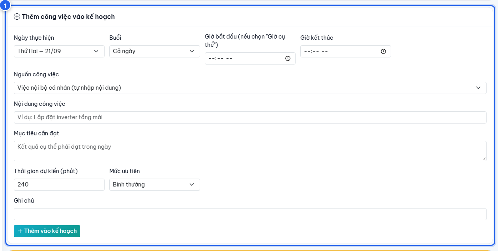

*Khung “Thêm công việc vào kế hoạch” với đầy đủ các trường cần nhập.*

#### Phân biệt “Lưu nháp” và “Hoàn tất kế hoạch tuần”

| Nút | Ý nghĩa |
| --- | --- |
| Lưu nháp | Ghi nhận kế hoạch ở trạng thái “Đang lập”. Bạn vẫn sửa được thoải mái. Trưởng phòng nhìn thấy kế hoạch của bạn ở tình trạng chưa chốt. |
| Hoàn tất kế hoạch tuần | Chốt kế hoạch của tuần. Trạng thái chuyển thành “Đã hoàn tất”. Đây là tín hiệu để Trưởng phòng bắt đầu điều phối và đối chiếu kết quả cuối tuần. |
| Sao chép tuần trước | Chép lại các đầu việc của tuần liền trước sang tuần đang xem, giúp tiết kiệm thời gian với công việc lặp lại. Những dòng bị trùng hoặc đã đóng sẽ được bỏ qua. |

#### Khi nào hệ thống không cho hoàn tất tuần

Nút “Hoàn tất kế hoạch tuần” bị khoá khi còn lỗi cần sửa. Các trường hợp thường gặp:

- Tuần chưa có bất kỳ công việc nào.
- Có ngày làm việc để trống mà chưa được đánh dấu lý do (nghỉ theo lịch, nghỉ phép, chờ phân công hoặc không có kế hoạch). Riêng Chủ nhật không bắt buộc phải có kế hoạch.
- Có ngày bị dồn quá nhiều việc, tổng thời lượng vượt trần tối đa 16 giờ một ngày. Đây là giới hạn cứng, hệ thống chặn hoàn tất cho tới khi bạn giãn bớt việc sang ngày khác.

#### Cảnh báo trùng lịch và quá tải

Ngoài các lỗi chặn, hệ thống còn hiển thị khung “Cảnh báo — vẫn có thể hoàn tất”. Cảnh báo không khoá nút hoàn tất nhưng cần được xem xét:

- Quá tải: tổng thời lượng dự kiến của một ngày vượt giờ làm việc chuẩn.
- Trùng khung giờ: hai công việc trong cùng một ngày có khoảng thời gian chồng lên nhau.
- Một đầu việc xuất hiện ở nhiều ngày trong tuần.
- Đầu việc đã quá hạn so với thời hạn ghi ở nguồn công việc.
- Đầu việc không còn được giao cho bạn nữa.

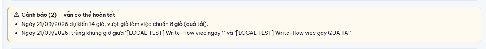

*Khung cảnh báo khi một ngày bị quá tải hoặc có hai công việc trùng khung giờ. (Ảnh minh họa)*

> **Lưu ý:** Trang Kế hoạch còn có ba tab nội bộ: “Tuần này”, “Tuần trước” và “Lịch sử kế hoạch”. Tab “Lịch sử kế hoạch” liệt kê toàn bộ các tuần bạn đã lập, kèm trạng thái và số việc.

### 4.3. Thực hiện công việc

- Đầu mỗi buổi sáng, mở mục Tổng quan để xem “Việc hôm nay” và khung “Ưu tiên hôm nay”.
- Mở mục Kế hoạch để xem chi tiết từng đầu việc của ngày: nội dung, mục tiêu cần đạt, công trình liên quan, thời gian dự kiến và mức ưu tiên.
- Trong quá trình làm, bạn có thể mở ô “Sửa” của từng dòng để cập nhật trạng thái công việc: Dự kiến, Đang thực hiện, Hoàn thành, Chưa hoàn thành, Chuyển sang ngày sau, Đã huỷ.
- Nếu công việc không kịp trong ngày, dùng chức năng chuyển sang ngày khác trong cùng tuần thay vì xoá bỏ, để giữ được lịch sử theo dõi.
- Khi Trưởng phòng yêu cầu cập nhật lại kế hoạch hoặc đã điều chỉnh một dòng việc, trang Kế hoạch sẽ hiện thông báo kèm lý do ngay ở đầu trang.

### 4.4. Viết báo cáo ngày

Vào mục Báo cáo ở nhóm “KỸ THUẬT”. Trang “Báo cáo của tôi” có hai nút chính ở góc trên bên phải: “Viết báo cáo” và “Báo cáo việc phát sinh”.

#### Trường hợp 1 — Công việc đã có trong kế hoạch (7 bước)

1. Bấm “Viết báo cáo”. Trang “Viết báo cáo ngày” mở ra.
2. Ở ô “Công việc theo kế hoạch”, chọn đúng dòng kế hoạch của ngày. Chọn đúng dòng giúp hệ thống so sánh được kế hoạch với kết quả.
3. Nhập “Nội dung đã thực hiện” — đây là trường bắt buộc. Mô tả cụ thể công việc đã làm trong ngày.
4. Nhập tiếp “Kết quả đạt được”, “Lý do chưa hoàn thành” (bỏ trống nếu đã xong), “Vật tư đã dùng / ghi chú vật tư”, “Vấn đề phát sinh” và “Kế hoạch tiếp theo”.
5. Ở khung “Thông tin chung” bên phải, kiểm tra “Ngày báo cáo” (bắt buộc) và nhập “% hoàn thành” (bắt buộc). “Số giờ thực hiện” không bắt buộc.
6. Ở khung “Ảnh / file minh chứng”, đính kèm hình ảnh hoặc tài liệu nếu có.
7. Bấm “Hoàn tất báo cáo” để nộp, hoặc “Lưu nháp” nếu muốn hoàn thiện sau.

*Hai nút kết thúc của biểu mẫu báo cáo ngày và ghi chú giải thích ngay bên dưới.*

#### Trường hợp 2 — Việc phát sinh ngoài kế hoạch (5 bước)

1. Bấm “Báo cáo việc phát sinh”. Trang “Báo cáo việc phát sinh” mở ra với ô “Công việc phát sinh (ngoài kế hoạch tuần)” đã được đánh dấu sẵn.
2. Nhập “Lý do phát sinh” — đây là trường BẮT BUỘC đối với việc phát sinh. Không có lý do, hệ thống sẽ không nhận báo cáo.
3. Nhập “Nội dung đã thực hiện” và các thông tin còn lại như báo cáo thông thường.
4. Kiểm tra “Ngày báo cáo” và nhập “% hoàn thành”.
5. Bấm “Hoàn tất báo cáo”.

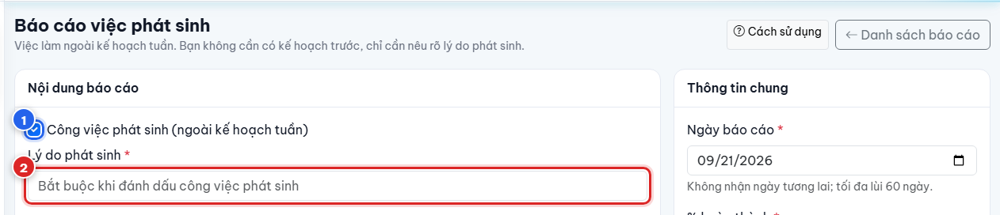

*Biểu mẫu báo cáo việc phát sinh — ô lý do phát sinh là bắt buộc.*

#### Những điều cần nhớ khi viết báo cáo

- Việc phát sinh không cần có kế hoạch trước, nhưng bắt buộc phải nêu rõ lý do phát sinh.
- Mỗi đầu việc được viết thành MỘT báo cáo riêng. Không gộp nhiều đầu việc vào một báo cáo.
- Báo cáo cũ không bao giờ bị ghi đè. Mỗi lần nộp là một bản ghi riêng, kèm lịch sử thay đổi.
- Ngày báo cáo không được là ngày trong tương lai và chỉ lùi lại tối đa 60 ngày.
- Đính kèm tối đa 10 tập tin cho mỗi lần tải lên, mỗi tập tin không quá 10 MB. Hệ thống nhận ảnh, PDF, Word và Excel. Tập tin được lưu ở khu vực riêng tư — chỉ người có quyền mới tải về được.
- Sau khi bấm “Hoàn tất báo cáo”, bạn không còn sửa được nội dung. Chỉ khi quản lý chuyển báo cáo sang trạng thái “Yêu cầu sửa”, bạn mới mở lại được để cập nhật và gửi lại.
- Khi báo cáo bị yêu cầu sửa, mở báo cáo đó, đọc kỹ ý kiến của quản lý ở đầu trang, bấm “Sửa báo cáo”, cập nhật nội dung rồi bấm “Gửi duyệt” để gửi lại.

## 5. Hướng dẫn dành cho Trưởng phòng kỹ thuật

### 5.1. Theo dõi kế hoạch của phòng

Vào mục Tổng quan ở nhóm “QUẢN LÝ KỸ THUẬT”. Trang “Tổng quan phòng Kỹ thuật” hiển thị tám chỉ số của tuần đang xem:

| Chỉ số | Ý nghĩa |
| --- | --- |
| Nhân sự kỹ thuật | Tổng số nhân sự thuộc phạm vi quản lý. |
| Chưa lập kế hoạch tuần | Số nhân viên chưa lập kế hoạch cho tuần đang xem. |
| Công việc kế hoạch | Tổng số đầu việc đã được đưa vào kế hoạch. |
| Hoàn thành | Số đầu việc đã hoàn thành. |
| Quá hạn | Số đầu việc đã quá thời hạn. |
| Phát sinh | Số việc làm ngoài kế hoạch. |
| Báo cáo đã nộp | Số đầu việc đã có báo cáo hoàn tất. |
| Báo cáo chưa nộp | Số đầu việc đã tới ngày nhưng chưa có báo cáo. |

Nếu có nhân viên chưa lập kế hoạch, hệ thống hiện một khung cảnh báo kèm danh sách tên và liên kết “mở kế hoạch” của từng người. Bên dưới là bảng “Theo nhân viên”. Góc trên bên phải có hai nút chuyển nhanh: “Kế hoạch nhân viên” và “Tổng kết tuần”.

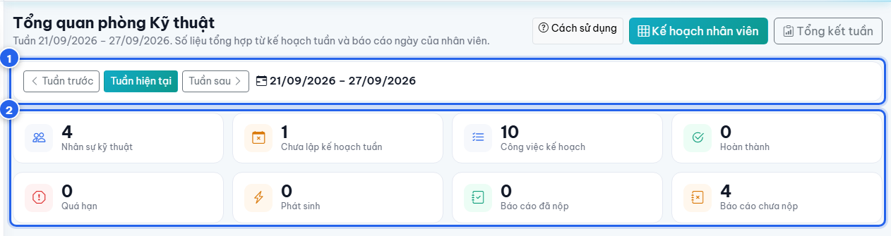

*Trang Tổng quan phòng Kỹ thuật với tám chỉ số theo tuần.*

### 5.2. Tạo kế hoạch và giao việc

Vào mục Kế hoạch nhân viên. Trang hiển thị “Ma trận kế hoạch tuần”: mỗi hàng là một nhân viên, mỗi cột là một ngày trong tuần, cột cuối là “Tổng giờ” và “Tình trạng”. Góc trên bên phải có hai nút riêng biệt: “Tạo kế hoạch” và “Giao việc”.

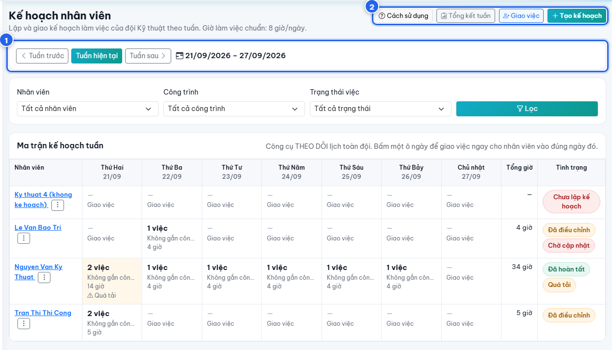

*Ma trận kế hoạch tuần của cả phòng — bấm một ô ngày để giao việc ngay cho nhân viên vào đúng ngày đó.*

Mười bước thực hiện:

1. Chọn tuần cần lập bằng các nút “Tuần trước”, “Tuần hiện tại”, “Tuần sau”.
2. Dùng bộ lọc “Nhân viên”, “Công trình”, “Trạng thái việc” để thu hẹp phạm vi xem nếu cần, rồi bấm “Lọc”.
3. Quan sát ma trận: ô ngày có việc hiển thị số việc, công trình chính và tổng giờ; ô có dấu hiệu “Quá tải” hoặc “… quá hạn” là ô cần xử lý trước.
4. Để lập nhiều việc cho một nhân viên trong cùng một lần, bấm “Tạo kế hoạch”. Khung “Tạo kế hoạch tuần” mở ra ở cạnh phải màn hình.
5. Chọn “Nhân viên nhận kế hoạch”, sau đó điền “Công việc 1”: Ngày thực hiện, Buổi, Giờ bắt đầu / Giờ kết thúc, Thời gian dự kiến, Mức độ ưu tiên, Nguồn công việc, Đầu việc, Nội dung công việc, Mục tiêu cần đạt, Ghi chú.
6. Bấm “Thêm công việc” để thêm dòng thứ hai, thứ ba… Có thể lập công việc cho nhiều ngày trong tuần trong cùng một lần lưu. Nút “Sao chép dòng” giúp nhân bản nhanh một dòng đã điền.
7. Nhập “Lý do tạo/giao kế hoạch” — đây là trường BẮT BUỘC, tối thiểu 5 ký tự.
8. Bấm “Lưu nháp” nếu chỉ muốn ghi nhận, hoặc “Lưu và giao kế hoạch” để giao chính thức cho nhân viên.
9. Để giao nhanh MỘT công việc, bấm “Giao việc” ở góc trên bên phải, hoặc bấm thẳng vào ô ngày của nhân viên trên ma trận. Khung “Giao việc cho nhân viên” mở ra với nhân viên và ngày đã được chọn sẵn. Điền nội dung, nhập “Lý do giao việc” (bắt buộc) rồi bấm “Giao việc”.
10. Nếu kế hoạch có cảnh báo (trùng khung giờ hoặc quá tải), hệ thống hiện khung cảnh báo màu vàng và yêu cầu bạn tích ô “Tôi xác nhận vẫn giao dù có cảnh báo” trước khi lưu.

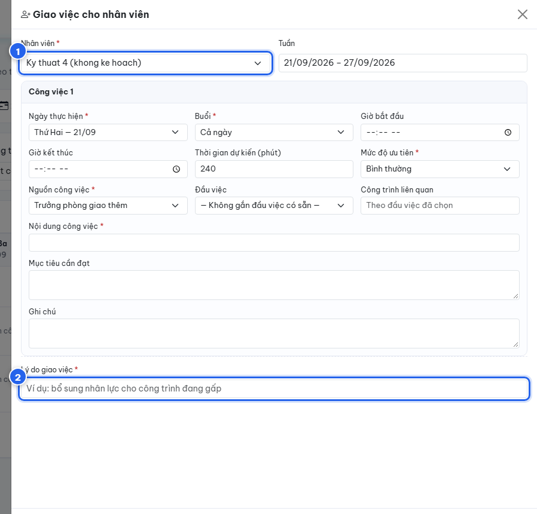

*Khung “Giao việc cho nhân viên” mở ra sau khi bấm một ô ngày trên ma trận.*

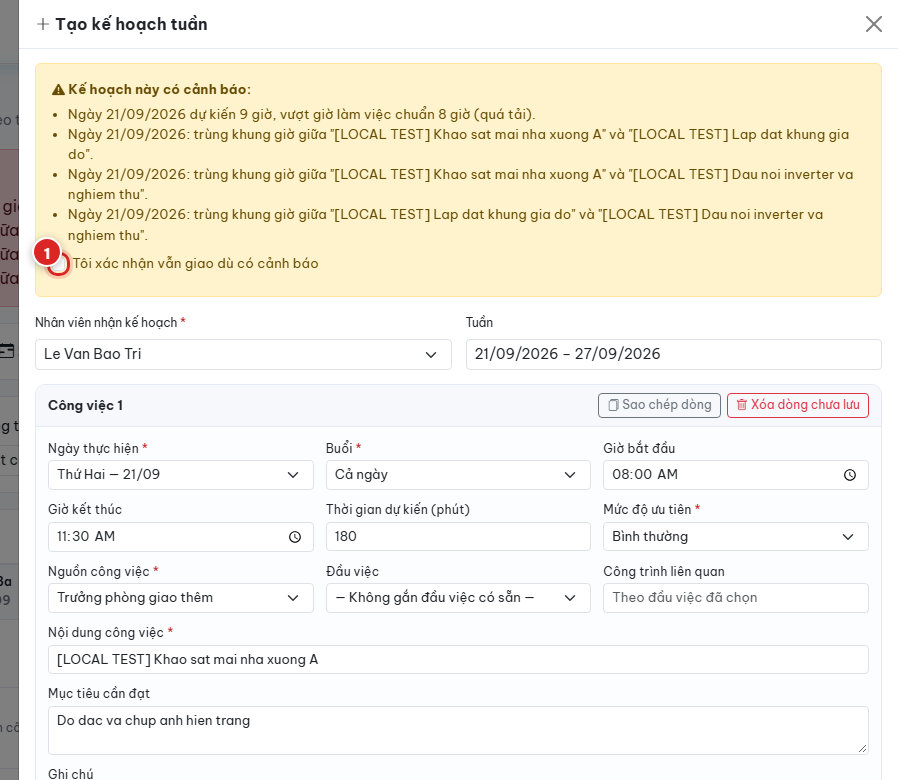

*Hệ thống yêu cầu xác nhận khi kế hoạch có cảnh báo trùng lịch hoặc quá tải. (Ảnh minh họa)*

#### Điều chỉnh kế hoạch đã có

- Bấm vào tên nhân viên trên ma trận để mở trang chi tiết kế hoạch của người đó.
- Với mỗi dòng việc, mở ô điều chỉnh để sửa Ngày thực hiện, Buổi, Thời gian dự kiến, Ưu tiên, Nội dung, Mục tiêu. Trường “Lý do điều chỉnh” là BẮT BUỘC.
- Nếu muốn nhân viên tự cập nhật lại, dùng khung “Yêu cầu nhân viên cập nhật (bắt buộc lý do)”. Kế hoạch của nhân viên sẽ hiện tình trạng “Chờ cập nhật” và thông báo lý do ở đầu trang của họ.
- Mọi lần điều chỉnh đều được ghi lại ở bảng “Lịch sử điều chỉnh” cuối trang, gồm thời gian, người thực hiện, hành động, giá trị trước, giá trị sau và lý do.
- Menu ba chấm cạnh tên nhân viên trên ma trận gom bốn thao tác nhanh: “Xem chi tiết”, “Tạo kế hoạch”, “Giao thêm việc”, “Điều chỉnh”.

### 5.3. Theo dõi và duyệt báo cáo

Vào mục Báo cáo. Trang “Báo cáo Kỹ thuật” hiển thị báo cáo của toàn phòng, với hai tab chính là “Báo cáo ngày” và “Tổng hợp tuần”.

Ở tab “Báo cáo ngày”, thanh lọc nhanh theo trạng thái gồm: “Báo cáo nhân viên”, “Nháp”, “Chờ duyệt”, “Đã duyệt”, “Yêu cầu sửa”. Bên dưới còn có bộ lọc theo khoảng ngày, theo trạng thái và theo nhân sự.

Các bước duyệt báo cáo:

1. Bấm tab lọc “Chờ duyệt” để thấy các báo cáo đang đợi xử lý.
2. Bấm biểu tượng xem ở cuối dòng để mở trang chi tiết báo cáo.
3. Đọc phần “Nội dung”: nguồn công việc, nội dung đã thực hiện, % hoàn thành, số giờ thực hiện, vật tư đã dùng, vấn đề phát sinh, kế hoạch tiếp theo, cùng các tập tin minh chứng.
4. Nếu chấp nhận: nhập “Ý kiến duyệt (không bắt buộc)” rồi bấm “Duyệt báo cáo”.
5. Nếu cần bổ sung: nhập “Ý kiến yêu cầu sửa” (BẮT BUỘC, tối thiểu 5 ký tự) rồi bấm “Yêu cầu sửa”. Nhân viên sẽ nhận được ý kiến này ngay trên báo cáo và có thể cập nhật, gửi lại.
6. Khung “Duyệt” bên phải ghi lại thời điểm gửi, người duyệt, thời điểm duyệt và ý kiến. Khung “Lịch sử” bên dưới ghi lại toàn bộ diễn biến của báo cáo.

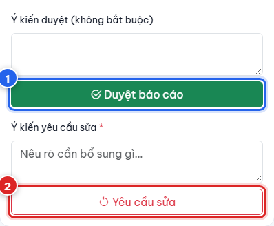

*Hai nút xử lý báo cáo dành cho người duyệt: “Duyệt báo cáo” và “Yêu cầu sửa”.*

> **Lưu ý:** Quy tắc không tự duyệt báo cáo của chính mình: Trưởng phòng Kỹ thuật không thể duyệt báo cáo do chính mình viết — hệ thống không hiển thị nút duyệt trong trường hợp đó. Báo cáo của Trưởng phòng cần một người quản lý khác xử lý.

### 5.4. Tổng kết tuần

Vào mục Tổng kết tuần. Trang so sánh kế hoạch với kết quả thực hiện của cả phòng trong tuần đang xem. Trên thanh chọn tuần hiển thị hai tỷ lệ: “Tỷ lệ hoàn thành” và “Tỷ lệ nộp báo cáo”.

Tám chỉ số chính:

| Chỉ số | Ý nghĩa |
| --- | --- |
| Công việc kế hoạch | Tổng số đầu việc đã lên kế hoạch trong tuần. |
| Hoàn thành | Số đầu việc đã hoàn thành. |
| Chưa hoàn thành | Số đầu việc chưa xong, gồm cả việc còn đang thực hiện. |
| Chuyển ngày | Số đầu việc được dời sang ngày khác. |
| Quá hạn | Số đầu việc đã quá thời hạn. |
| Phát sinh | Số việc làm ngoài kế hoạch. |
| Giờ dự kiến | Tổng thời lượng dự kiến theo kế hoạch. |
| Giờ thực tế | Tổng số giờ nhân viên ghi nhận trong báo cáo. |

Bên dưới là biểu đồ theo tuần, bảng “Theo nhân viên” và bảng “Theo công trình”.

> **Lưu ý:** Khi chưa có dữ liệu để tính (ví dụ tuần chưa có đầu việc nào đến hạn), hệ thống hiển thị “N/A” thay vì hiển thị 0%. Đây là cách phân biệt “chưa có gì để đánh giá” với “đánh giá bằng không”.

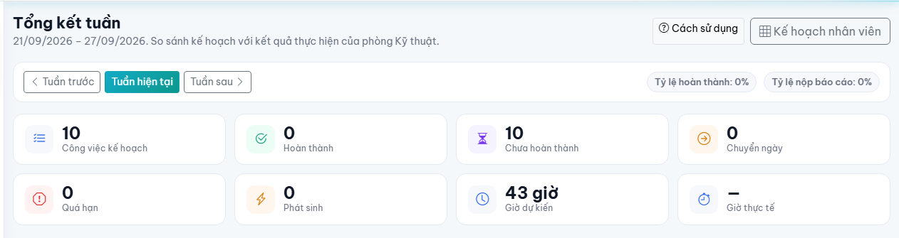

*Trang Tổng kết tuần với hai tỷ lệ và tám chỉ số so sánh kế hoạch với thực tế.*

## 6. Hướng dẫn dành cho Admin / Giám đốc

### 6.1. Tổng quan điều hành

Vào mục Tổng quan ở nhóm “KỸ THUẬT”. Trang “Tổng quan Kỹ thuật” dành cho Ban Giám đốc là màn hình theo dõi kết quả, không phải màn hình thao tác. Trang có hai chế độ xem: “Theo tuần” và “Theo tháng”, kèm các nút “Kỳ trước”, “Kỳ hiện tại”, “Kỳ sau”.

Sáu chỉ số ở hàng đầu: Tổng nhân viên kỹ thuật, Đã lập kế hoạch, Công việc hoàn thành, Công việc quá hạn, Báo cáo đã nộp, Báo cáo chưa nộp.

Ngay bên dưới là dòng tóm tắt “Tỷ lệ hoàn thành … · Tỷ lệ nộp báo cáo … · Giờ kế hoạch … / giờ thực tế …”, kèm biểu tượng thông tin giải thích cách tính. Tiếp theo là khung “Chi tiết” (Chưa lập kế hoạch, Tổng công việc đã lên kế hoạch, Công việc chưa hoàn thành, Công việc phát sinh), khung “Biểu đồ tuần/tháng”, bảng “Kết quả theo nhân viên” và bảng “Kết quả theo công trình”.

Bộ lọc gồm “Nhân viên”, “Công trình” và “Trạng thái công việc”.

### 6.2. Tạo kế hoạch và giao việc

Vào mục Kế hoạch & Giao việc. Trang hiển thị sáu chỉ số: Tổng nhân viên kỹ thuật, Đã lập kế hoạch, Chưa lập kế hoạch, Tổng công việc trong kế hoạch, Tổng giờ dự kiến, Cảnh báo trùng lịch / quá tải. Bên dưới là “Bảng theo dõi kế hoạch tuần” với các cột: Nhân viên, Tuần, Số ngày đã lập, Số công việc, Giờ dự kiến, Trạng thái, Chi tiết, Hành động.

Admin và Giám đốc được tạo kế hoạch và giao việc giống Trưởng phòng. Hai nút “Tạo kế hoạch” và “Giao việc” ở góc trên bên phải dẫn thẳng sang đúng biểu mẫu mà Trưởng phòng đang dùng, với tuần và nhân viên đã chọn sẵn. Toàn bộ mười bước ở mục 5.2 áp dụng y nguyên, kể cả yêu cầu bắt buộc ghi lý do và bước xác nhận khi có cảnh báo.

Menu ba chấm ở cột “Hành động” của từng nhân viên cho phép mở nhanh “Chi tiết” hoặc “Giao thêm việc”.

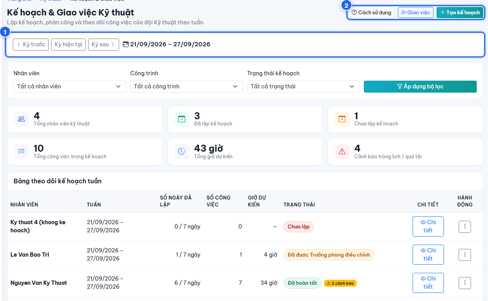

*Trang Kế hoạch & Giao việc Kỹ thuật dành cho Admin / Giám đốc.*

### 6.3. Theo dõi báo cáo ngày và tuần

Vào mục Báo cáo ngày/tuần. Đây là trang dùng chung cho cả ba vai trò, gồm HAI TAB khác nhau:

| Tab | Nội dung |
| --- | --- |
| Báo cáo ngày | Danh sách từng báo cáo của từng nhân viên, kèm các tab lọc theo trạng thái (Nháp, Chờ duyệt, Đã duyệt, Yêu cầu sửa) và bộ lọc theo khoảng ngày, trạng thái, nhân sự. Bấm biểu tượng xem ở cuối dòng để mở chi tiết một báo cáo. |
| Tổng hợp tuần | Bảng tổng hợp kết quả của cả tuần. Không phải danh sách báo cáo, mà là số liệu đã được hệ thống tính sẵn. |

#### Nội dung tab “Tổng hợp tuần”

Tab này dành cho người có quyền quản lý (Trưởng phòng, Admin, Giám đốc) xem số liệu toàn phòng; nhân viên mở tab này chỉ thấy số liệu của chính mình. Tab có bộ lọc theo “Nhân viên”, “Công trình”, “Trạng thái công việc” và thanh chọn tuần.

Tám thẻ số liệu: Tổng báo cáo đã nộp, Báo cáo chờ duyệt, Báo cáo đã duyệt, Báo cáo yêu cầu sửa, Công việc hoàn thành, Công việc chưa hoàn thành, Công việc phát sinh, Tổng giờ thực tế.

Bên dưới là bảng “Kết quả theo nhân viên” (Số báo cáo, Việc hoàn thành, Việc chưa hoàn thành, Việc phát sinh, Giờ thực tế, Tỷ lệ nộp báo cáo, Trạng thái kế hoạch tuần) và bảng “Kết quả theo công trình” (Người phụ trách, Tổng đầu việc báo cáo, Hoàn thành, Chưa hoàn thành, Giờ thực tế).

> **Lưu ý:** Tab “Tổng hợp tuần” là màn hình CHỈ XEM và chỉ tổng hợp THEO TUẦN. Hệ thống hiện chưa có tổng hợp theo tháng ở trang Báo cáo. Nếu cần nhìn theo tháng, dùng chế độ “Theo tháng” ở trang Tổng quan (mục 6.1).

#### Quyền duyệt báo cáo trên màn hình của Admin / Giám đốc

> **Điểm cần nắm rõ**
>
> - Hiện nay việc duyệt báo cáo do Trưởng phòng Kỹ thuật thực hiện. Màn hình chi tiết báo cáo của Admin và Giám đốc được đặt ở chế độ chỉ theo dõi: không hiển thị nút “Duyệt báo cáo” và nút “Yêu cầu sửa”.
> - Nút “Mở lại báo cáo” đối với báo cáo đã duyệt hiện KHÔNG xuất hiện trên màn hình. Nếu cần mở lại một báo cáo đã duyệt, vui lòng liên hệ người quản trị hệ thống.
> - Admin và Giám đốc vẫn xem được toàn bộ nội dung báo cáo, tập tin minh chứng, phần “Duyệt” và phần “Lịch sử” của mọi nhân viên.

### 6.4. Theo dõi KPI

Vào mục KPIs. Trang “KPIs Kỹ thuật” theo dõi hiệu quả của nhân sự kỹ thuật THEO THÁNG. Chọn tháng ở ô “Tháng KPI”, lọc theo “Kỹ sư” và theo “Trạng thái” (Chưa chấm, Chờ duyệt, Đã duyệt).

Sáu thẻ tổng hợp ở đầu trang:

| Thẻ | Ý nghĩa |
| --- | --- |
| KPI trung bình | Mức KPI trung bình của phòng trong tháng, kèm số kỹ sư, số hồ sơ KPI và số người chưa chấm. |
| Đạt KPI | Số người đạt từ 90% trở lên. |
| Vượt KPI | Số người đạt từ 100% trở lên. |
| Chờ duyệt | Số hồ sơ cần trưởng bộ phận xác nhận. |
| Cần cải thiện | Số người dưới 75% KPI. |
| CT ảnh hưởng KPI | Số công trình có vấn đề ảnh hưởng KPI: trễ hạn, nghiệm thu, an toàn lao động, vật tư. |

Năm tiêu chí KPI và tỷ trọng đang áp dụng:

| Tiêu chí | Tỷ trọng | Nguồn đánh giá |
| --- | --- | --- |
| Tiến độ hoàn thành lắp đặt hệ thống | 30% | Tiến độ và nghiệm thu công trình |
| Chất lượng thi công & thẩm mỹ | 25% | Biên bản nghiệm thu, phản hồi khách hàng |
| Khảo sát kỹ thuật & khối lượng | 15% | Vật tư xuất kho trừ vật tư hoàn trả nguyên vẹn |
| An toàn lao động (HSE) & vệ sinh | 15% | Danh mục kiểm tra an toàn, biên bản sự cố |
| Hỗ trợ thủ tục EVN & cài đặt App | 15% | Nghiệm thu, bàn giao, cấu hình ứng dụng |

Tổng tỷ trọng phải đúng 100%. Nếu tổng tỷ trọng bị lệch, hệ thống hiện cảnh báo và tạm khoá việc chấm hoặc cập nhật KPI cho tới khi được chỉnh lại trong “Cấu hình KPI”.

> **KPI hiện chưa tự động hoàn toàn**
>
> - KPI được tính theo THÁNG, dựa trên bảng theo dõi lương kỹ thuật, không phải theo tuần.
> - Chỉ phần số liệu liên quan tới tiến độ và tình trạng công trình được hệ thống lấy tự động; cột “CT ảnh hưởng KPI” và danh sách công trình đóng góp KPI của từng kỹ sư thuộc phần này.
> - Các phần còn lại do quản lý kiểm tra và nhập qua nút “Chấm / cập nhật KPI”. Ô nào chưa có số sẽ hiển thị “Chưa có dữ liệu” hoặc “Chưa chấm KPI”.
> - KPI KHÔNG lấy dữ liệu từ kế hoạch tuần và báo cáo ngày. Hai phần này phục vụ việc điều hành và tổng kết tuần, không tự động quy đổi thành điểm KPI.

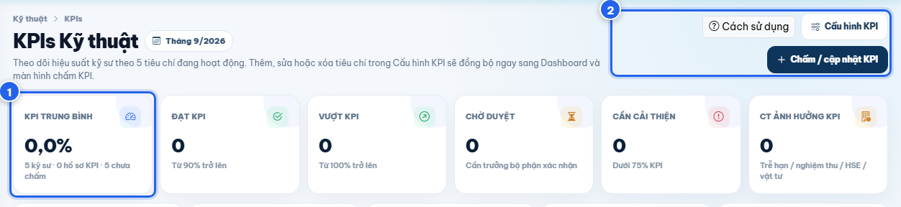

*Trang KPIs Kỹ thuật theo tháng với sáu thẻ tổng hợp.*

#### Liên kết với Công trình, nhiệm vụ nội bộ và Bảo trì / Bảo hành

- Kế hoạch tuần và báo cáo ngày chỉ LIÊN KẾT tới Công trình, nhiệm vụ nội bộ và Bảo trì / Bảo hành để chọn đúng đầu việc được giao.
- Việc lập kế hoạch hay viết báo cáo KHÔNG làm thay đổi dữ liệu của Công trình, của nhiệm vụ nội bộ hay của hồ sơ Bảo trì / Bảo hành.
- Chức năng “Đề xuất đổi hàng BH” thuộc luồng Bảo trì / Bảo hành riêng, nằm ở nhóm “BẢO TRÌ / BẢO HÀNH” trong danh sách mục của nhân viên kỹ thuật, không phải một bước của kế hoạch hay báo cáo ngày.

## 7. Quy trình phê duyệt báo cáo

Luồng thuận lợi:

| Bước | Nội dung |
| --- | --- |
| 1 | Nháp |
| 2 | Gửi duyệt |
| 3 | Quản lý xem |
| 4 | Đã duyệt |

Luồng khi cần bổ sung:

| Bước | Nội dung |
| --- | --- |
| 1 | Quản lý xem |
| 2 | Yêu cầu sửa |
| 3 | Nhân viên cập nhật |
| 4 | Gửi lại |
| 5 | Đã duyệt |

Ý nghĩa từng trạng thái, theo đúng tên hiển thị trên màn hình:

| Trạng thái | Ý nghĩa |
| --- | --- |
| Nháp | Báo cáo đã được ghi lại nhưng chưa nộp. Chỉ người viết nhìn thấy nội dung đầy đủ và còn sửa được. |
| Đã gửi · chờ duyệt | Báo cáo đã nộp và đang đợi quản lý xem. Người viết không sửa được nữa. Ở các danh sách rút gọn, trạng thái này còn được ghi là “Hoàn tất (đã nộp)”. |
| Đã duyệt | Quản lý đã chấp nhận báo cáo. Khung “Duyệt” ghi rõ người duyệt, thời điểm duyệt và ý kiến. |
| Yêu cầu sửa | Quản lý yêu cầu bổ sung. Ý kiến yêu cầu sửa hiển thị ngay ở đầu báo cáo. Người viết mở lại được để cập nhật và gửi lại. Ở các danh sách rút gọn, trạng thái này còn được ghi là “Cần cập nhật lại”. |

> **Báo cáo “Hoàn tất” được tính là đã nộp ngay**
>
> - Khi nhân viên bấm “Hoàn tất báo cáo”, hệ thống coi báo cáo đó là ĐÃ NỘP và dùng ngay vào việc so sánh kế hoạch với kết quả cũng như vào các bảng tổng hợp tuần.
> - Nói cách khác, không cần chờ duyệt thì số liệu mới được ghi nhận. Bước duyệt của Trưởng phòng là bước kiểm soát chất lượng nội dung, không phải điều kiện để báo cáo được tính.
> - Nút “Gửi duyệt” chỉ xuất hiện khi báo cáo đang ở trạng thái “Nháp” hoặc “Yêu cầu sửa”.

## 8. Quy tắc làm việc đề xuất

### 8.1. Đối với nhân viên kỹ thuật

- Lập kế hoạch tuần TRƯỚC khi tuần bắt đầu, chậm nhất là sáng thứ Hai.
- Kiểm tra nhiệm vụ của mình mỗi sáng ở mục Tổng quan trước khi ra công trình.
- Cập nhật báo cáo ngay sau khi hoàn thành công việc, không để dồn cuối tuần.
- Ghi rõ lý do đối với mọi việc phát sinh ngoài kế hoạch.
- Không gộp nhiều đầu việc thành một nội dung chung chung khiến quản lý khó kiểm tra.
- Đánh dấu rõ những ngày nghỉ hoặc chờ phân công thay vì để trống kế hoạch.

### 8.2. Đối với Trưởng phòng Kỹ thuật

- Kiểm tra kế hoạch của toàn phòng vào đầu tuần, xử lý ngay danh sách “Chưa lập kế hoạch tuần”.
- Điều phối lại khi ma trận báo “Quá tải” hoặc báo trùng khung giờ; ghi rõ lý do điều chỉnh.
- Duyệt báo cáo hằng ngày, không để tồn đọng ở tab “Chờ duyệt”.
- Khi yêu cầu sửa, viết ý kiến cụ thể để nhân viên biết chính xác cần bổ sung gì.
- Tổng kết vào cuối tuần bằng trang Tổng kết tuần và trao đổi lại với từng nhân viên.
- Khi giao việc gấp, dùng chức năng giao việc nhanh bằng cách bấm thẳng vào ô ngày của nhân viên trên ma trận.

### 8.3. Đối với Giám đốc / Admin

- Theo dõi tab “Tổng hợp tuần” để nắm kết quả chung của phòng.
- Kiểm tra hai chỉ số quan trọng: “Công việc quá hạn” và “Báo cáo chưa nộp”.
- Kiểm tra KPI theo tháng và nhắc nhở khi còn hồ sơ ở trạng thái “Chưa chấm”.
- Chỉ can thiệp giao việc trực tiếp khi thật sự cần thiết, tránh chồng chéo với Trưởng phòng.
- Đánh giá nhân sự dựa trên ba mặt: tiến độ, kết quả và chất lượng nội dung báo cáo.

## 9. Checklist vận hành

### 9.1. Checklist hằng ngày của nhân viên kỹ thuật

| STT | Nội dung kiểm tra | Thời điểm | Người thực hiện | Hoàn thành |
| --- | --- | --- | --- | --- |
| 1 | Mở mục Tổng quan, xem “Việc hôm nay” và “Việc quá hạn” | Đầu giờ sáng | Nhân viên kỹ thuật | ☐ |
| 2 | Đối chiếu kế hoạch ngày trong mục Kế hoạch | Đầu giờ sáng | Nhân viên kỹ thuật | ☐ |
| 3 | Cập nhật trạng thái từng đầu việc khi bắt đầu và khi xong | Trong ngày | Nhân viên kỹ thuật | ☐ |
| 4 | Viết báo cáo cho từng đầu việc đã thực hiện | Cuối ngày | Nhân viên kỹ thuật | ☐ |
| 5 | Đính kèm ảnh hoặc tài liệu minh chứng | Cuối ngày | Nhân viên kỹ thuật | ☐ |
| 6 | Báo cáo việc phát sinh kèm lý do (nếu có) | Cuối ngày | Nhân viên kỹ thuật | ☐ |
| 7 | Kiểm tra chỉ số “Báo cáo chưa nộp” về 0 | Cuối ngày | Nhân viên kỹ thuật | ☐ |
| 8 | Xử lý lại các báo cáo ở trạng thái “Yêu cầu sửa” | Cuối ngày | Nhân viên kỹ thuật | ☐ |

### 9.2. Checklist hằng tuần của Trưởng phòng Kỹ thuật

| STT | Nội dung kiểm tra | Thời điểm | Người thực hiện | Hoàn thành |
| --- | --- | --- | --- | --- |
| 1 | Mở Tổng quan phòng, kiểm tra danh sách “Chưa lập kế hoạch tuần” | Sáng thứ Hai | Trưởng phòng | ☐ |
| 2 | Rà ma trận kế hoạch, xử lý ô báo “Quá tải” và trùng khung giờ | Sáng thứ Hai | Trưởng phòng | ☐ |
| 3 | Giao bổ sung việc cho nhân viên còn trống lịch (kèm lý do) | Đầu tuần | Trưởng phòng | ☐ |
| 4 | Duyệt hoặc yêu cầu sửa các báo cáo ở tab “Chờ duyệt” | Hằng ngày | Trưởng phòng | ☐ |
| 5 | Theo dõi số “Việc quá hạn” và “Báo cáo chưa nộp” | Giữa tuần | Trưởng phòng | ☐ |
| 6 | Mở Tổng kết tuần, xem tỷ lệ hoàn thành và tỷ lệ nộp báo cáo | Chiều thứ Bảy | Trưởng phòng | ☐ |
| 7 | Xem bảng “Theo nhân viên” và “Theo công trình” | Chiều thứ Bảy | Trưởng phòng | ☐ |
| 8 | Trao đổi kết quả tuần với từng nhân viên | Cuối tuần | Trưởng phòng | ☐ |

### 9.3. Checklist hằng tuần và hằng tháng của Giám đốc / Admin

| STT | Nội dung kiểm tra | Thời điểm | Người thực hiện | Hoàn thành |
| --- | --- | --- | --- | --- |
| 1 | Mở Tổng quan Kỹ thuật ở chế độ “Theo tuần” | Hằng tuần | Giám đốc / Admin | ☐ |
| 2 | Xem tab “Tổng hợp tuần” ở mục Báo cáo ngày/tuần | Hằng tuần | Giám đốc / Admin | ☐ |
| 3 | Kiểm tra “Công việc quá hạn” và “Báo cáo chưa nộp” | Hằng tuần | Giám đốc / Admin | ☐ |
| 4 | Kiểm tra “Cảnh báo trùng lịch / quá tải” ở Kế hoạch & Giao việc | Hằng tuần | Giám đốc / Admin | ☐ |
| 5 | Chuyển Tổng quan sang chế độ “Theo tháng” để nhìn xu hướng | Hằng tháng | Giám đốc / Admin | ☐ |
| 6 | Mở mục KPIs, chọn đúng tháng cần đánh giá | Hằng tháng | Giám đốc / Admin | ☐ |
| 7 | Rà số hồ sơ “Chưa chấm” và “Chờ duyệt”, nhắc hoàn tất | Hằng tháng | Giám đốc / Admin | ☐ |
| 8 | Xem “CT ảnh hưởng KPI” để nắm các công trình có vấn đề | Hằng tháng | Giám đốc / Admin | ☐ |

## 10. Các tình huống thường gặp

| Tình huống | Cách xử lý |
| --- | --- |
| Không thấy công việc trong kế hoạch | Kiểm tra bạn đang xem đúng tuần chưa (thanh chọn tuần ở đầu trang). Nếu ô “Nguồn công việc” không có đầu việc nào, nghĩa là chưa có công việc từ Công trình, nhiệm vụ nội bộ hay Bảo trì / Bảo hành được giao cho bạn — bạn vẫn có thể chọn “Việc nội bộ cá nhân (tự nhập nội dung)”. Nếu chắc chắn đã được giao việc, báo Trưởng phòng kiểm tra lại phân công. |
| Không thể hoàn tất kế hoạch tuần | Đọc khung “Chưa thể hoàn tất kế hoạch tuần” ở đầu trang — khung này liệt kê đúng những lỗi đang chặn. Thường là: tuần chưa có việc nào, còn ngày làm việc bỏ trống chưa đánh dấu, hoặc có ngày vượt trần 16 giờ. Sửa hết các mục trong khung rồi bấm lại. |
| Lịch bị trùng hoặc quá tải | Mở khung “Cảnh báo — vẫn có thể hoàn tất” để xem ngày nào và hai công việc nào đang chồng giờ. Giãn bớt việc sang ngày khác hoặc điều chỉnh khung giờ. Nếu vẫn cần giữ nguyên, bạn vẫn hoàn tất được; Trưởng phòng sẽ thấy dấu hiệu “Quá tải” trên ma trận và cùng bạn sắp xếp lại. |
| Không thể viết báo cáo | Kiểm tra “Ngày báo cáo”: không được là ngày tương lai và chỉ lùi tối đa 60 ngày. Kiểm tra hai trường bắt buộc “Nội dung đã thực hiện” và “% hoàn thành”. Nếu báo cáo đã ở trạng thái “Đã gửi · chờ duyệt” hoặc “Đã duyệt” thì không sửa được nữa — hãy liên hệ Trưởng phòng. |
| Báo cáo bị yêu cầu sửa | Mở báo cáo đó, đọc ý kiến yêu cầu sửa hiển thị ở đầu trang, bấm “Sửa báo cáo”, bổ sung đúng nội dung được yêu cầu rồi bấm “Gửi duyệt” để gửi lại. |
| Việc phát sinh nhưng chưa có kế hoạch | Dùng nút “Báo cáo việc phát sinh”. Bạn không cần có kế hoạch trước, nhưng bắt buộc nhập “Lý do phát sinh”. Nội dung này vẫn được tính vào tổng hợp tuần ở cột “Công việc phát sinh”. |
| Không xem được trang quản lý | Hệ thống không cho phép mở trang nằm ngoài phạm vi quyền của bạn và sẽ hiện thông báo từ chối. Nếu công việc của bạn thật sự cần trang đó, liên hệ người quản trị hệ thống để kiểm tra lại quyền của tài khoản. |
| KPI chưa có dữ liệu | Kiểm tra bạn đang chọn đúng tháng ở ô “Tháng KPI”. Nếu trạng thái là “Chưa chấm” hoặc các ô ghi “Chưa có dữ liệu”, nghĩa là KPI của tháng đó chưa được nhập — hãy dùng nút “Chấm / cập nhật KPI” hoặc nhắc người phụ trách hoàn tất. Nếu có cảnh báo về tổng tỷ trọng, cần chỉnh lại trong “Cấu hình KPI” cho đủ 100%. |
| Không tìm thấy nút mở lại báo cáo đã duyệt | Nút mở lại báo cáo đã duyệt hiện không xuất hiện trên màn hình. Nếu cần mở lại một báo cáo đã duyệt, vui lòng liên hệ người quản trị hệ thống. |

Với mọi trục trặc không tự xử lý được, hãy liên hệ người quản trị hệ thống và mô tả rõ: bạn đang ở trang nào, bấm nút gì, và thông báo hiện lên nói gì. Không tự ý chỉnh sửa dữ liệu để “chữa cháy”.

## 11. Những điểm cần lưu ý

- KPI chưa tự động hoàn toàn. KPI tính theo tháng dựa trên bảng theo dõi lương kỹ thuật; chỉ phần liên quan tới tiến độ và tình trạng công trình được lấy tự động, phần còn lại do quản lý kiểm tra và nhập. Kế hoạch tuần và báo cáo ngày không tự quy đổi thành điểm KPI.
- Báo cáo việc phát sinh được phép không có kế hoạch trước, nhưng BẮT BUỘC phải có lý do phát sinh.
- Một số chức năng chỉ hiện theo quyền. Hai người ở hai vai trò khác nhau sẽ thấy hai màn hình khác nhau — điều này là bình thường.
- Màn hình chi tiết báo cáo của Admin và Giám đốc đang ở chế độ chỉ theo dõi: không có nút duyệt và nút yêu cầu sửa. Việc duyệt báo cáo do Trưởng phòng thực hiện.
- Nút mở lại báo cáo đã duyệt hiện chưa xuất hiện trên màn hình. Cần mở lại thì liên hệ người quản trị hệ thống.
- Người quản lý không tự duyệt được báo cáo do chính mình viết.
- Trang Báo cáo hiện chỉ có tổng hợp THEO TUẦN, chưa có tổng hợp theo tháng. Muốn nhìn theo tháng thì dùng chế độ “Theo tháng” ở trang Tổng quan của Ban Giám đốc.
- Trang Tổng quan của nhân viên hiện chỉ hiển thị bốn chỉ số: Việc hôm nay, Việc đang thực hiện, Việc quá hạn, Báo cáo chưa nộp.
- Không dùng chung tài khoản. Mọi thao tác đều được ghi lại theo tên người thực hiện; dùng chung tài khoản sẽ làm sai lệch số liệu và trách nhiệm.
- Tập tin đính kèm chỉ tải về được khi có quyền. Tập tin lưu ở khu vực riêng tư, không truy cập được bằng đường dẫn trực tiếp.
- Không tự ý chỉnh sửa hoặc xoá dữ liệu đã duyệt. Báo cáo đã nộp hoặc đã duyệt được khoá lại để bảo đảm tính trung thực của số liệu.
- Mọi lần giao việc và điều chỉnh kế hoạch đều bắt buộc ghi lý do và được lưu vào lịch sử điều chỉnh.
- Mỗi ngày tối đa 12 dòng công việc trong kế hoạch; trần thời lượng một ngày là 16 giờ; Chủ nhật không bắt buộc phải có kế hoạch.
- Nếu giao diện không hiện chức năng bạn cần dùng, hãy liên hệ người quản trị hệ thống để kiểm tra quyền của tài khoản, không tìm cách vào bằng đường khác.

## 12. Kết luận

Việc vận hành phòng Kỹ thuật trên hệ thống CRM EGO SOLAR mang lại sáu lợi ích rõ rệt:

- Minh bạch kế hoạch: mọi công việc của tuần được thể hiện trên một ma trận chung, ai cũng nhìn thấy khối lượng thực tế của từng người.
- Rõ trách nhiệm: mỗi đầu việc gắn với một người, một ngày và một mục tiêu cần đạt; mọi lần giao việc, điều chỉnh đều có lý do và người thực hiện.
- Theo dõi tiến độ liên tục: tình hình công việc được cập nhật theo ngày thay vì chờ tới cuối tuần.
- Giảm bỏ sót báo cáo: chỉ số “Báo cáo chưa nộp” hiển thị ngay trên màn hình của cả nhân viên lẫn quản lý.
- Có cơ sở tổng kết tuần và đánh giá KPI: số liệu so sánh kế hoạch với thực tế được tổng hợp sẵn, làm căn cứ cho các cuộc họp và cho việc đánh giá nhân sự.
- Liên kết chặt với Công trình và Bảo trì / Bảo hành: công việc kỹ thuật luôn gắn với nguồn gốc của nó, giúp nhìn được kết quả theo từng công trình.

Để hệ thống phát huy đúng giá trị, đề nghị các bộ phận tuân thủ ba nguyên tắc: lập kế hoạch trước tuần, báo cáo trong ngày, và duyệt báo cáo hằng ngày. Mọi vướng mắc về quyền sử dụng hoặc về chức năng chưa hiển thị, vui lòng liên hệ người quản trị hệ thống.

---

*Hệ thống CRM EGO SOLAR · Phiên bản tháng 09/2026*
