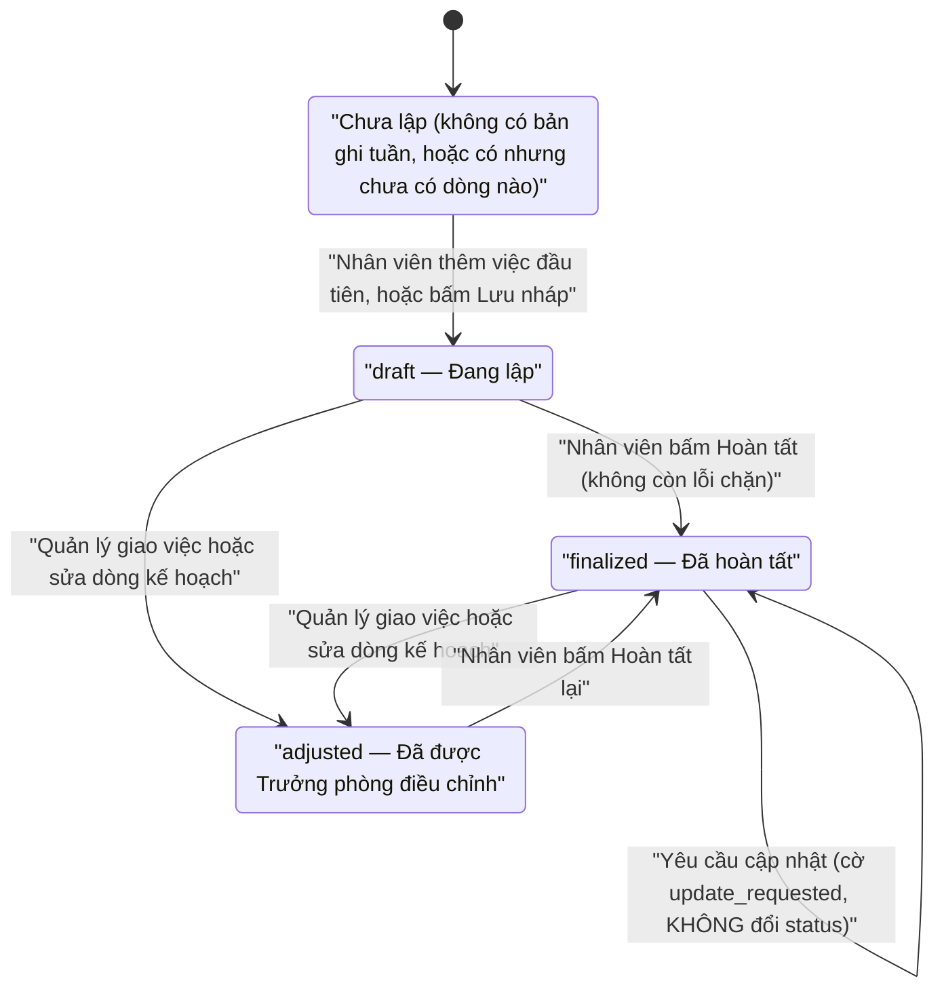
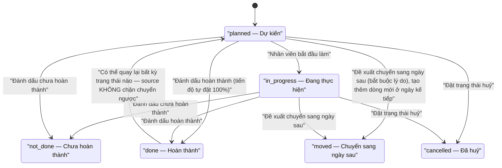

# QUY TRÌNH VẬN HÀNH MODULE KỸ THUẬT

> Tài liệu này mô tả **đúng những gì source hiện tại đang làm**. Mọi câu đều được kiểm chứng từ route, controller, service, model, migration, config, view và test trong mã nguồn. Chỗ nào không kiểm chứng được, tài liệu ghi rõ "chưa xác minh được từ source" thay vì suy đoán.

---

## 1. Tổng quan

### 1.1 Mục tiêu

Module Kỹ thuật giúp phòng Kỹ thuật trả lời bốn câu hỏi mỗi tuần:

1. Tuần này mỗi người **dự kiến làm gì**, ngày nào, bao lâu?
2. Mỗi ngày **thực tế đã làm gì**, kết quả ra sao, có minh chứng không?
3. Trưởng phòng **đã duyệt hay yêu cầu sửa** những báo cáo nào?
4. Cuối tuần, **kế hoạch so với thực tế** chênh nhau bao nhiêu?

### 1.2 Các phân hệ hiện có

| Phân hệ | Đường dẫn gốc | Tình trạng |
|---|---|---|
| Tổng quan Kỹ thuật (điều hướng theo vai trò) | `/ky-thuat` | Đang dùng |
| Kế hoạch tuần của nhân viên | `/ky-thuat/ke-hoach-tuan` | Đang dùng |
| Công việc hôm nay | `/ky-thuat/cong-viec-hom-nay` | Đang dùng (không có trong menu) |
| Báo cáo ngày + tab Tổng hợp tuần | `/ky-thuat/bao-cao-ngay` | Đang dùng |
| Bàn điều phối của Trưởng phòng | `/ky-thuat/quan-ly/...` | Đang dùng |
| Dashboard Admin/Giám đốc | `/ky-thuat/dashboard/...` | Đang dùng (Tổng quan + Kế hoạch); hai URL còn lại chỉ chuyển hướng |
| KPI / Lương KPI kỹ thuật | `/ky-thuat/kpis`, `/ky-thuat/luong` | Đang dùng, **tách rời** khỏi kế hoạch và báo cáo ngày |
| Hướng dẫn sử dụng | `/ky-thuat/huong-dan` | Đang dùng, nội dung tĩnh trong source |
| Bảo trì / Bảo hành | `/ky-thuat/bao-tri-bao-hanh/...` | Đang dùng, là module riêng nhưng cùng tiền tố URL |
| Đề xuất đổi hàng bảo hành | `/ky-thuat/de-xuat-doi-hang-bao-hanh` | Đang dùng, menu nằm ở nhóm "Bảo trì / Bảo hành" |
| Bàn làm việc Kỹ thuật (giai đoạn 1) | `/ky-thuat/cong-viec-cua-toi`, `/ky-thuat/lich-cong-viec`, `/ky-thuat/quan-ly-ky-thuat` | Còn route, **không còn link từ menu** |
| Kế hoạch / Báo cáo / Hoàn thiện bản cũ | `/ky-thuat/ke-hoach`, `/ky-thuat/bao-cao`, `/ky-thuat/hoan-thien` | Legacy, còn route và dữ liệu, không còn link từ menu |
| Workspace Kỹ thuật cũ | `/ky-thuat/workspace-cu`, `/ky-thuat/cong-trinh/...`, `/ky-thuat/dieu-hanh/...`, `/ky-thuat/ho-so/...` | Legacy, còn route |

### 1.3 Liên kết giữa các module

- **Công trình (`sites`, `project_workflow_assignments`, `project_workflow_steps`)**, **Task nội bộ (`tasks` có `site_id`)** và **Bảo trì/Bảo hành (`solar_maintenance_schedules`)** là **ba nguồn công việc thật**. `App\Services\Technical\TechnicalWorkFeedService` đọc gộp ba nguồn này bằng `UNION ALL` và **chỉ đọc** — module Kỹ thuật không bao giờ ghi ngược vào ba bảng đó.
- **Kế hoạch tuần** (`technical_week_plans` + `technical_plan_items`) chỉ **liên kết** tới công việc nguồn bằng bộ ba `source_type` / `source_id` / `site_id`; nội dung thật của công việc vẫn nằm ở module gốc.
- **Báo cáo ngày** (`technical_daily_reports`) gắn với dòng kế hoạch (`plan_item_id`) và/hoặc công việc nguồn (`source_type` + `source_id`).
- **KPI / Lương KPI** (`technical_kpi_payrolls`, `technical_payroll_kpi_items`, `technical_kpi_project_evidence`) **không đọc** bảng kế hoạch tuần và **không đọc** bảng báo cáo ngày. Kiểm chứng: trong `app/Http/Controllers/Synced/TechnicalKpi/TechnicalPayrollController.php` và `app/Services/TechnicalKpi/ProjectKpiLinkService.php` không có bất kỳ tham chiếu nào tới `technical_daily_reports` hay `technical_plan_items`.

### 1.4 Phần nào đã tự động, phần nào vẫn nhập tay

**Đã tự động:**
- Danh sách "đầu việc được giao cho tôi" (gộp từ 3 nguồn, xác thực lại ở server).
- Cảnh báo trùng lịch, quá tải, trùng việc nguồn, việc quá hạn, việc không còn được giao.
- Toàn bộ số liệu tổng hợp tuần (kế hoạch ↔ thực tế) tính bằng aggregate ở database.
- Nhật ký thay đổi kế hoạch và báo cáo (ai / trước / sau / lý do / IP / user agent).

**Vẫn nhập tay:**
- Nội dung, mục tiêu, thời lượng dự kiến, ưu tiên của mỗi dòng kế hoạch.
- Toàn bộ nội dung báo cáo ngày, tiến độ %, giờ làm thực tế, file minh chứng.
- **Toàn bộ dữ liệu KPI**: số kế hoạch (plan) và số thực hiện (actual) của 5 tiêu chí được nhập trong form chấm KPI; chỉ khi có bản ghi "bằng chứng công trình" (`technical_kpi_project_evidence`, do người quản lý nhập ở `/ky-thuat/kpis/cong-trinh/{site}`) thì hệ thống mới tự lấy số thay cho số nhập tay.

---

## 2. Vai trò và quyền hạn

### 2.1 Source nhận diện vai trò như thế nào

Toàn bộ module dùng lớp mỏng `App\Services\Technical\TechnicalAccess` (`app/Services/Technical/TechnicalAccess.php`):

| Hàm | Ý nghĩa | Điều kiện thật trong source |
|---|---|---|
| `canUseModule($user)` | Được vào module Kỹ thuật | `User::isAdmin()` **hoặc** `SolarMaintenanceAccess::isTechnician()` **hoặc** `SolarMaintenanceAccess::isExecutive()` |
| `canManage($user)` | Được xem dữ liệu người khác, duyệt / trả lại báo cáo | `User::isAdmin()` **hoặc** `SolarMaintenanceAccess::isManager()` **hoặc** có permission Spatie `technical.reports.approve` |
| `isScopedToSelf($user)` | Kỹ thuật viên thuần: chỉ thấy dữ liệu của mình | `canUseModule()` đúng **và** `canManage()` sai |

Chi tiết trong `app/Support/SolarMaintenanceAccess.php`:

- `isAdmin()` = cột `users.is_admin = 1` **hoặc** có role `admin` / `administrator` / `super_admin`.
- `isManager()` = `isAdmin()` **hoặc** có permission `maintenance.approve` **hoặc** có một trong các role: `technical_manager`, `truong_phong_ky_thuat`, `maintenance_manager`, `ky_thuat_manager`, `quan_ly_ky_thuat`, `manager`, `management`, `director`, `giam_doc`, `ban_giam_doc`.
- `isTechnician()` = `isManager()` **hoặc** có permission `maintenance.submit` **hoặc** có một trong các role: `ky_thuat`, `technical`, `technician`, `technical_staff`, `technical_leader`, `bao_hanh`, `maintenance` **hoặc** thuộc phòng ban/chức danh có từ khoá kỹ thuật.
- `isExecutive()` = `isAdmin()` **hoặc** các role ban giám đốc (`director`, `general_director`, `ceo`, `giam_doc`, `tong_giam_doc`, `ban_giam_doc`, `management`).

`User::isAdmin()` (`app/Models/User.php`) trả về `true` khi user có role thuộc `config('role_permissions.admin_roles')` — hiện là `['admin']` — hoặc `users.role = 'admin'` hoặc `users.is_admin = 1`.

**Admin và Giám đốc có cùng cấp quyền không?** — Theo source: **không hoàn toàn**. Chỉ `isAdmin()` mới mở được ba thứ: (a) khu Dashboard kết quả không cần permission riêng, (b) quyền tự duyệt báo cáo của chính mình, (c) quyền mở lại báo cáo đã duyệt. Người có role giám đốc/quản lý (ví dụ `management`, `giam_doc`) mà **không** thuộc `admin_roles` thì được `canManage()` (duyệt báo cáo người khác) nhưng **không** được mở lại báo cáo đã duyệt và phải có permission `technical.dashboard.view` mới vào được khu Dashboard.

Quyền **truy cập trang** vẫn do middleware `EnforcePageAccess` + permission `page.technical` quyết định. `config/role_permissions.php` khai báo `page.technical` gồm `routes: ['ky-thuat.*', 'serial-warranty.*']` và `path_prefixes: ['/ky-thuat', '/serial-warranty']` — nghĩa là **mọi URL bắt đầu bằng `/ky-thuat`** (kể cả các route mang tên `technical.*`) đều chịu quyền này.

Khu Dashboard dùng thêm permission `technical.dashboard.view` (hằng `TechnicalDashboardController::PERMISSION_VIEW`, kiểm trong trait `AuthorizesTechnicalDashboard`).

### 2.2 Bảng quyền theo chức năng

| Chức năng | Nhân viên kỹ thuật | Trưởng phòng kỹ thuật | Admin/Giám đốc |
|---|---|---|---|
| Xem tổng quan | Có — `/ky-thuat` hiển thị "Tổng quan của tôi" | Có — `/ky-thuat` **chuyển hướng** sang `/ky-thuat/quan-ly/tong-quan` | Admin: `/ky-thuat` **chuyển hướng** sang `/ky-thuat/dashboard`. Giám đốc không phải Admin: đi theo nhánh trưởng phòng |
| Tự lập kế hoạch tuần | Có — `/ky-thuat/ke-hoach-tuan`, chỉ cho chính mình | Có (cũng là một người dùng của module) | Có |
| Tạo và giao kế hoạch cho người khác | Không | Có — drawer "Tạo kế hoạch" và "Giao việc" ở `/ky-thuat/quan-ly/ke-hoach` | Có — cùng form đó (trang Admin chỉ mở liên kết GET sang bàn điều phối) |
| Điều chỉnh kế hoạch người khác | Không | Có — bắt buộc lý do ≥ 5 ký tự | Có |
| Gửi yêu cầu cập nhật kế hoạch | Không | Có — bắt buộc lý do | Có |
| Viết báo cáo ngày | Có — chỉ cho chính mình | Có (cho chính mình) | Có (cho chính mình) |
| Báo cáo việc phát sinh | Có — bắt buộc lý do phát sinh ≥ 5 ký tự | Có | Có |
| Xem báo cáo người khác | Không | Có | Có |
| Duyệt / yêu cầu sửa báo cáo | Không | Có — **backend cho phép, giao diện có nút** | **Backend cho phép, nhưng giao diện ẩn nút** (xem mục 6) |
| Tự duyệt báo cáo của chính mình | Không | **Không** | **Có ở backend**, nhưng giao diện ẩn nút |
| Mở lại báo cáo đã duyệt | Không | Không | **Chỉ backend cho phép; giao diện không bao giờ hiện nút** (xem mục 6) |
| Xem tổng hợp tuần | Có — nhưng bị ép về phạm vi của chính mình | Có — toàn phòng, thêm trang `/ky-thuat/quan-ly/tong-ket-tuan` | Có |
| Xem KPI | Có — `/ky-thuat/kpis` (role `ky_thuat`/`technical` được vào) | Có | Có |
| Chấm / lưu KPI | Có nếu có role trong danh sách route `ky-thuat.luong.store` (`ky_thuat`, `technical`, `accounting`, `admin`, `manager`) | Có | Có |
| Duyệt phiếu KPI/lương | Có nếu thuộc các role trên (route `ky-thuat.luong.approve` dùng chung danh sách role, **không giới hạn riêng cho người duyệt**) | Có | Có |
| Nhập bằng chứng KPI công trình | Không (route `ky-thuat.kpis.project.save` chỉ cho `technical_manager`, `admin`, `manager`, `management`) | Có | Có |
| Xem bài hướng dẫn | Có — 4 bài nhóm "staff" | Có — 4 bài staff + 3 bài manager | Có — toàn bộ 10 bài |

---

## 3. Sơ đồ quy trình tổng thể

```mermaid
flowchart TD
    A1["Công trình - project_workflow_assignments"] --> F["TechnicalWorkFeedService (UNION ALL, chỉ đọc)"]
    A2["Task nội bộ có site_id - tasks"] --> F
    A3["Lịch bảo trì / bảo hành - solar_maintenance_schedules"] --> F

    F --> P1["Nhân viên tự lập kế hoạch tuần"]
    F --> P2["Trưởng phòng / Admin tạo và giao kế hoạch"]

    P1 --> KH["technical_plan_items (LIÊN KẾT: source_type, source_id, site_id)"]
    P2 --> KH
    PN["Việc nội bộ cá nhân (personal) - không gắn nguồn"] --> KH
    PG["Trưởng phòng giao thêm (manager_assigned) - không gắn nguồn"] --> KH

    KH --> TH["Thực hiện - cập nhật trạng thái dòng kế hoạch"]
    TH --> BC["Báo cáo ngày - technical_daily_reports"]
    PS["Việc phát sinh không có kế hoạch (is_unplanned = 1, bắt buộc lý do)"] --> BC

    BC --> D{"Trưởng phòng xử lý"}
    D -->|"Duyệt"| DD["Đã duyệt"]
    D -->|"Yêu cầu sửa (bắt buộc ý kiến)"| YS["Yêu cầu sửa"]
    YS --> BC

    DD --> TT["Tổng hợp tuần - /ky-thuat/bao-cao-ngay?tab=weekly-summary"]
    KH --> TT
    TT --> TK["Tổng kết tuần của Trưởng phòng"]

    A1 -.->|"Bằng chứng công trình nhập tay: technical_kpi_project_evidence"| KPI["KPI tháng - technical_kpi_payrolls"]
    KPI -.->|"Số plan/actual còn lại: NHẬP TAY trong form chấm KPI"| KPI

    BC -.->|"KHÔNG có liên kết dữ liệu trong source"| KPI
    KH -.->|"KHÔNG có liên kết dữ liệu trong source"| KPI
```



### Dữ liệu được LIÊN KẾT và dữ liệu được SAO CHÉP

**Chỉ liên kết (không sao chép nội dung nghiệp vụ):**
- `technical_plan_items.source_type` + `source_id` + `site_id` → trỏ tới công việc nguồn. Migration `2026_09_19_150000_create_technical_week_plan_tables.php` ghi rõ: *"KHÔNG sao chép dữ liệu nguồn"*, và cố ý **không đặt khoá ngoại** cho `source_id` / `site_id` vì nguồn nằm ở nhiều bảng.
- `technical_daily_reports.source_type` + `source_id` + `plan_item_id` + `week_plan_id` + `site_id`.

**Được sao chép (snapshot) để dữ liệu vẫn đọc được khi bản ghi gốc đổi:**

| Bảng | Cột snapshot | Nguồn |
|---|---|---|
| `technical_week_plans` | `user_name` | `users.name` tại thời điểm tạo |
| `technical_plan_items` | `site_name`, `user_name`, `created_by_name`, `source_due_at` | tên công trình / tên người / hạn của việc nguồn tại thời điểm lập |
| `technical_daily_reports` | `site_name`, `work_title`, `user_name` | tên công trình và tên đầu việc tại thời điểm báo cáo |
| `technical_plan_histories` | `user_name`, `changes_before`, `changes_after` | ảnh chụp trước/sau |
| `technical_daily_report_histories` | `user_name`, `status_before`, `status_after` | ảnh chụp trạng thái |

Lưu ý: `technical_daily_reports.work_title` được lấy từ `plan_item.title` nếu báo cáo từ dòng kế hoạch, từ `item.title` của feed nếu báo cáo theo đầu việc nguồn, hoặc là chuỗi cố định `"Công việc phát sinh"` nếu là việc phát sinh không gắn nguồn (`TechnicalDailyReportController::resolveReportLink()`).

**Về KPI:** sơ đồ trên dùng đường đứt cho mọi mũi tên tới KPI vì source hiện tại **không** lấy dữ liệu KPI từ kế hoạch tuần hay báo cáo ngày. Nguồn bán tự động duy nhất là bảng bằng chứng công trình `technical_kpi_project_evidence`, mà bảng này cũng do con người nhập.

---

## 4. Quy trình của Nhân viên kỹ thuật

### 4.1 Tổng quan

- **Trang mở:** `/ky-thuat` (route `ky-thuat.tong-quan`, `TechnicalWorkboardController@overview`). Với nhân viên kỹ thuật thuần, trang này hiển thị view `resources/views/technical/workboard/overview.blade.php`.
- **Số liệu lấy từ đâu:** toàn bộ từ `TechnicalWorkFeedService::summary()` và `::paginate()` — tức là đọc trực tiếp ba nguồn công việc thật, **không** đọc bảng `technical_work_records` cũ.
- **Bộ lọc có thật:** `filter` với 6 giá trị (`all`, `today`, `week`, `overdue`, `unreported`, `done` — hằng `FILTER_LABELS`). Danh sách công việc phân trang 12 dòng.
- **Menu của nhân viên** (sidebar và `config/ego_menu_v4.php` nhánh `technical_staff`) chỉ có 3 mục: **Tổng quan**, **Kế hoạch**, **Báo cáo**.

### 4.2 Lập kế hoạch tuần

Trang `/ky-thuat/ke-hoach-tuan` (route `technical.week-plan.index`, `TechnicalWeekPlanController@index`).

**Chọn tuần.** Ba tab nội bộ trong cùng một trang: `?tab=this` (tuần hiện tại, mặc định), `?tab=prev` (tuần trước), `?tab=history` (lịch sử tối đa 52 tuần gần nhất của chính mình). Ngoài ra có tham số `week=Y-m-d` và `offset=±n`. Tuần luôn được chuẩn hoá về **thứ Hai → Chủ nhật** (`TechnicalWeekPlan::weekStartFor()`), và `offset` bị kẹp trong khoảng ±`config('technical.week_plan.max_week_offset')` = **±8 tuần**.

**Thêm việc theo ngày** (`POST /ky-thuat/ke-hoach-tuan/viec`). Các trường và ràng buộc (trait `ValidatesPlanItems`):

| Trường | Bắt buộc | Ràng buộc |
|---|---|---|
| `plan_date` | Có | Phải nằm trong tuần đang lập |
| `day_part` | Có | `morning` / `afternoon` / `full_day` / `custom` |
| `start_time`, `end_time` | Chỉ khi `day_part = custom` | `H:i`; `end_time` phải sau `start_time`; chọn "Giờ cụ thể" mà không nhập giờ bắt đầu thì bị chặn |
| `title` (nội dung) | Có | 3–255 ký tự |
| `objective` (mục tiêu) | Không | ≤ 2000 ký tự |
| `note` (ghi chú) | Không | ≤ 2000 ký tự |
| `estimated_minutes` (thời lượng) | Không | 15 → 960 phút (trần cứng `hard_limit_minutes` = 16 giờ) |
| `priority` (ưu tiên) | Có | `low` / `normal` / `high` / `urgent` |
| `source_type` (nguồn) | Có | `project_workflow` / `task` / `maintenance` / `personal` / `manager_assigned` |
| `source_id` | Không (nhưng bắt buộc khi nguồn là 1 trong 3 nguồn thật) | Số nguyên ≥ 1 |

**Chọn nguồn công việc.** Ô chọn gửi lên một khoá gộp `source_type|source_id`; server tách lại bằng `normalisePlanSourceKey()` để form vẫn chạy khi trình duyệt tắt JavaScript. Sau đó `TechnicalWeekPlanService::resolveSource()` **xác thực lại với feed**: nếu đầu việc đó không được giao cho chính chủ kế hoạch thì trả lỗi *"Công việc này không được giao cho nhân viên đó."*. Hai nguồn `personal` và `manager_assigned` không có bản ghi nguồn nên `source_id` = NULL.

**Các chặn khi thêm việc** (`TechnicalWeekPlanService::addItem()`):
- Ngày phải nằm trong tuần đang lập.
- Tối đa **12 dòng/ngày** (`max_items_per_day`).
- Không được trùng "cùng người + cùng ngày + cùng việc nguồn" (chặn ở cả PHP lẫn UNIQUE trong DB). Việc nội bộ cá nhân (`source_id` NULL) **không** bị ràng buộc này.

**Lưu nháp vs Hoàn tất — khác nhau thế nào:**
- **"Lưu nháp"** (`POST /ky-thuat/ke-hoach-tuan/luu-nhap`) chỉ **tạo bản ghi tuần nếu chưa có**. Bản thân mỗi dòng kế hoạch đã được lưu ngay khi bấm "Thêm việc", nên nút này không lưu thêm nội dung gì. Trạng thái tuần giữ nguyên `draft`.
- **"Hoàn tất"** (`POST /ky-thuat/ke-hoach-tuan/hoan-tat`) chạy `validateWeek()`; chỉ khi **không còn lỗi chặn** mới chuyển tuần sang `finalized`, ghi `finalized_at` / `finalized_by` và **xoá cờ** `update_requested`. Không cần ai duyệt.

**Sao chép việc / chuyển ngày / sao chép tuần trước / ngày nghỉ:**
- Sao chép một việc sang ngày khác: `POST /ky-thuat/ke-hoach-tuan/viec/{item}/sao-chep` (kèm `plan_date`).
- Chuyển một việc sang ngày khác: `POST /ky-thuat/ke-hoach-tuan/viec/{item}/chuyen-ngay`. Khi ngày đổi, hệ thống ghi `moved_from_date` và `moved_to_date`, và nhật ký ghi hành động `move` thay vì `update`.
- "Đề xuất chuyển sang ngày sau": `POST /ky-thuat/ke-hoach-tuan/viec/{item}/chuyen-ngay-sau` — **bắt buộc lý do ≥ 5 ký tự**; đổi dòng hiện tại sang trạng thái `moved` **và** tạo một dòng mới ở ngày kế tiếp.
- Sao chép tuần trước: `POST /ky-thuat/ke-hoach-tuan/sao-chep-tuan-truoc`. Chỉ chép dòng **chưa xong** (bỏ qua `done` và `cancelled`); dòng nào bị trùng hoặc việc nguồn đã bị thu hồi thì bỏ qua chứ không làm hỏng cả thao tác. Kết quả trả về số đã chép / số bỏ qua và ghi một dòng nhật ký `copy_week`.
- Đánh dấu ngày: `POST /ky-thuat/ke-hoach-tuan/danh-dau-ngay` với 4 giá trị `day_off` (Nghỉ theo lịch), `leave` (Nghỉ phép), `awaiting_assignment` (Chờ phân công), `no_plan` (Không có kế hoạch). Khi ngày đó được thêm việc, đánh dấu sẽ **tự động bị xoá**.

**Điều kiện KHÔNG cho hoàn tất tuần** (3 lỗi chặn, `TechnicalWeekPlanService::validateWeek()`):
1. Tuần chưa có dòng kế hoạch nào.
2. Có ngày làm việc (thứ Hai → thứ Bảy; **Chủ nhật được miễn** theo `optional_weekdays = [7]`) vừa không có việc vừa chưa được đánh dấu.
3. Tổng thời lượng một ngày **vượt trần cứng 16 giờ** (`hard_limit_minutes` = 960 phút).

**Cảnh báo — vẫn cho hoàn tất nhưng hiển thị rõ:**
- Trùng việc nguồn (cùng một việc xuất hiện ở nhiều ngày trong tuần).
- Trùng khung giờ trong cùng một ngày. Khung giờ quy ước: sáng 08:00–12:00, chiều 13:00–18:00, cả ngày 08:00–18:00, "giờ cụ thể" lấy đúng giờ nhập.
- Quá tải: tổng thời lượng ngày vượt giờ làm việc chuẩn × `overload_ratio` (hiện `overload_ratio` = 1.0).
- Việc có hạn (`source_due_at`) **trước** ngày được xếp làm.
- Việc nguồn hiện **không còn được giao** cho nhân viên đó.

**Lịch sử chỉnh sửa.** Mọi thao tác ghi đi qua `TechnicalPlanLogger::log()` **trong cùng transaction**, lưu vào `technical_plan_histories`: người thao tác, người bị tác động, hành động, JSON giá trị trước/sau (chỉ các trường thực sự đổi), lý do, IP, user agent.

### 4.3 Thực hiện và báo cáo ngày

**Trang "Công việc hôm nay"** `/ky-thuat/cong-viec-hom-nay` (route `technical.today`) liệt kê dòng kế hoạch của một ngày, cho phép đổi trạng thái/tiến độ (`POST .../viec/{item}/trang-thai`, tiến độ 0–100) và đề xuất chuyển sang ngày sau. **Lưu ý: trang này không còn mục menu riêng** — sidebar và `ego_menu_v4.php` chỉ dùng tên route `technical.today` làm *pattern* để bôi đậm mục "Tổng quan", không tạo liên kết tới nó. Lối vào duy nhất trong giao diện là từ chính view `technical/week-plan/today.blade.php`.

**Ba lối vào viết báo cáo** (`GET /ky-thuat/bao-cao-ngay/tao`, `TechnicalDailyReportController@create`):
1. Theo **dòng kế hoạch** của mình: `?plan_item_id=...` — ngày báo cáo tự lấy theo `plan_date`.
2. Theo **đầu việc nguồn** được giao: `?source_type=...&source_id=...` — server kiểm lại bằng `feed->findItem()`, sai thì 403 *"Đầu việc này không được giao cho bạn."*.
3. **Việc phát sinh**: `?mode=phat-sinh` (hoặc `?is_unplanned=1`) — **không cần có kế hoạch trước**.

**Trường bắt buộc khi lưu báo cáo:**

| Trường | Bắt buộc | Ràng buộc |
|---|---|---|
| `report_date` (ngày thực hiện) | Có | Không được là ngày tương lai; **không lùi quá 60 ngày** |
| `content` (nội dung đã thực hiện) | Có | 5–20.000 ký tự |
| `progress_percent` (tiến độ) | Có | 0–100 |
| `work_hours` (giờ thực tế) | Không | 0–24 |
| `result_achieved` (kết quả đạt được) | Không | ≤ 5000 ký tự |
| `not_done_reason` (lý do chưa xong) | Không | ≤ 5000 ký tự |
| `materials_note` (vật tư) | Không | ≤ 5000 ký tự |
| `issues_note` (vấn đề phát sinh) | Không | ≤ 5000 ký tự |
| `next_plan` (kế hoạch tiếp theo) | Không | ≤ 5000 ký tự |
| `unplanned_reason` (lý do phát sinh) | **Có** khi là việc phát sinh | 5–2000 ký tự |
| `files[]` (minh chứng) | Không | Tối đa 10 file, mỗi file ≤ 10 MB, định dạng jpg/jpeg/png/webp/gif/pdf/doc/docx/xls/xlsx |

**Quy tắc suy ra "việc phát sinh"**: khi không gắn dòng kế hoạch **và** không chọn đầu việc nguồn nào, báo cáo tự động được coi là việc phát sinh và lý do phát sinh trở thành bắt buộc. Ngược lại, nếu đã gắn dòng kế hoạch thì luôn **không** phải việc phát sinh.

**Trạng thái và luồng duyệt:**

```
Nháp (draft) ──gửi duyệt──> Đã gửi · chờ duyệt (submitted) ──duyệt──> Đã duyệt (approved)
                                    │                                        │
                                    └──yêu cầu sửa──> Yêu cầu sửa            │
                                                       (revision_requested)  │
                                                              ▲              │
                                                              └── mở lại ────┘ (chỉ backend, xem mục 6)
```

Khi lưu, nút "Gửi duyệt" gửi kèm `submit=1`; khi đó báo cáo được tạo/ cập nhật thẳng sang `submitted` và ghi `submitted_at`. Nếu không, báo cáo ở `draft`.

**Khi bị yêu cầu sửa:** báo cáo quay về `revision_requested`, `approved_by` và `approved_at` bị xoá, `review_note` lưu ý kiến của người duyệt. Nhân viên sửa lại nội dung (`GET .../{report}/sua`, `PUT .../{report}`) rồi gửi lại (`POST .../{report}/gui-duyet`).

**Một ngày gửi được bao nhiêu báo cáo?** Không giới hạn. Model `TechnicalDailyReport` ghi rõ: mỗi lần báo cáo là **một bản ghi riêng**, nên một người báo cáo được nhiều đầu việc trong cùng một ngày. Không có ràng buộc UNIQUE nào trên `(user_id, report_date)` trong migration.

**Báo cáo cũ có bị ghi đè không?** **Không.** Đây là khác biệt cố ý so với bảng cũ `technical_work_records` (bảng cũ chỉ có một báo cáo cho mỗi kế hoạch và bị ghi đè mỗi lần lưu). Ở bảng mới, sửa báo cáo chỉ sửa **chính bản ghi đó**, và mọi lần sửa đều để lại dòng nhật ký.

**File minh chứng:** lưu trên disk `local` (thư mục riêng tư `storage/app/private`), đường dẫn `technical/daily-reports/{report_id}/{uuid}.{ext}`. Tên gốc chỉ lưu trong DB. Không có URL công khai; mọi lượt tải đi qua route `technical.daily-reports.files.download` có kiểm quyền. Chỉ **chính chủ** được xoá file, và chỉ khi báo cáo còn ở `draft` hoặc `revision_requested`.

---

## 5. Quy trình của Trưởng phòng kỹ thuật

### 5.1 Tổng quan phòng

Trang `/ky-thuat/quan-ly/tong-quan` (route `technical.manager.overview`, `TechnicalPlanBoardController@overview`), view `technical.manager.overview`.

Dữ liệu: `TechnicalPlanVsActualService::summary()` (số tổng) và `::perUser()` (một dòng cho **mỗi** nhân sự kỹ thuật, kể cả người chưa có kế hoạch — nhờ vậy nhìn ra ngay "ai chưa lập kế hoạch").

Mỗi dòng nhân sự gồm: `week_plan_status`, `has_week_plan`, `planned_items`, `done_items`, `not_done_items`, `moved_items`, `on_time_items`, `overdue_items`, `estimated_minutes`, `due_items`, `reported_items`, `unreported_items`, `unplanned_items`, `completion_rate`, `report_rate`.

Bộ lọc thật: `user_id` (chỉ nhận id nằm trong phạm vi quản lý), `site_id`, `status` (trạng thái công việc), `week` / `offset`.

Trang ma trận `/ky-thuat/quan-ly/ke-hoach` (`technical.manager.board`) hiển thị bảng **nhân viên × 7 ngày**; mỗi ô có số việc, tổng thời lượng, công trình chính, số công trình, **số việc quá hạn** và cờ **quá tải**. Toàn bộ ma trận được dựng bằng **một truy vấn GROUP BY** duy nhất.

### 5.2 Tạo kế hoạch và giao việc

Có **ba lối ghi** trong giao diện, nhưng chỉ **một lõi ghi duy nhất** ở backend (`TechnicalPlanBoardController::persistPlanRows()` → `TechnicalWeekPlanService::addItem()`):

| Lối vào | Route | Số dòng | Cổng xác nhận cảnh báo |
|---|---|---|---|
| Drawer "**+ Tạo kế hoạch**" (trang ma trận) | `POST /ky-thuat/quan-ly/ke-hoach/luu` với `mode=draft` hoặc `mode=assign` | Nhiều dòng | **Có** — ô `confirm_warnings` |
| Drawer "**Giao việc**" (trang ma trận) | `POST /ky-thuat/quan-ly/ke-hoach/luu` với `mode=assign` | Một dòng | **Có** — ô `confirm_warnings` |
| Form "**Giao thêm việc**" (trang chi tiết nhân viên) | `POST /ky-thuat/quan-ly/ke-hoach/{member}/giao-viec` | Một dòng | **Không** — cảnh báo chỉ hiển thị, không chặn |

**Đây là một khác biệt có thật giữa hai luồng**, được ghi rõ trong docblock của `assign()`: *"Khác biệt cố ý duy nhất: form một dòng này KHÔNG có ô xác nhận cảnh báo, nên cảnh báo trùng lịch / quá tải vẫn là warning-only ở đây... Drawer mới có ô xác nhận nên bật cổng chặn."* Kiểm chứng: `assign()` gọi `persistPlanRows(gateOnWarnings: false, confirmed: false)`, còn `storePlan()` gọi `persistPlanRows(gateOnWarnings: true, confirmed: $request->boolean('confirm_warnings'))`. Ô `confirm_warnings` chỉ tồn tại trong `resources/views/technical/manager/partials/plan-drawers.blade.php` (hai chỗ), không có trong `detail.blade.php`.

**Cách mở drawer:**
- `?open=create` hoặc `?open=assign` (deep-link).
- `?focus=assign` — tương thích ngược với liên kết cũ, mở drawer Giao việc.
- Bấm vào **ô nhân viên × ngày** trong ma trận → mở drawer Giao việc với nhân viên và ngày chọn sẵn.
- Khi form bị lỗi validation, drawer vừa submit được mở lại (dựa trên `old('tp_form')`).
- Menu "Giao việc" của trưởng phòng trỏ thẳng tới `technical.manager.board?open=assign`.

**"Lưu nháp" vs "Lưu và giao":**
- `mode=draft` → `assignMode = false`: dòng vẫn được ghi và vẫn ghi nhật ký, nhưng **không** đánh dấu `is_manager_assigned`, **không** ghi `assigned_by` / `assigned_at`, và **không** đẩy tuần sang trạng thái `adjusted`.
- `mode=assign` → `assignMode = true`: đánh dấu `is_manager_assigned = 1`, ghi `assigned_by` = người thao tác, `assigned_at` = thời điểm, ghi nhật ký hành động `assign`, và **chuyển tuần sang `adjusted`** ("Đã được Trưởng phòng điều chỉnh").

**Lý do bắt buộc.** Mọi lối ghi của trưởng phòng đều đi qua `validateReason()` → `TechnicalPlanLogger::reasonRules()`: `required|string|min:5|max:2000`. Thiếu lý do → lỗi *"Bắt buộc nhập lý do điều chỉnh."*.

**Transaction.** `persistPlanRows()` bọc toàn bộ các dòng trong **một** `DB::transaction` — một dòng sai thì không dòng nào được ghi (all-or-nothing). Cổng cảnh báo tính cảnh báo của tuần **trước** và **sau** khi ghi; cảnh báo **mới phát sinh** mà chưa được xác nhận sẽ ném `ValidationException`, huỷ cả transaction, và form quay lại kèm danh sách cảnh báo + ô xác nhận.

**Endpoint hỗ trợ:** `GET /ky-thuat/quan-ly/ke-hoach/dau-viec` (route `technical.manager.work-items`) trả JSON danh sách đầu việc được giao cho một nhân viên, dùng cho ô chọn động trong drawer. Chỉ đọc, và vẫn kiểm quyền y hệt các màn hình ghi.

**Điều chỉnh và chuyển ngày:**
- `PUT /ky-thuat/quan-ly/viec/{item}` (`technical.manager.items.adjust`) — bắt buộc lý do.
- `POST /ky-thuat/quan-ly/viec/{item}/chuyen-ngay` (`technical.manager.items.move`) — bắt buộc lý do.
- Cả hai đều kiểm: dòng phải thuộc công ty đang làm việc (nếu không → 404) và người sở hữu phải nằm trong phạm vi quản lý (nếu không → 403).

**Yêu cầu nhân viên cập nhật kế hoạch:** `POST /ky-thuat/quan-ly/ke-hoach/{member}/yeu-cau-cap-nhat` — bắt buộc lý do; đặt `update_requested = 1`, `update_request_note`, `update_requested_at`. Nếu nhân viên chưa lập kế hoạch tuần đó thì trả thông báo lỗi chứ không tạo kế hoạch rỗng.

**Trưởng phòng có nhập báo cáo thay nhân viên không?** **Không.** Docblock của `TechnicalPlanBoardController` ghi rõ và kiểm chứng được: controller này không có endpoint nào tạo hay sửa báo cáo. Ở `TechnicalDailyReportController`, hàm `canEdit()` yêu cầu `report.user_id === user.id`, nên không ai sửa được báo cáo của người khác.

### 5.3 Theo dõi báo cáo

Trang `/ky-thuat/bao-cao-ngay` (route `technical.daily-reports.index`) — **dùng chung cho cả ba vai trò**.

**Bộ lọc THẬT ở tab "Báo cáo ngày"** (`TechnicalDailyReportController::index()` và `resources/views/technical/daily-reports/index.blade.php`):

| Bộ lọc | Tham số | Ghi chú |
|---|---|---|
| Từ ngày | `from` | so với `report_date` |
| Đến ngày | `to` | so với `report_date` |
| Trạng thái duyệt | `status` | 4 giá trị của `STATUS_LABELS` |
| Nhân viên | `user_id` | **chỉ hiện với người có quyền quản lý**; người thường bị ép về chính mình |

**Không có** bộ lọc theo công trình và **không có** bộ lọc theo nguồn việc ở tab này. (Hai bộ lọc đó chỉ tồn tại ở tab "Tổng hợp tuần": `site_id` và `work_status`.)

**Duyệt và yêu cầu sửa:**
- `POST .../{report}/duyet` — ý kiến (`note`) **tuỳ chọn**, ≤ 2000 ký tự.
- `POST .../{report}/yeu-cau-sua` — ý kiến **bắt buộc**, 5–2000 ký tự.
- Điều kiện của `canReview()`: người thao tác phải `canManage()`, **và** báo cáo phải đang ở trạng thái `submitted`, **và** không phải báo cáo do chính mình viết — *trừ khi* người đó là Admin.

**Không được tự duyệt báo cáo của chính mình:** đúng với trưởng phòng (và mọi người có `technical.reports.approve`). Với Admin thì backend **cho phép**, nhưng giao diện lại ẩn nút (xem mục 6).

### 5.4 Tổng kết tuần

Trang `/ky-thuat/quan-ly/tong-ket-tuan` (route `technical.manager.weekly-summary`), view `technical.manager.weekly-summary`. Dữ liệu từ `TechnicalPlanVsActualService`: `summary()`, `perUser()`, `perSite()`, `weeklyTrend($weekStart, 6, $filters)`.

**Định nghĩa chỉ số (áp dụng thống nhất mọi màn hình).** Phạm vi: dòng kế hoạch có `plan_date` trong khoảng, thuộc công ty đang làm việc, **chưa soft-delete**, và **loại bỏ dòng `cancelled` khỏi mọi mẫu số**.

| Chỉ số | Công thức / định nghĩa | Nguồn |
|---|---|---|
| `planned_items` | Số dòng kế hoạch (trừ đã huỷ) | `technical_plan_items` |
| `done_items` | `status = done` | nt |
| `not_done_items` | `status = not_done` | nt |
| `moved_items` | `status = moved` | nt |
| `open_items` | `status ∈ {planned, in_progress}` | nt |
| `overdue_items` | `open_items` có `plan_date < hôm nay` | nt |
| `on_time_items` | `done_items` **chưa từng** bị dời ngày (`moved_from_date IS NULL`) | nt |
| `late_items` | `done_items` **đã** bị dời ngày | nt |
| `estimated_minutes` | `SUM(estimated_minutes)` | nt |
| `due_items` | `planned_items` có `plan_date <= hôm nay` | nt |
| `reported_items` | dòng trong `due_items` có **ít nhất một** báo cáo ở trạng thái `submitted` hoặc `approved` | nt + `technical_daily_reports` |
| `unreported_items` | `max(0, due_items - reported_items)` | — |
| `unplanned_items` | Số **báo cáo** có `is_unplanned = 1` trong khoảng ngày | `technical_daily_reports` |
| `actual_minutes` | `SUM(work_hours) × 60` của báo cáo `submitted`/`approved` | `technical_daily_reports` |
| `completion_rate` | `done_items / planned_items` | — |
| `report_rate` | `reported_items / due_items` | — |

**Khi mẫu số bằng 0**, hàm `rate()` trả về `null`, và `rateLabel()` hiển thị **"N/A"** — **không bao giờ** hiển thị 0%.

Trang này **chỉ xem**, không có thao tác duyệt.

---

## 6. Quy trình của Admin/Giám đốc

### 6.1 Bốn màn hình trong menu

`config/ego_menu_v4.php` (nhánh `admin` và `technical_admin`) và `resources/views/partials/sidebar.blade.php` cho Admin đúng 4 mục:

| Mục menu | URL | Route | Thao tác được phép |
|---|---|---|---|
| Tổng quan | `/ky-thuat/dashboard` | `technical.dashboard` | **Chỉ xem** |
| Kế hoạch & Giao việc | `/ky-thuat/dashboard/ke-hoach` | `technical.dashboard.plans` | Chỉ xem; có **liên kết GET** sang bàn điều phối để tạo/giao |
| Báo cáo ngày/tuần | `/ky-thuat/bao-cao-ngay` | `technical.daily-reports.index` | Xem, viết báo cáo của chính mình; **nút duyệt bị ẩn** |
| KPIs | `/ky-thuat/kpis` | `ky-thuat.kpis.index` | Xem, và tuỳ role còn chấm/duyệt ở `/ky-thuat/luong` |

Hai URL cũ **chỉ còn chuyển hướng 302** (quyền vẫn được kiểm **trước** khi chuyển hướng, nên người không có quyền vẫn nhận 403):
- `/ky-thuat/dashboard/bao-cao` → `/ky-thuat/bao-cao-ngay?tab=weekly-summary`
- `/ky-thuat/dashboard/kpis` và `/ky-thuat/dashboard/kpis/{member}` → `/ky-thuat/kpis`

### 6.2 Quyền tạo / giao kế hoạch

**Giống trưởng phòng.** `TechnicalDashboardPlanController` ghi rõ trong docblock: Admin/Giám đốc **được** tạo kế hoạch và giao việc, và trang này **không thêm endpoint ghi mới** — nó chỉ mở liên kết GET sang `technical.manager.board?open=create|assign` (kèm `week`, `user_id`, đôi khi `date`). Khi ghi, `TechnicalPlanBoardController::authorizeManager()` kiểm lại `canManage()`, mà `canManage()` trả `true` cho Admin. Vì vậy chỉ tồn tại **một luồng ghi kế hoạch duy nhất**, và lý do + nhật ký vẫn bị ép buộc như với trưởng phòng.

### 6.3 ⚠️ CẢNH BÁO — Backend cho phép nhưng giao diện không có nút

Đây là điểm quan trọng nhất của mục này, kiểm chứng tại `app/Http/Controllers/Technical/TechnicalDailyReportController.php` dòng 459–466 và `resources/views/technical/daily-reports/show.blade.php` dòng 113, 127, 151:

```php
$readOnlyForAdmin = (bool) $user->isAdmin();

return view('technical.daily-reports.show', [
    'canReview' => $this->canReview($report, $user) && ! $readOnlyForAdmin,
    'canReopen' => $this->canReopen($report, $user) && ! $readOnlyForAdmin,
]);
```

Trong khi đó:

```php
private function canReopen(TechnicalDailyReport $report, $user): bool
{
    return $report->status === TechnicalDailyReport::STATUS_APPROVED && $user->isAdmin();
}
```

**Hệ quả có thật:**

| Chức năng | Backend (route + `abort_unless`) | Giao diện (nút hiển thị) |
|---|---|---|
| **Duyệt báo cáo** (`technical.daily-reports.approve`) | Admin **được phép** | **Nút bị ẩn với Admin** (`canReview && !readOnlyForAdmin`) |
| **Yêu cầu sửa** (`technical.daily-reports.request-revision`) | Admin **được phép** | **Nút bị ẩn với Admin** |
| **Tự duyệt báo cáo của chính mình** | Admin **được phép** (`canReview()` miễn trừ Admin) | **Nút bị ẩn với Admin** |
| **Mở lại báo cáo đã duyệt** (`technical.daily-reports.reopen`) | **Chỉ Admin** được phép | **Nút KHÔNG BAO GIỜ hiển thị cho bất kỳ ai**: biến truyền vào view là `canReopen() && !isAdmin()` = `(approved && isAdmin) && !isAdmin` — luôn luôn `false` |

Nói cách khác: **nút "Mở lại báo cáo đã duyệt" tồn tại trong Blade nhưng điều kiện hiển thị của nó không thể đúng.** Trong khi đó hệ thống vẫn có một **bài hướng dẫn dành riêng cho Admin** về chức năng này (`/ky-thuat/huong-dan/admin-mo-lai-bao-cao`, file `resources/views/technical/guides/admin-mo-lai-bao-cao.blade.php`) và `config/technical_guides.php` mô tả nhóm admin là *"...mở lại báo cáo đã duyệt và KPI"*. **Tài liệu hướng dẫn và giao diện đang mâu thuẫn nhau.** Xem mục 17.

Tương tự, **trưởng phòng không bị ảnh hưởng**: `readOnlyForAdmin` chỉ đúng với Admin, nên trưởng phòng vẫn thấy nút Duyệt / Yêu cầu sửa bình thường.

### 6.4 Quyền sửa báo cáo đã duyệt

Không ai sửa được báo cáo đã duyệt: `canEdit()` yêu cầu **vừa** là chính chủ **vừa** ở trạng thái `draft` hoặc `revision_requested`. Kể cả Admin cũng không sửa được nội dung báo cáo của người khác.

---

## 7. Quy trình Kế hoạch và Giao việc

### 7.1 Ai tạo, tạo cho ai, lưu ở đâu

| Người tạo | Cho ai | Route | Bảng ghi |
|---|---|---|---|
| Nhân viên | Chính mình | `technical.week-plan.items.store` | `technical_week_plans` (tự tạo nếu chưa có) + `technical_plan_items` |
| Trưởng phòng / Admin | Nhân sự trong phạm vi quản lý | `technical.manager.plan.store`, `technical.manager.assign` | như trên |

`TechnicalWeekPlanService::firstOrCreatePlan()` luôn được gọi **bên trong transaction** của thao tác ghi, để thao tác thất bại không để lại bản ghi tuần rỗng.

### 7.2 Khi nào là nháp, khi nào là "đã giao"

`addItem()` nhận tham số `?bool $managerAssigned`:
- `null` (mặc định) → suy ra từ việc người thao tác **khác** chủ kế hoạch.
- `false` → ép "không phải giao việc" (dùng cho **Lưu nháp** của quản lý).
- `true` → ép "đã giao".

Ánh xạ thật:

| Tình huống | `is_manager_assigned` | `assigned_by` | `assigned_at` | Nhật ký | Trạng thái tuần |
|---|---|---|---|---|---|
| Nhân viên tự thêm việc | `0` | NULL | NULL | `create` | giữ nguyên |
| Quản lý **Lưu nháp** (`mode=draft`) | `0` | NULL | NULL | `create` | **giữ nguyên** |
| Quản lý **Lưu và giao** (`mode=assign`) | `1` | id người thao tác | `now()` | `assign` | chuyển sang `adjusted` |
| Quản lý **Giao thêm việc** (trang chi tiết) | `1` | id người thao tác | `now()` | `assign` | chuyển sang `adjusted` |
| Quản lý **sửa** một dòng của nhân viên | không đổi | không đổi | không đổi | `update` hoặc `move` | chuyển sang `adjusted` |

`markAdjusted()` ghi thêm `adjusted_at`, `adjusted_by`, `adjust_note` (= lý do).

Ở lối "Giao thêm việc", nếu trưởng phòng chọn nguồn `personal` thì hệ thống **tự đổi** thành `manager_assigned` để không mất dấu ai là người nghĩ ra việc đó.

### 7.3 Khi nào nhân viên được sửa

Nhân viên sửa được **mọi dòng kế hoạch của chính mình** ở bất kỳ trạng thái tuần nào — `authorizeOwnItem()` chỉ kiểm công ty và quyền sở hữu, **không** kiểm trạng thái tuần. Nghĩa là tuần đã `finalized` hoặc `adjusted` vẫn sửa được (và thao tác vẫn được ghi nhật ký).

### 7.4 Xử lý dòng quá hạn, chuyển ngày, xoá

- **Quá hạn**: là trạng thái **suy ra**, không lưu trong DB. Điều kiện: `status ∈ {planned, in_progress}` **và** `plan_date < hôm nay`.
- **Chuyển ngày**: ghi `moved_from_date` / `moved_to_date`; nhật ký ghi hành động `move`.
- **Xoá**: **soft delete**. `deleteItem()` **chặn xoá nếu dòng đã có báo cáo** (đếm `technical_daily_reports.plan_item_id` chưa soft-delete > 0) với thông báo *"Công việc này đã có báo cáo — không thể xoá khỏi kế hoạch."*. Khi soft-delete, cột `active_flag` chuyển thành NULL để UNIQUE chống trùng không còn chặn việc lập lại đúng việc đó về sau.
- **Việc nguồn không còn được giao**: không bị xoá tự động; `validateWeek()` sinh **cảnh báo** *"Công việc ... hiện không còn được giao cho nhân viên này."*.
- **Xoá kế hoạch không xoá báo cáo**: khoá ngoại `tdr_plan_item_fk` dùng `nullOnDelete`.

### 7.5 Sơ đồ trạng thái

**Kế hoạch tuần (`technical_week_plans.status`):**



Ghi chú: "Yêu cầu cập nhật" **không** phải một trạng thái — nó là cờ boolean `update_requested` lưu riêng; cờ này chỉ bị tắt khi nhân viên bấm "Hoàn tất" lại.

**Dòng kế hoạch (`technical_plan_items.status`):**



Lưu ý quan trọng: source **không có máy trạng thái chặn chiều**. `changeStatus()` và `updateItem()` chỉ kiểm tra giá trị nằm trong `STATUS_LABELS`, nên **mọi chuyển đổi đều hợp lệ**. Riêng khi chuyển sang `done` mà không nhập tiến độ thì `progress_percent` tự đặt 100.

---

## 8. Quy trình Báo cáo ngày và Tổng hợp tuần

### 8.1 Báo cáo ngày

- **Từng đầu việc một**: mỗi báo cáo gắn với đúng một đầu việc (một dòng kế hoạch, hoặc một công việc nguồn). Muốn báo cáo nhiều việc trong ngày thì tạo nhiều báo cáo.
- **Việc phát sinh không cần kế hoạch**: lối vào `?mode=phat-sinh`. Khi không gắn nguồn nào, báo cáo được lưu với `source_type = personal`, `source_id = NULL`, `work_title = "Công việc phát sinh"`, `is_unplanned = 1`, và **bắt buộc** `unplanned_reason`.
- **Quy trình duyệt**: `draft` → `submitted` → `approved` / `revision_requested`. Xem mục 4.3 và 5.3.
- **File đính kèm**: xem bảng ở mục 4.3 và mục 15.
- **Phân quyền tải file**: `downloadFile()` kiểm lần lượt — người dùng thuộc module (`canUseModule`), báo cáo cùng công ty (nếu không → 404), là chính chủ **hoặc** có quyền quản lý (nếu không → 403), file đúng thuộc báo cáo đó (nếu không → 404), file còn tồn tại trên disk (nếu không → 404). Sau đó mới stream file từ disk riêng tư.

### 8.2 Tổng hợp tuần

**Đây là một TAB tổng hợp, KHÔNG phải một loại báo cáo ngày.** URL: `/ky-thuat/bao-cao-ngay?tab=weekly-summary` — cùng route `technical.daily-reports.index`, cùng view `technical.daily-reports.index`, chỉ khác dữ liệu truyền vào (hằng `TechnicalDailyReportController::TAB_WEEKLY = 'weekly-summary'`).

**Ai xem được:** cả ba vai trò. Nhưng nhân viên thường bị **ép về phạm vi của chính mình** bằng `TechnicalAccess::visibleUserId()` — không thấy dữ liệu toàn đội, kể cả khi tự sửa `?user_id=` trên URL.

**Tám thẻ chỉ số** (`weeklyCards()`), số lấy nguyên từ service, không tính lại trong Blade:

| Thẻ | Nguồn |
|---|---|
| Tổng báo cáo đã nộp | `reportStatusCounts()['finalized']` = submitted + approved |
| Báo cáo chờ duyệt | `reportStatusCounts()['submitted']` |
| Báo cáo đã duyệt | `reportStatusCounts()['approved']` |
| Báo cáo yêu cầu sửa | `reportStatusCounts()['revision_requested']` |
| Công việc hoàn thành | `summary()['done_items']` |
| Công việc chưa hoàn thành | `summary()['not_done_items'] + summary()['open_items']` |
| Công việc phát sinh | `summary()['unplanned_items']` |
| Tổng giờ thực tế | `summary()['actual_minutes']`, định dạng bằng `minutesLabel()` |

Ngoài ra có **bảng theo nhân sự** (thêm `report_count` và `actual_minutes` cho mỗi người) và **bảng theo công trình** (thêm `lead_name` từ `TechnicalDashboardReadService::siteLeadNames()` và `actual_minutes` theo công trình).

**Bộ lọc thật của tab này:** `week` / `offset`, `user_id` (chỉ người quản lý dùng được), `site_id`, `work_status` (trạng thái **công việc**, cố ý đặt tên khác `status` vì ở tab kia `status` nghĩa là trạng thái **duyệt báo cáo**).

**Chỉ xem** — tab này không có thao tác duyệt.

**Có tổng hợp THÁNG chưa?** — **Chưa có ở màn hình tổng hợp tuần.** Kiểm chứng: `resources/views/technical/daily-reports/partials/weekly-summary.blade.php` không chứa bất kỳ tham chiếu nào tới "tháng"/"month"; `weeklySummaryTab()` chỉ nhận `week` và `offset`. Nơi duy nhất còn chế độ tháng là **trang Tổng quan của Admin** `/ky-thuat/dashboard?mode=month` (`TechnicalDashboardController::MODE_MONTH`), vốn là một màn hình khác. Route cũ `/ky-thuat/dashboard/bao-cao?period=month&month=YYYY-MM` vẫn nhận tham số nhưng chỉ dùng nó để **quy về tuần chứa ngày đầu tháng** rồi chuyển hướng.

---

## 9. Quy trình KPI

> **Cảnh báo đọc số:** KPI kỹ thuật là một phân hệ **tách rời** khỏi kế hoạch tuần và báo cáo ngày. Đừng giả định điểm KPI phản ánh dữ liệu trong hai phân hệ kia.

### 9.1 Chu kỳ và nguồn dữ liệu

- **Chu kỳ: THÁNG.** Cột `payroll_month` dạng `YYYY-MM`.
- **Bảng dữ liệu:** `technical_kpi_payrolls` (phiếu), `technical_kpi_payroll_items` (từng tiêu chí của phiếu, có snapshot trọng số/công thức), `technical_payroll_kpi_items` (cấu hình tiêu chí đang hoạt động), `technical_kpi_project_evidence` (bằng chứng theo công trình × người × tháng), `technical_payroll_slip_fields` / `technical_payroll_slip_values` (cấu hình phiếu lương).
- **KPI có tự lấy từ kế hoạch tuần và báo cáo ngày chưa?** — **Chưa.** Không có tham chiếu nào tới `technical_plan_items` hay `technical_daily_reports` trong `TechnicalPayrollController` (Synced) hoặc `ProjectKpiLinkService`.

### 9.2 Năm tiêu chí và trọng số hiện hành

Bộ mặc định trong `TechnicalPayrollController::kpiTemplate()` (chỉ dùng khi bảng `technical_payroll_kpi_items` chưa có hoặc không có dòng nào bật):

| # | Tên tiêu chí | Chủ đề | Đơn vị | Trọng số | Loại công thức | Quy tắc (nguyên văn) |
|---|---|---|---|---|---|---|
| 1 | Tiến độ hoàn thành lắp đặt hệ thống | Tiến độ | Công trình | **30%** | `actual_div_plan` | TH / KH. TH là số công trình hoàn thành đúng hạn; KH là tổng công trình đến hạn trong kỳ. |
| 2 | Chất lượng thi công & thẩm mỹ | Chất lượng | Công trình | **25%** | `actual_div_plan` | TH / KH. TH là số công trình nghiệm thu đạt ngay lần đầu; KH là tổng công trình nghiệm thu. |
| 3 | Khảo sát kỹ thuật & khối lượng | Khảo sát / Vật tư | % hao hụt | **15%** | `material_waste` | 0% = 120%; >0–2% = 100%; >2–4% = 85%; >4–6% = 70%; >6% = 0%. |
| 4 | An toàn lao động (HSE) & vệ sinh | HSE | Công trình | **15%** | `actual_div_plan` | TH / KH. TH là số công trình đạt checklist HSE; vi phạm nghiêm trọng có thể trừ thêm 10–20 điểm KPI. |
| 5 | Hỗ trợ thủ tục EVN & cài đặt App | EVN / App | Công trình | **15%** | `actual_div_plan` | TH / KH. TH là số công trình hoàn tất các hạng mục EVN/App cần thực hiện; KH là số công trình có yêu cầu. |

Tổng = 100%. Nếu Admin sửa cấu hình mà tổng trọng số **khác 100%**, hệ thống **không âm thầm quay về bộ mặc định** mà chặn thao tác chấm KPI với thông báo nêu rõ tổng hiện tại (`assertValidKpiTemplate()`).

**Các loại công thức có thật** (`calculateRate()`): `actual_div_plan`, `plan_div_actual`, `material_waste`, `minus_quality`, `minus_safety`, `minus_equipment`, `success_project`, `customer_feedback`. Cấu hình động chỉ cho phép 5 loại đầu trong danh sách `allowedTypes`: `actual_div_plan`, `plan_div_actual`, `minus_quality`, `minus_safety`, `material_waste`.

**Bậc quy đổi hao hụt vật tư** (`material_waste`) — nguyên văn từ source:

| Hao hụt thực tế | Tỷ lệ đạt |
|---|---|
| ≤ 0% | **120%** |
| > 0% đến ≤ 2% | 100% |
| > 2% đến ≤ 4% | 85% |
| > 4% đến ≤ 6% | 70% |
| > 6% | **0%** |

**Điểm trừ HSE:** công thức tính điểm của tiêu chí 4 là `actual_div_plan` thuần tuý. Câu "vi phạm nghiêm trọng có thể trừ thêm 10–20 điểm KPI" nằm trong **văn bản mô tả quy tắc**, không phải một phép tính tự động. Nơi trừ điểm thật là cột `penalty_points` (nhập tay ở trang bằng chứng công trình và ở phiếu KPI). Các loại `minus_quality` / `minus_safety` / `minus_equipment` trừ theo hệ số cấu hình (`quality_error_penalty`, `safety_error_penalty`, `equipment_error_penalty` — mặc định 0.05 tương đương 5% mỗi lỗi), nhưng **không tiêu chí mặc định nào dùng ba loại này**.

### 9.3 Trường hợp kế hoạch (plan) = 0

**Source hiện tại vẫn trả về 0 điểm khi plan = 0** với công thức `actual_div_plan`:

```php
if ($type === 'actual_div_plan') {
    return $plan == 0 ? 0 : min(1, $actual / $plan);
}
```

Tức là nếu kỳ đó một người **không có công trình nào đến hạn** (KH = 0), tiêu chí đó bị chấm **0 điểm** chứ không phải "N/A". Với `plan_div_actual` thì ngược lại: `actual == 0` → 0.

Ngoại lệ duy nhất đã được xử lý: trong `ProjectKpiLinkService::metricsForUserMonth()`, khi **không có công trình nào yêu cầu EVN/App** trong kỳ, tiêu chí EVN/App được trả về `plan = 1, actual = 1` với nhãn *"Không có công trình yêu cầu EVN/App trong kỳ (N/A)"* — tức là đạt 100% thay vì 0. Bốn tiêu chí còn lại **không** có xử lý tương tự.

Ngoài ra `actual_div_plan` bị **chặn trần ở 1** (`min(1, ...)`), nên làm vượt kế hoạch cũng chỉ được 100%. Riêng `material_waste` có thể đạt 120%.

### 9.4 Trạng thái phiếu KPI

| Mã | Ý nghĩa | Ai đặt |
|---|---|---|
| `draft` | Mới lưu, chưa duyệt | `store()` đặt cứng khi tạo phiếu |
| `approved` | Đã duyệt | `approve()` đặt, kèm `approved_by` và `approved_at` |
| `not_scored` | **Không lưu trong DB** — nhãn suy ra ở màn hình `/ky-thuat/kpis` cho nhân sự chưa có phiếu trong kỳ | `kpis()` |

### 9.5 Phần tự động / bán tự động / thủ công

| Phần | Mức độ | Chi tiết |
|---|---|---|
| Danh sách nhân sự kỹ thuật của kỳ | Tự động | Truy vấn `users` theo role/phòng ban |
| Số **plan** và **actual** của từng tiêu chí | **Thủ công** | Nhập trong form chấm KPI; giá trị mặc định lấy từ cấu hình tiêu chí |
| Thay số nhập tay bằng số thật | **Bán tự động** | Chỉ khi tiêu chí có `source_code ≠ manual` **và** `ProjectKpiLinkService::metricsForUserMonth()` báo `available = true` — tức là đã có dòng trong `technical_kpi_project_evidence` cho kỳ đó. 5 mã nguồn: `project_timeline`, `project_quality`, `project_material_waste`, `project_hse`, `project_evn_app` |
| Bằng chứng công trình (`technical_kpi_project_evidence`) | **Thủ công** | Nhập ở `/ky-thuat/kpis/cong-trinh/{site}` bởi `technical_manager` / `admin` / `manager` / `management` |
| Danh sách công trình của một kỹ sư trong tháng | Tự động | Từ `project_workflow_assignments` + `project_workflow_steps` + `sites`, fallback `sites.lead_engineer_id` |
| Tính điểm, quy đổi ra lương KPI | Tự động | `calculate()` trong `TechnicalPayrollController` |
| Duyệt phiếu | Thủ công | `POST /ky-thuat/luong/{id}/approve` |

Câu nói "`ProjectKpiLinkService` chỉ tự động 1 tiêu chí" **không đúng với source hiện tại**: service này cung cấp tín hiệu cho **cả 5** tiêu chí — nhưng mọi tín hiệu đều bắt nguồn từ bảng bằng chứng nhập tay, nên toàn bộ vẫn là **bán tự động**.

### 9.6 Admin sửa/duyệt phiếu ra sao

- Sửa: `GET /ky-thuat/luong/{id}/edit` → `PUT /ky-thuat/luong/{id}` (hoặc `POST /ky-thuat/luong/{id}/update`). `update()` **tính lại toàn bộ và thay hết dòng chi tiết** của phiếu.
- Khi sửa phiếu cũ, template được dựng lại từ **snapshot** đã lưu trong `technical_kpi_payroll_items` (`payrollKpiTemplate()`), nên phiếu lịch sử không bị lệch theo cấu hình KPI mới.
- Duyệt: `POST /ky-thuat/luong/{id}/approve` — **không có bước kiểm tra trạng thái hiện tại**, không kiểm người duyệt khác người tạo. Route chấp nhận role `ky_thuat|technical|accounting|admin|manager`.
- Cấu hình tiêu chí KPI: `POST /ky-thuat/luong/settings/kpi-items` (role `admin|accounting|manager`).
- Cấu hình phiếu lương: `/ky-thuat/luong/slip-settings` (**chỉ role `admin`**).

### 9.7 Rủi ro và hành vi hiện tại (chỉ ghi những gì kiểm chứng được)

| Câu hỏi | Trả lời theo source |
|---|---|
| Có khoá kỳ KPI không? | **Không.** `update()` và `destroy()` không kiểm `status`, nên phiếu đã `approved` vẫn sửa và xoá được. |
| Có audit log cho KPI không? | **Không có bảng nhật ký riêng.** Chỉ có các cột `created_by`, `updated_by`, `approved_by`, `approved_at` trên chính phiếu. Khác hẳn kế hoạch tuần và báo cáo ngày (đều có bảng lịch sử riêng). |
| Có UNIQUE `(user_id, payroll_month)` không? | **Chưa xác minh được từ source.** Bảng `technical_kpi_payrolls` và `technical_kpi_payroll_items` **không có migration `Schema::create` nào trong repo** (đã tìm toàn bộ `database/migrations`); controller chỉ dùng `tableExists()` để phòng thủ. Bảng bằng chứng `technical_kpi_project_evidence` **thì có** UNIQUE `(site_id, user_id, payroll_month)` tên `tech_kpi_project_user_month_uq`. |
| Có chặn lưu hai phiếu cùng người cùng tháng không? | Không thấy kiểm tra ở tầng PHP trong `store()`. |
| Có company scope không? | Không thấy điều kiện `company_id` trong các truy vấn KPI/lương. |

---

## 10. Liên kết với Công trình và Bảo trì/Bảo hành

### 10.1 Kế hoạch liên kết công trình thế nào

Dòng kế hoạch mang bộ ba `source_type` / `source_id` / `site_id` cộng snapshot `site_name` và `source_due_at`. Không có khoá ngoại tới bảng nguồn. Khi tạo dòng, `resolveSource()` gọi `feed->findItem($sourceType, $sourceId, $ownerId)` — nếu đầu việc không được giao cho đúng người đó thì **chặn**.

### 10.2 Task nội bộ

Nhánh `taskBranch()` chỉ lấy task **có `site_id`** (`whereNotNull('t.site_id')` + join `sites`), và chỉ trong công ty đang làm việc (`sites.company_id`). Người được giao là `tasks.assignee_id`. Nếu bảng `tasks` chưa có cột `site_id`, nhánh này bị bỏ qua và hệ thống ghi cảnh báo vào log.

### 10.3 Lịch bảo trì / bảo hành vào danh sách việc ra sao

Nhánh `maintenanceBranch()` đọc `solar_maintenance_schedules`:
- **Người được giao**: ưu tiên bảng `solar_maintenance_assignees` (`COALESCE(a.user_id, m.assigned_to)`); dùng `COALESCE` thay vì UNION hai nhánh để một lịch không bị đếm hai lần.
- **Tiêu đề** của đầu việc lấy từ cột `m.type`.
- **Loại được coi là "bảo hành"** (hằng `TechnicalWorkFeedService::WARRANTY_TYPES`): `warranty_inverter` (bảo hành inverter) và `incident` (xử lý sự cố). Các loại còn lại — `periodic`, `panel_check`, `cleaning`, `monitoring`, `handover` — là bảo trì/vận hành.
- **Trạng thái coi như đã kết thúc**: `completed`, `cancelled`.
- **Hạn hoàn thành**: `scheduled_end_at` nếu schema có cột đó, nếu không thì cuối ngày của `scheduled_date`.

### 10.4 Báo cáo có cập nhật tiến độ Công trình không?

**Không.** Docblock của `TechnicalDailyReportController` ghi rõ: *"duyệt báo cáo chỉ đổi trạng thái của chính báo cáo, không cập nhật tiến độ công trình."* Tương tự, `TechnicalWeekPlanController` ghi: các thao tác trên trang "Công việc hôm nay" chỉ đổi trạng thái/tiến độ của **dòng kế hoạch**, không ghi gì vào workflow Công trình / task / lịch bảo trì.

### 10.5 Bảng nguồn tuyệt đối không bị module Kỹ thuật ghi

`sites`, `project_workflow_assignments`, `project_workflow_steps`, `tasks`, `solar_maintenance_schedules`, `solar_maintenance_assignees`, `attendance_settings`, `users`, `departments`, `positions` — module kế hoạch/báo cáo chỉ **đọc** (SELECT) các bảng này.

### 10.6 "Đề xuất đổi hàng bảo hành" nằm ở đâu

Đây là một **luồng riêng**, không thuộc phân hệ kế hoạch/báo cáo:
- Route: nhóm `ky-thuat.warranty-exchange.*` trong `routes/technical.php`, URL `/ky-thuat/de-xuat-doi-hang-bao-hanh`, controller `TechnicalWarrantyExchangeController`.
- **Menu**: nằm ở nhóm sidebar **"Bảo trì / Bảo hành"**, không nằm trong nhóm "Kỹ thuật" (xem `resources/views/partials/sidebar.blade.php`).
- Gồm 8 route: danh sách, tra serial, tra serial theo đơn, tạo đề xuất, tải/tải về/xoá minh chứng, xem chi tiết.

---

## 11. Trạng thái và ý nghĩa

| Đối tượng | Mã trạng thái trong DB | Tên hiển thị | Ai tạo/chuyển trạng thái | Điều kiện |
|---|---|---|---|---|
| **Kế hoạch tuần** | *(không có bản ghi)* | Chưa lập | — | Hằng `TechnicalWeekPlan::LABEL_NOT_STARTED`; **suy ra**, không lưu |
| | `draft` | Đang lập | Hệ thống, khi tạo bản ghi tuần | Mặc định của cột `status` |
| | `finalized` | Đã hoàn tất | Nhân viên (hoặc quản lý thay mặt) qua `technical.week-plan.finalize` | `validateWeek()` không còn lỗi chặn |
| | `adjusted` | Đã được Trưởng phòng điều chỉnh | Quản lý, qua `markAdjusted()` | Khi giao việc (`mode=assign`) hoặc sửa dòng của người khác |
| | *(cờ)* `update_requested = 1` | Có yêu cầu cập nhật | Quản lý, qua `technical.manager.request-update` | Bắt buộc lý do ≥ 5 ký tự; tắt khi nhân viên hoàn tất lại |
| **Dòng kế hoạch** | `planned` | Dự kiến | Hệ thống khi tạo dòng | Mặc định |
| | `in_progress` | Đang thực hiện | Nhân viên / quản lý | Không có điều kiện chặn |
| | `done` | Hoàn thành | Nhân viên / quản lý | Nếu không nhập tiến độ thì tự đặt 100% |
| | `not_done` | Chưa hoàn thành | Nhân viên / quản lý | — |
| | `moved` | Chuyển sang ngày sau | Nhân viên qua `items.defer`, hoặc đặt trực tiếp | `items.defer` bắt buộc lý do ≥ 5 ký tự và tạo thêm dòng ở ngày kế tiếp |
| | `cancelled` | Đã huỷ | Nhân viên / quản lý | Bị **loại khỏi mọi mẫu số** thống kê |
| | *(suy ra)* | Quá hạn | — | `status ∈ {planned, in_progress}` **và** `plan_date < hôm nay`. **Suy ra, không lưu** |
| | *(suy ra)* | Chưa báo cáo | — | `plan_date <= hôm nay` và **không có** báo cáo `submitted`/`approved` trỏ tới dòng đó. **Suy ra, không lưu** |
| **Báo cáo ngày** (kỹ thuật) | `draft` | Nháp | Người viết | Lưu mà không bấm "Gửi duyệt" |
| | `submitted` | Đã gửi · chờ duyệt | Người viết | "Đã gửi" và "chờ duyệt" là **cùng một trạng thái** |
| | `approved` | Đã duyệt | Người có `canManage()` | Chỉ từ `submitted` |
| | `revision_requested` | Yêu cầu sửa | Người có `canManage()` (yêu cầu sửa) hoặc Admin (mở lại) | Bắt buộc ý kiến ≥ 5 ký tự |
| **Báo cáo ngày** (nhãn nghiệp vụ) | `draft` | Nháp | — | `BUSINESS_STATUS_LABELS` — chỉ là **lớp hiển thị**, enum DB không đổi |
| | `submitted` | Hoàn tất (đã nộp) | — | nt |
| | `approved` | Hoàn tất (đã nộp) | — | nt |
| | `revision_requested` | Cần cập nhật lại | — | nt |
| **Đánh dấu ngày** | `day_off` | Nghỉ theo lịch | Nhân viên | Xoá tự động khi ngày đó có việc |
| | `leave` | Nghỉ phép | Nhân viên | nt |
| | `awaiting_assignment` | Chờ phân công | Nhân viên | nt |
| | `no_plan` | Không có kế hoạch | Nhân viên | nt |
| **Nguồn công việc** (`source_type`) | `project_workflow` | Công trình | — | Có bản ghi nguồn, phải xác thực với feed |
| | `task` | Task nội bộ | — | nt |
| | `maintenance` | Bảo trì / Bảo hành | — | nt |
| | `personal` | Việc nội bộ cá nhân | — | `source_id` = NULL, không ràng buộc chống trùng |
| | `manager_assigned` | Trưởng phòng giao thêm | — | `source_id` = NULL |
| **Nhóm trạng thái đầu việc nguồn** | `pending` | Chờ thực hiện | — | Quy về từ trạng thái gốc bằng CASE trong SQL |
| | `in_progress` | Đang thực hiện | — | nt |
| | `done` | Hoàn thành | — | nt |
| | `cancelled` | Đã huỷ / hoãn | — | nt |
| **Phiếu KPI / lương kỹ thuật** | `draft` | Nháp (chờ duyệt) | Người tạo phiếu | Đặt cứng trong `store()` |
| | `approved` | Đã duyệt | Người bấm duyệt | Không kiểm trạng thái trước đó |
| | *(suy ra)* `not_scored` | Chưa chấm | — | Nhân sự chưa có phiếu trong kỳ. **Suy ra, không lưu** |

---

## 12. Routes và màn hình

`php artisan route:list` trả về **1.023** route toàn hệ thống, trong đó **146 route** thuộc phạm vi `/ky-thuat` hoặc mang tên `technical.*` / `ky-thuat.*` / `technical-workspace.*` / `technical-projects.*`.

**Route trùng tên — CÒN TỒN TẠI (2 tên, 4 route):**

| Tên route trùng | Các URI cùng mang tên này |
|---|---|
| `ky-thuat.luong.store` | `POST ky-thuat/luong` (khai báo trong `routes/technical.php`) và `POST ky-thuat/luong/luu` (khai báo ở nơi khác, role hẹp hơn) |
| `ky-thuat.luong.update` | `PUT ky-thuat/luong/{id}` và `POST ky-thuat/luong/{id}/update` |

Hệ quả: `route('ky-thuat.luong.store')` sẽ sinh ra URL của route **đăng ký sau cùng**, tức `/ky-thuat/luong/luu`. Đây là vấn đề đã biết và được ghi chú ngay trong `routes/technical_work.php`.

### 12.1 Phân hệ Kế hoạch – Báo cáo – Điều phối – Dashboard (đang dùng)

| Tên màn hình | URL | Route name | Controller/Method | Vai trò được truy cập | Chức năng chính |
|---|---|---|---|---|---|
| Tổng quan Kỹ thuật | `GET /ky-thuat` | `ky-thuat.tong-quan` | `TechnicalWorkboardController@overview` | Mọi người trong module | Điều hướng theo vai trò; nhân viên xem tổng quan việc của mình |
| Kế hoạch tuần của tôi | `GET /ky-thuat/ke-hoach-tuan` | `technical.week-plan.index` | `TechnicalWeekPlanController@index` | Mọi người trong module | 3 tab: tuần này / tuần trước / lịch sử |
| Thêm việc | `POST /ky-thuat/ke-hoach-tuan/viec` | `technical.week-plan.items.store` | `@storeItem` | Chính chủ | Thêm dòng kế hoạch |
| Sửa việc | `PUT /ky-thuat/ke-hoach-tuan/viec/{item}` | `technical.week-plan.items.update` | `@updateItem` | Chính chủ | Sửa nội dung dòng |
| Xoá việc | `DELETE /ky-thuat/ke-hoach-tuan/viec/{item}` | `technical.week-plan.items.destroy` | `@destroyItem` | Chính chủ | Soft delete; chặn nếu đã có báo cáo |
| Chuyển ngày | `POST /ky-thuat/ke-hoach-tuan/viec/{item}/chuyen-ngay` | `technical.week-plan.items.move` | `@moveItem` | Chính chủ | Đổi `plan_date` |
| Sao chép việc | `POST /ky-thuat/ke-hoach-tuan/viec/{item}/sao-chep` | `technical.week-plan.items.copy` | `@copyItem` | Chính chủ | Nhân bản sang ngày khác |
| Đổi trạng thái việc | `POST /ky-thuat/ke-hoach-tuan/viec/{item}/trang-thai` | `technical.week-plan.items.status` | `@updateItemStatus` | Chính chủ | Trạng thái + tiến độ 0–100 |
| Chuyển sang ngày sau | `POST /ky-thuat/ke-hoach-tuan/viec/{item}/chuyen-ngay-sau` | `technical.week-plan.items.defer` | `@proposeMoveToNextDay` | Chính chủ | Bắt buộc lý do; tạo dòng mới ngày kế tiếp |
| Sao chép tuần trước | `POST /ky-thuat/ke-hoach-tuan/sao-chep-tuan-truoc` | `technical.week-plan.copy-previous` | `@copyPreviousWeek` | Chính chủ | Bỏ qua việc đã xong / bị trùng |
| Đánh dấu ngày | `POST /ky-thuat/ke-hoach-tuan/danh-dau-ngay` | `technical.week-plan.mark-day` | `@markDay` | Chính chủ | 4 loại đánh dấu |
| Lưu nháp kế hoạch | `POST /ky-thuat/ke-hoach-tuan/luu-nhap` | `technical.week-plan.save-draft` | `@saveDraft` | Chính chủ | Tạo bản ghi tuần nếu chưa có |
| Hoàn tất kế hoạch | `POST /ky-thuat/ke-hoach-tuan/hoan-tat` | `technical.week-plan.finalize` | `@finalize` | Chính chủ | Chặn nếu còn lỗi |
| Công việc hôm nay | `GET /ky-thuat/cong-viec-hom-nay` | `technical.today` | `TechnicalWeekPlanController@today` | Mọi người trong module | **Không còn mục menu** |
| Danh sách báo cáo ngày | `GET /ky-thuat/bao-cao-ngay` | `technical.daily-reports.index` | `TechnicalDailyReportController@index` | Mọi người trong module | Kiêm tab Tổng hợp tuần qua `?tab=weekly-summary` |
| Form tạo báo cáo | `GET /ky-thuat/bao-cao-ngay/tao` | `technical.daily-reports.create` | `@create` | Mọi người trong module | 3 lối vào |
| Lưu báo cáo | `POST /ky-thuat/bao-cao-ngay` | `technical.daily-reports.store` | `@store` | Mọi người trong module | Nháp hoặc gửi duyệt |
| Xem báo cáo | `GET /ky-thuat/bao-cao-ngay/{report}` | `technical.daily-reports.show` | `@show` | Chính chủ hoặc người quản lý | — |
| Sửa báo cáo | `GET /ky-thuat/bao-cao-ngay/{report}/sua` | `technical.daily-reports.edit` | `@edit` | Chính chủ, khi nháp/yêu cầu sửa | — |
| Cập nhật báo cáo | `PUT /ky-thuat/bao-cao-ngay/{report}` | `technical.daily-reports.update` | `@update` | như trên | — |
| Gửi duyệt | `POST /ky-thuat/bao-cao-ngay/{report}/gui-duyet` | `technical.daily-reports.submit` | `@submit` | Chính chủ | — |
| Duyệt báo cáo | `POST /ky-thuat/bao-cao-ngay/{report}/duyet` | `technical.daily-reports.approve` | `@approve` | `canManage()`; **nút ẩn với Admin** | Ý kiến tuỳ chọn |
| Yêu cầu sửa | `POST /ky-thuat/bao-cao-ngay/{report}/yeu-cau-sua` | `technical.daily-reports.request-revision` | `@requestRevision` | `canManage()`; **nút ẩn với Admin** | Ý kiến bắt buộc |
| Mở lại báo cáo | `POST /ky-thuat/bao-cao-ngay/{report}/mo-lai` | `technical.daily-reports.reopen` | `@reopen` | Chỉ Admin ở backend; **nút không bao giờ hiện** | Lý do bắt buộc |
| Tải file minh chứng | `GET /ky-thuat/bao-cao-ngay/{report}/tep/{file}` | `technical.daily-reports.files.download` | `@downloadFile` | Chính chủ hoặc người quản lý | Disk riêng tư |
| Xoá file minh chứng | `DELETE /ky-thuat/bao-cao-ngay/{report}/tep/{file}` | `technical.daily-reports.files.destroy` | `@destroyFile` | Chính chủ, khi còn sửa được | — |
| Tổng quan phòng | `GET /ky-thuat/quan-ly/tong-quan` | `technical.manager.overview` | `TechnicalPlanBoardController@overview` | `canManage()` | — |
| Ma trận kế hoạch | `GET /ky-thuat/quan-ly/ke-hoach` | `technical.manager.board` | `@board` | `canManage()` | Kèm hai drawer tạo/giao |
| Đầu việc theo nhân viên (JSON) | `GET /ky-thuat/quan-ly/ke-hoach/dau-viec` | `technical.manager.work-items` | `@workItems` | `canManage()` | Chỉ đọc |
| Lưu kế hoạch (dùng chung) | `POST /ky-thuat/quan-ly/ke-hoach/luu` | `technical.manager.plan.store` | `@storePlan` | `canManage()` | `mode=draft|assign`, có cổng cảnh báo |
| Chi tiết kế hoạch nhân viên | `GET /ky-thuat/quan-ly/ke-hoach/{member}` | `technical.manager.detail` | `@detail` | `canManage()` + trong phạm vi | Kèm form "Giao thêm việc" |
| Giao thêm việc | `POST /ky-thuat/quan-ly/ke-hoach/{member}/giao-viec` | `technical.manager.assign` | `@assign` | `canManage()` + trong phạm vi | **Không có cổng cảnh báo** |
| Yêu cầu cập nhật kế hoạch | `POST /ky-thuat/quan-ly/ke-hoach/{member}/yeu-cau-cap-nhat` | `technical.manager.request-update` | `@requestUpdate` | `canManage()` + trong phạm vi | Bắt buộc lý do |
| Điều chỉnh một dòng | `PUT /ky-thuat/quan-ly/viec/{item}` | `technical.manager.items.adjust` | `@adjust` | `canManage()` + trong phạm vi | Bắt buộc lý do |
| Chuyển ngày một dòng | `POST /ky-thuat/quan-ly/viec/{item}/chuyen-ngay` | `technical.manager.items.move` | `@move` | `canManage()` + trong phạm vi | Bắt buộc lý do |
| Tổng kết tuần (Trưởng phòng) | `GET /ky-thuat/quan-ly/tong-ket-tuan` | `technical.manager.weekly-summary` | `@weeklySummary` | `canManage()` | Chỉ xem |
| Dashboard Tổng quan | `GET /ky-thuat/dashboard` | `technical.dashboard` | `TechnicalDashboardController@index` | `isAdmin()` hoặc `technical.dashboard.view` | Chế độ tuần/tháng |
| Dashboard Kế hoạch | `GET /ky-thuat/dashboard/ke-hoach` | `technical.dashboard.plans` | `TechnicalDashboardPlanController@index` | như trên | Chỉ đọc + liên kết GET sang bàn điều phối |
| Dashboard Kế hoạch (chi tiết) | `GET /ky-thuat/dashboard/ke-hoach/{member}` | `technical.dashboard.plans.detail` | `@show` | như trên | Chỉ đọc |
| Danh mục hướng dẫn | `GET /ky-thuat/huong-dan` | `technical.guides.index` | `TechnicalGuideController@index` | Mọi người trong module | Lọc theo vai trò |
| Bài hướng dẫn | `GET /ky-thuat/huong-dan/{slug}` | `technical.guides.show` | `@show` | Theo `roles` của bài | 404 nếu sai slug, 403 nếu sai vai trò |

### 12.2 Route chuyển hướng (redirect) — còn sống, chỉ 302

| URL | Route name | Đích | Ghi chú |
|---|---|---|---|
| `GET /ky-thuat/dashboard/bao-cao` | `technical.dashboard.reports` | `/ky-thuat/bao-cao-ngay?tab=weekly-summary` | Kiểm quyền **trước** khi chuyển; ánh xạ `status` cũ sang `work_status` mới |
| `GET /ky-thuat/dashboard/kpis` | `technical.dashboard.kpis` | `/ky-thuat/kpis` | Kiểm quyền trước |
| `GET /ky-thuat/dashboard/kpis/{member}` | `technical.dashboard.kpis.detail` | `/ky-thuat/kpis` | Kiểm quyền trước |
| `GET /ky-thuat` (với Admin) | `ky-thuat.tong-quan` | `/ky-thuat/dashboard` | Chuyển hướng trong controller |
| `GET /ky-thuat` (với Trưởng phòng) | `ky-thuat.tong-quan` | `/ky-thuat/quan-ly/tong-quan` | nt |

### 12.3 Route LEGACY — còn sống nhưng không có link từ menu

| URL | Route name | Controller | Tình trạng |
|---|---|---|---|
| `GET /ky-thuat/cong-viec-cua-toi` | `technical.work.my` | `TechnicalWorkboardController@myWork` | Chỉ được liên kết từ chính các view workboard |
| `GET /ky-thuat/lich-cong-viec` | `technical.work.calendar` | `@calendar` | nt |
| `GET /ky-thuat/quan-ly-ky-thuat` | `technical.work.management` | `@management` | **Không view nào liên kết tới** |
| `GET /ky-thuat/cong-viec-hom-nay` | `technical.today` | `TechnicalWeekPlanController@today` | Chỉ được liên kết từ chính view `today.blade.php` |
| `GET / POST /ky-thuat/ke-hoach` | `ky-thuat.ke-hoach`, `ky-thuat.ke-hoach.store` | `TechnicalWorkController@plan` / `@storePlan` | **Kế hoạch bản cũ** — ghi vào `technical_work_records` |
| `GET /ky-thuat/bao-cao`, `POST /ky-thuat/bao-cao/{record}` | `ky-thuat.bao-cao`, `ky-thuat.bao-cao.save` | `TechnicalWorkController@reports` / `@saveReport` | **Báo cáo bản cũ** — ghi đè mỗi lần lưu |
| `GET /ky-thuat/hoan-thien`, `POST /ky-thuat/hoan-thien/{record}` | `ky-thuat.hoan-thien`, `ky-thuat.hoan-thien.save` | `TechnicalWorkController@completion` / `@saveCompletion` | Legacy |
| `GET /ky-thuat/workspace-cu` | `technical-workspace.overview` | `TechnicalWorkspaceController@overview` | Workspace cũ |
| 8 route `/ky-thuat/cong-trinh/...` | `technical-workspace.projects.*` | `TechnicalWorkspaceController` | Danh sách công trình theo giai đoạn |
| 4 route `/ky-thuat/dieu-hanh/...` | `technical-workspace.operations.*` | nt | Điều hành cũ |
| 5 route `/ky-thuat/dieu-phoi/...` | `technical-workspace.coordination.*` | nt | Alias bookmark cũ |
| 6 route `/ky-thuat/ho-so/...` + `/ky-thuat/ho-so-bien-ban` | `technical-workspace.documents*` | nt | Hồ sơ |
| 4 route `/ky-thuat/bao-tri-bao-hanh/lich-om|phieu-su-co|thiet-bi-can-doi|lich-su-xu-ly` | `technical-workspace.warranty.*` | nt | Bảo hành cũ |
| 4 route `/ky-thuat/bao-cao/...` | `technical-workspace.reports.*` | nt | Báo cáo cũ |
| `GET /ky-thuat/cong-viec`, `/ky-thuat/bao-cao-cu`, `/ky-thuat/bao-hanh`, `/ky-thuat/vat-tu-thi-cong` | `technical-workspace.tasks`, `.report`, `.warranty`, `.materials.index` | nt | Legacy |

Ngoài ra, các route V3/V4 của workspace kỹ thuật đã **hoàn toàn bị gỡ khỏi hệ thống**: bốn file `routes/technical_workspace_v151.php`, `v152.php`, `v154.php`, `v155.php` **không được `require` ở bất kỳ đâu** — chúng là **file chết** trong repo.

### 12.4 Route thuộc các phân hệ khác nằm dưới tiền tố `/ky-thuat`

| Nhóm | Số route | Controller | Ghi chú |
|---|---|---|---|
| KPI / Lương kỹ thuật (`ky-thuat.luong.*` + `ky-thuat.kpis.*`) | 19 | `Synced\TechnicalKpi\TechnicalPayrollController`, `TechnicalKpi\TechnicalProjectKpiController` | Bao gồm 2 tên route trùng |
| Bảo trì / Bảo hành (`ky-thuat.maintenance.*`) | 22 | `Technical\SolarMaintenance*Controller` | Prefix `/ky-thuat/bao-tri-bao-hanh` |
| Đề xuất đổi hàng bảo hành | 8 | `Technical\TechnicalWarrantyExchangeController` | Menu ở nhóm Bảo trì / Bảo hành |
| Công trình do Kỹ thuật tạo | 7 | `ProjectTestController` (tên route `technical-projects.*`) | Có middleware `RetireLegacyProjectModule` |

**Tổng cộng: 146 route** trong phạm vi khảo sát.

---

## 13. Cấu trúc dữ liệu

> **Đính chính tên bảng:** tên gợi ý `technical_weekly_plans` và `technical_weekly_plan_items` **KHÔNG tồn tại** trong source. Tên thật là **`technical_week_plans`** và **`technical_plan_items`** (xem `database/migrations/2026_09_19_150000_create_technical_week_plan_tables.php` và thuộc tính `$table` của các model).

| Bảng | Mục đích | Dữ liệu quan trọng | Quan hệ | Module được phép ghi |
|---|---|---|---|---|
| `technical_week_plans` | Kế hoạch tuần của **một** nhân viên (T2→CN) | `week_start`, `week_end`, `status`, `finalized_at/by`, `adjusted_at/by`, `adjust_note`, `update_requested` + note + thời điểm, `company_id`, `user_name` | FK `user_id`, `finalized_by`, `adjusted_by` → `users` (nullOnDelete). UNIQUE `twp_user_week_uniq (user_id, week_start)`. Index `(company_id, week_start)`, `(week_start, status)`. **Soft delete** | **Kỹ thuật ghi** |
| `technical_plan_items` | Một **dòng** kế hoạch trong ngày | `plan_date`, `day_part`, `start_time`, `end_time`, `title`, `objective`, `note`, `source_type`, `source_id`, `site_id`, `site_name`, `estimated_minutes`, `priority`, `status`, `progress_percent`, `source_due_at`, `is_manager_assigned`, `assigned_by/at`, `moved_from_date`, `moved_to_date`, `active_flag`, `company_id` | FK `week_plan_id` → `technical_week_plans` (**cascadeOnDelete**); FK `user_id`, `created_by`, `assigned_by` → `users`. **Không FK** cho `source_id`/`site_id`. UNIQUE `tpi_user_date_source_uniq (user_id, plan_date, source_type, source_id, active_flag)`. Index: `(user_id, plan_date)`, `(week_plan_id, plan_date)`, `(company_id, plan_date)`, `(plan_date, status)`, `(source_type, source_id)`. **Soft delete** | **Kỹ thuật ghi** |
| `technical_plan_day_marks` | Đánh dấu ngày không có kế hoạch một cách hợp lệ | `plan_date`, `mark`, `reason`, `company_id` | FK `week_plan_id` (cascade), `user_id`. UNIQUE `tpdm_user_date_uniq (user_id, plan_date)` | **Kỹ thuật ghi** |
| `technical_plan_histories` | Nhật ký điều chỉnh kế hoạch — chỉ thêm dòng | `action`, `changes_before`, `changes_after` (JSON), `reason`, `ip_address`, `user_agent`, `target_user_id`, `user_name` | **Cố ý không FK** tới `week_plan_id` / `plan_item_id` để nhật ký sống lâu hơn bản ghi. FK `user_id` → `users` | **Kỹ thuật ghi** (chỉ INSERT) |
| `technical_daily_reports` | Báo cáo ngày của kỹ thuật viên | `report_date`, `source_type`, `source_id`, `plan_item_id`, `week_plan_id`, `is_unplanned`, `unplanned_reason`, `site_id`, `site_name`, `work_title`, `content`, `result_achieved`, `not_done_reason`, `progress_percent`, `work_hours`, `materials_note`, `issues_note`, `next_plan`, `status`, `submitted_at`, `approved_by/at`, `review_note`, `company_id` | FK `user_id`, `approved_by` → `users`; FK `tdr_plan_item_fk (plan_item_id)` → `technical_plan_items` (**nullOnDelete** — xoá kế hoạch không xoá báo cáo). Index: `(user_id, report_date)`, `(source_type, source_id, report_date)`, `(status, report_date)`, `(company_id, report_date)`. **Soft delete** | **Kỹ thuật ghi** |
| `technical_daily_report_files` | File minh chứng của báo cáo | `disk`, `path`, `original_name`, `mime_type`, `size`, `uploaded_by` | FK `report_id` → `technical_daily_reports` (**cascadeOnDelete**); FK `uploaded_by` → `users` | **Kỹ thuật ghi** |
| `technical_daily_report_histories` | Nhật ký thao tác trên báo cáo — chỉ thêm dòng | `action`, `status_before`, `status_after`, `note`, `ip_address`, `user_agent`, `user_name` | **Cố ý không FK** cho `report_id`. FK `user_id` → `users`. Index `(report_id, created_at)` | **Kỹ thuật ghi** (chỉ INSERT) |
| `technical_work_records` | **Bảng CŨ** của màn hình Kế hoạch/Báo cáo/Hoàn thiện legacy | — | — | Chỉ `TechnicalWorkController` (legacy) ghi. Phân hệ mới **không đọc, không ghi** |
| `technical_schedule_events`, `technical_schedule_event_users` | Sự kiện lịch kỹ thuật (từ `2026_08_04_231500_create_technical_schedule_workspace`) | — | — | Có model `TechnicalScheduleEvent` / `TechnicalScheduleEventUser` và service `TechnicalScheduleSyncService`; **phân hệ kế hoạch/báo cáo không dùng** |
| `technical_report_snapshots` | Ảnh chụp báo cáo (migration `2026_08_09_193000`) | — | — | Không được phân hệ kế hoạch/báo cáo dùng |
| `technical_payroll_kpi_items` | **Cấu hình** tiêu chí KPI đang hoạt động | `name`, `unit`, `weight`, `calc_type`, `source_code`, `sort_order`, `is_enabled`, `plan_value`, `actual_value`, `note` | — | **KPI ghi** |
| `technical_kpi_payrolls` | Phiếu KPI/lương theo tháng | `user_id`, `employee_name`, `position_name`, `payroll_month`, `gross_salary`, `base_rate`, `kpi_rate`, `total_kpi_percent`, `penalty_points`, `real_kpi_salary`, `total_income`, `status`, `created_by`, `approved_by/at` | **Không có migration `Schema::create` trong repo** — cấu trúc FK/index **chưa xác minh được từ source** | **KPI ghi** |
| `technical_kpi_payroll_items` | Từng tiêu chí của một phiếu KPI (snapshot) | `payroll_id`, `kpi_name`, `subject_name`, `unit_name`, `weight`, `calc_type`, `source_code`, `plan_value`, `actual_value`, `rule_note`, `data_source`, `sort_order` | **Không có migration `Schema::create` trong repo**; cột `source_code` được thêm bởi `2026_08_24_144500_link_technical_kpi_with_projects.php` | **KPI ghi** |
| `technical_kpi_project_evidence` | Bằng chứng KPI theo công trình × người × tháng | `timeline_excluded` + lý do, `quality_first_pass`, `material_waste_percent`, `hse_pass`, `evn_app_required`, `evn_app_completed`, `penalty_points`, `note`, `recorded_by`, `approved_by/at` | UNIQUE `tech_kpi_project_user_month_uq (site_id, user_id, payroll_month)`; index `site_id`, `user_id`, `payroll_month` | **KPI ghi** |
| `technical_payroll_slip_fields`, `technical_payroll_slip_values` | Cấu hình và giá trị của phiếu lương | — | — | **KPI ghi**, chỉ role `admin` |
| `project_workflow_assignments` | Giao việc theo bước quy trình Công trình | `user_id`, `workflow_step_id`, `status`, `is_active`, `progress_percent`, `started_at`, `submitted_at` | Join `project_workflow_steps` → `sites` | **Kỹ thuật CHỈ ĐỌC** |
| `project_workflow_steps` | Bước quy trình của một công trình | `site_id`, `step_code`, `status`, `due_at`, `recommitted_due_at`, `requirement`, `sequence`, `approved_at`, `submitted_at` | FK tới `sites` | **Kỹ thuật CHỈ ĐỌC** |
| `tasks` | Task nội bộ | `site_id`, `title`, `description`, `assignee_id`, `status`, `due_at`, `progress_percent` | Chỉ task **có** `site_id` mới vào feed | **Kỹ thuật CHỈ ĐỌC** |
| `sites` | Công trình — nguồn chuẩn duy nhất | `name`, `project_code`, `company_id`, `status`, `project_phase`, `progress_percent`, `lead_engineer_id`, `completed_at`, `handover_at`, `target_completion_at` | Gốc của company scope cho hai nguồn `project_workflow` và `task` | **Kỹ thuật CHỈ ĐỌC** |
| `solar_maintenance_schedules` | Lịch bảo trì / bảo hành | `site_id`, `site_name`, `type`, `status`, `scheduled_date`, `scheduled_end_at`, `assigned_to`, `company_id`, `technical_note`, `issue_note` | Có thể có `deleted_at` | Phân hệ Bảo trì ghi; **phân hệ kế hoạch/báo cáo CHỈ ĐỌC** |
| `solar_maintenance_assignees` | Người được giao một lịch bảo trì | `maintenance_schedule_id`, `user_id` | Đã có UNIQUE theo cặp lịch + người | nt |
| `attendance_settings` | Cài đặt chấm công — nguồn **giờ làm chuẩn** | `min_work_minutes`, `work_start_time`, `work_end_time` | Chỉ lấy **dòng có id nhỏ nhất** | **Kỹ thuật CHỈ ĐỌC** |
| `users` | Người dùng | `name`, `email`, `is_active`, `is_admin`, `role`, `department_id`, `position_id` | Nguồn của phạm vi quản lý | **Kỹ thuật CHỈ ĐỌC** |
| `departments`, `positions` | Phòng ban / chức danh | `name`, `code` | Dùng để nhận diện nhân sự kỹ thuật theo từ khoá | **Kỹ thuật CHỈ ĐỌC** |
| `permissions`, `roles`, `model_has_roles`, `role_has_permissions` (Spatie) | Phân quyền | Quyền kỹ thuật: **`technical.reports.approve`** (migration `2026_09_19_140500`), **`technical.dashboard.view`** (migration `2026_09_19_151000`), và `page.technical` (từ `config/role_permissions.php`) | — | **Kỹ thuật CHỈ ĐỌC** |

**Cột `company_id`:** có ở `technical_week_plans`, `technical_plan_items`, `technical_plan_day_marks`, `technical_plan_histories`, `technical_daily_reports`. **Không có** ở `technical_daily_report_files` và `technical_daily_report_histories` (hai bảng này gắn với báo cáo cha). **Không tìm thấy** điều kiện `company_id` trong các truy vấn KPI/lương.

---

## 14. Nhật ký và truy vết

### 14.1 Hành động CÓ nhật ký

**Kế hoạch tuần** — bảng `technical_plan_histories`, qua `TechnicalPlanLogger::log()`:

| Mã hành động | Nhãn | Có giá trị trước/sau? | Lý do bắt buộc? |
|---|---|---|---|
| `create` | Thêm việc | Sau (snapshot đầy đủ) | Không khi nhân viên tự thêm; **có** khi quản lý thao tác |
| `update` | Sửa việc | **Có** — chỉ các trường thực sự đổi | Không với chính chủ; **có** với quản lý |
| `move` | Chuyển ngày | Có | nt |
| `copy_week` | Sao chép tuần trước | Sau (`copied`, `skipped`) | Không |
| `delete` | Xoá việc | Trước (snapshot đầy đủ) | Không với chính chủ; **có** với quản lý |
| `status` | Đổi trạng thái | Có | Không (tuỳ chọn), **trừ** "chuyển sang ngày sau" thì bắt buộc |
| `assign` | Trưởng phòng giao việc | Sau | **Có** |
| `finalize` | Hoàn tất kế hoạch tuần | Có (`status`) | Không |
| `request_update` | Yêu cầu cập nhật kế hoạch | Có | **Có** |
| `day_mark` | Đánh dấu ngày | Sau | Không (ghi chú tuỳ chọn ≤ 500 ký tự) |

Ba mã khác được khai báo trong model nhưng **không thấy nơi nào gọi**: `copy` (`ACTION_COPY`) và `adjust` (`ACTION_ADJUST`). Sao chép một việc thực chất ghi mã `create`; điều chỉnh của quản lý ghi mã `update`/`move`.

Mỗi dòng nhật ký lưu: `company_id`, `week_plan_id`, `plan_item_id`, `target_user_id` (chủ kế hoạch bị tác động), `user_id` + `user_name` (người thao tác), `action`, `changes_before` / `changes_after` (JSON, chỉ trường đổi), `reason`, `ip_address`, `user_agent`, `created_at`. Các trường được chụp ảnh: `plan_date`, `day_part`, `start_time`, `end_time`, `title`, `objective`, `note`, `source_type`, `source_id`, `site_id`, `site_name`, `estimated_minutes`, `priority`, `status`, `progress_percent`.

**Báo cáo ngày** — bảng `technical_daily_report_histories`, qua `TechnicalDailyReportLogger::log()`:

| Mã hành động | Nhãn | Lý do bắt buộc? |
|---|---|---|
| `create` | Tạo báo cáo | Không |
| `update` | Cập nhật nội dung | Không |
| `submit` | Gửi duyệt | Không |
| `approve` | Duyệt báo cáo | Không (ý kiến tuỳ chọn) |
| `request_revision` | Yêu cầu sửa | **Có** (≥ 5 ký tự) |
| `reopen` | Mở lại báo cáo | **Có** (≥ 5 ký tự) |
| `delete` | Xoá báo cáo | Khai báo trong model nhưng **không có endpoint xoá báo cáo** nào trong module |

Xoá file minh chứng ghi một dòng `update` với ghi chú `"Xoá file minh chứng: <tên gốc>"`.

### 14.2 Transaction

Cả hai logger đều được gọi **bên trong cùng `DB::transaction()`** với thay đổi dữ liệu và **không nuốt lỗi**: nếu ghi nhật ký hỏng thì thay đổi dữ liệu cũng bị rollback. Nguyên tắc này được ghi rõ trong docblock của cả `TechnicalPlanLogger` và `TechnicalDailyReportLogger`.

### 14.3 Hành động HIỆN CHƯA có lịch sử

| Hành động | Ghi chú |
|---|---|
| **Tải file minh chứng** | `downloadFile()` không ghi log nào |
| **Xem báo cáo / xem kế hoạch của người khác** | Không ghi log |
| **Đọc endpoint JSON `technical.manager.work-items`** | Không ghi log |
| **Toàn bộ thao tác KPI / lương** (tạo phiếu, sửa phiếu, duyệt, xoá phiếu, sửa cấu hình tiêu chí, nhập bằng chứng công trình) | **Không có bảng nhật ký nào**; chỉ có cột `created_by` / `updated_by` / `approved_by` / `approved_at` trên bản ghi |
| **"Lưu nháp" kế hoạch tuần** (`technical.week-plan.save-draft`) | Chỉ `firstOrCreatePlan()`, không gọi logger |
| Các thao tác trên màn hình legacy `TechnicalWorkController` | Không có nhật ký |

Riêng **"Hoàn tất kế hoạch tuần" thì CÓ** ghi nhật ký (mã `finalize`).

---

## 15. Các quy tắc kiểm tra và cảnh báo

| Quy tắc | Giá trị thật trong source | Nơi định nghĩa |
|---|---|---|
| Ngày báo cáo không được ở tương lai | `before_or_equal: hôm nay` | `TechnicalDailyReportController::validatePayload()` |
| **Giới hạn báo cáo lùi ngày** | **60 ngày** (`after_or_equal: hôm nay − 60 ngày`), thông báo *"Ngày báo cáo quá xa trong quá khứ (tối đa 60 ngày)."* | nt |
| Giờ làm trong một báo cáo | 0–24 giờ | nt |
| Tiến độ báo cáo | 0–100 | nt |
| **Giờ làm chuẩn mỗi ngày** | Đọc từ **`attendance_settings`** (dòng id nhỏ nhất): ưu tiên `min_work_minutes`, nếu không có thì lấy `work_end_time − work_start_time`. Chỉ khi bảng trống mới dùng `config('technical.week_plan.default_daily_minutes')` = **480 phút** | `TechnicalWeekPlanService::dailyWorkingMinutes()` |
| **Trần cứng mỗi ngày (chặn hoàn tất)** | **960 phút = 16 giờ** (`hard_limit_minutes`) | `config/technical.php` |
| Ngưỡng quá tải (cảnh báo) | giờ làm chuẩn × `overload_ratio` = × **1.0** | nt |
| Thời lượng một dòng kế hoạch | 15 → 960 phút | `ValidatesPlanItems::planItemRules()` |
| Thời lượng mặc định gợi ý | 240 phút | `config('technical.week_plan.default_item_minutes')` |
| Số dòng tối đa mỗi ngày | **12** (`max_items_per_day`) | `guardDayCapacity()` |
| Số dòng tối đa một lần lưu (drawer nhiều dòng) | 12 × 7 = **84** | `validatePlanRows()` |
| Lệch tuần tối đa | **±8 tuần** (`max_week_offset`) | `resolveWeekStart()` |
| Ngày được miễn kế hoạch | **Chủ nhật** (`optional_weekdays = [7]`) | `config/technical.php` |
| Trùng lịch (cảnh báo) | Hai dòng cùng ngày có khung giờ giao nhau. Khung giờ quy ước: sáng 08:00–12:00, chiều 13:00–18:00, cả ngày 08:00–18:00, `custom` lấy giờ nhập. Dòng `cancelled` và `moved` bị bỏ qua | `timeConflicts()`, `dayPartRange()` |
| Kế hoạch thiếu ngày (chặn) | Ngày T2–T7 không có việc và không được đánh dấu | `validateWeek()` |
| Báo cáo phát sinh thiếu lý do | `required|string|min:5|max:2000` | `validatePlanExtras()` |
| Lý do điều chỉnh của quản lý | `required|string|min:5|max:2000` | `TechnicalPlanLogger::reasonRules()` |
| Ý kiến khi yêu cầu sửa / mở lại báo cáo | `required|string|min:5|max:2000` | `TechnicalDailyReportLogger::reasonRules()` |
| Quyền tự duyệt | Trưởng phòng **không** được tự duyệt báo cáo của mình; Admin **được** (ở backend) | `canReview()` |
| **File minh chứng** | Disk **`local`** (thư mục riêng tư, không nằm dưới `public/storage`). Thư mục `technical/daily-reports/{report_id}`. Tên file lưu là **UUID ngẫu nhiên** + phần mở rộng đã lọc ký tự; tên gốc chỉ lưu trong DB. Định dạng: `jpg, jpeg, png, webp, gif, pdf, doc, docx, xls, xlsx`. Tối đa **10 MB/file**, **10 file/lần tải lên**. Không giới hạn tổng số file của một báo cáo | `TechnicalDailyReportController` (hằng `ALLOWED_MIMES`, `MAX_FILE_KB`, `MAX_FILES`, `DISK`, `STORAGE_FOLDER`) |
| **Company scope** | `TechnicalWorkFeedService::companyId()`: ưu tiên công ty trong session (`EgoCompanyScope::currentId()`, do middleware đặt), nếu chưa có thì dùng công ty khoá cứng của module Công trình (`EgoCompanyLock::id()`). **Tuyệt đối không để truy vấn chạy mà không có điều kiện company.** Mọi truy vấn kế hoạch / báo cáo / thống kê đều lọc `company_id`; bản ghi khác công ty trả **404** | nt |

**Lưu ý về `guardDayCapacity` và `guardDuplicateSource`:** hai hàm này **không** lọc theo `company_id` (chỉ lọc `user_id` + `plan_date`), khác với các truy vấn đọc. Trong thực tế một người chỉ thuộc một công ty nên chưa gây ra vấn đề, nhưng đây là một điểm không nhất quán có thật trong source.

---

## 16. Hướng dẫn vận hành thực tế

### 16.1 Checklist Nhân viên kỹ thuật — mỗi tuần

- [ ] **Thứ Hai đầu giờ**: mở `/ky-thuat/ke-hoach-tuan`, bấm "Sao chép tuần trước" nếu phù hợp, rồi thêm/sửa việc cho từng ngày.
- [ ] Mỗi dòng: chọn đúng **nguồn công việc**, nhập **nội dung**, **buổi**, **thời lượng dự kiến**, **ưu tiên**.
- [ ] Ngày nào nghỉ hoặc chưa được phân công → **đánh dấu ngày** thay vì để trống (nếu không sẽ bị chặn hoàn tất).
- [ ] Đọc hết **cảnh báo** (trùng giờ, quá tải, việc quá hạn) rồi mới bấm **"Hoàn tất kế hoạch tuần"**.
- [ ] **Mỗi ngày cuối giờ**: vào `/ky-thuat/bao-cao-ngay/tao`, chọn dòng kế hoạch, ghi nội dung đã làm + tiến độ + giờ thực tế, đính kèm ảnh/hồ sơ, bấm **"Gửi duyệt"**.
- [ ] Làm việc ngoài kế hoạch → dùng lối **"Báo cáo việc phát sinh"** và ghi rõ **lý do phát sinh**.
- [ ] Nhận thông báo **"Yêu cầu sửa"** → đọc ý kiến ở phần Ý kiến duyệt, sửa lại báo cáo và **gửi lại** trong ngày.
- [ ] Nhận **"Yêu cầu cập nhật kế hoạch"** → sửa kế hoạch rồi **Hoàn tất lại** để tắt cờ.

### 16.2 Checklist Trưởng phòng kỹ thuật — mỗi tuần

- [ ] **Thứ Hai**: mở `/ky-thuat/quan-ly/ke-hoach`, rà cột "Trạng thái kế hoạch" xem **ai chưa lập**.
- [ ] Rà các ô bị đánh dấu **quá tải** và ô có **việc quá hạn**.
- [ ] Ai chưa lập hoặc lập sai → bấm **"Yêu cầu nhân viên cập nhật"** kèm lý do rõ ràng.
- [ ] Cần giao thêm việc → dùng drawer **"Giao việc"** trên trang ma trận (có ô xác nhận cảnh báo), **không** dùng form "Giao thêm việc" ở trang chi tiết nếu muốn được chặn khi phát sinh cảnh báo.
- [ ] **Mỗi ngày**: mở `/ky-thuat/bao-cao-ngay`, lọc `status = Đã gửi · chờ duyệt`, **duyệt** hoặc **yêu cầu sửa** kèm ý kiến.
- [ ] **Thứ Sáu / Thứ Bảy**: mở `/ky-thuat/quan-ly/tong-ket-tuan`, đọc tỷ lệ hoàn thành, tỷ lệ nộp báo cáo, số việc phát sinh và biểu đồ 6 tuần.
- [ ] Lưu ý: chỉ số hiển thị **"N/A"** nghĩa là **mẫu số bằng 0**, không phải 0%.

### 16.3 Checklist Admin / Giám đốc — mỗi tuần và mỗi tháng

**Mỗi tuần:**
- [ ] Mở `/ky-thuat/dashboard`, xem 6 thẻ: tổng nhân viên, đã lập kế hoạch, việc hoàn thành, việc quá hạn, báo cáo đã nộp, báo cáo chưa nộp.
- [ ] Mở `/ky-thuat/dashboard/ke-hoach`, rà danh sách "Chưa lập kế hoạch".
- [ ] Khi cần can thiệp, dùng nút "Tạo kế hoạch" / "Giao việc" trên trang đó — hệ thống sẽ mở bàn điều phối, nơi lý do và nhật ký bị ép buộc.
- [ ] Mở `/ky-thuat/bao-cao-ngay?tab=weekly-summary` để xem 8 thẻ tổng hợp tuần.

**Mỗi tháng:**
- [ ] Mở `/ky-thuat/dashboard?mode=month` để xem số liệu theo tháng.
- [ ] Trước khi chấm KPI: vào `/ky-thuat/kpis/cong-trinh/{site}` nhập **bằng chứng công trình** cho từng người (tiến độ, chất lượng, hao hụt vật tư, HSE, EVN/App) — nếu bỏ qua bước này, form KPI sẽ dùng số nhập tay.
- [ ] Vào `/ky-thuat/luong` chấm KPI tháng, kiểm **tổng trọng số phải đúng 100%**, rồi lưu và duyệt.
- [ ] Nhớ: tiêu chí dùng công thức `TH/KH` sẽ bị **0 điểm** nếu KH = 0 (trừ tiêu chí EVN/App khi lấy số từ bằng chứng công trình).

---

## 17. Những giới hạn hiện tại

### 17.1 Lỗi/khác biệt giữa backend và giao diện

1. **Nút "Mở lại báo cáo đã duyệt" không bao giờ hiển thị.** Điều kiện truyền vào view là `canReopen() && !isAdmin()`, trong khi `canReopen()` đòi `isAdmin()` — luôn cho kết quả `false`. Backend (route `technical.daily-reports.reopen`) vẫn hoạt động nếu gửi POST hợp lệ. Xem mục 6.3.
2. **Nút "Duyệt" và "Yêu cầu sửa" bị ẩn với Admin**, dù `canReview()` cho phép Admin (kể cả tự duyệt báo cáo của chính mình).
3. **Tài liệu hướng dẫn mâu thuẫn với giao diện**: `config/technical_guides.php` có bài `admin-mo-lai-bao-cao` ("Admin: Mở lại báo cáo đã duyệt") và mô tả nhóm admin là *"...mở lại báo cáo đã duyệt và KPI"*, nhưng chức năng đó không thao tác được từ giao diện.
4. **Hai luồng giao việc có mức chặn khác nhau**: drawer trên trang ma trận có cổng xác nhận cảnh báo; form "Giao thêm việc" ở trang chi tiết nhân viên thì không. Đây là khác biệt **cố ý** (được ghi trong docblock), nhưng người dùng dễ hiểu nhầm là lỗi.

### 17.2 Phần chưa tự động / phụ thuộc nhập tay

- **KPI hoàn toàn tách rời** khỏi kế hoạch tuần và báo cáo ngày. Không có bất kỳ liên kết dữ liệu nào.
- Nguồn bán tự động duy nhất của KPI (`technical_kpi_project_evidence`) **cũng do người nhập tay**.
- Toàn bộ nội dung kế hoạch và báo cáo là nhập tay.
- Báo cáo được duyệt **không** cập nhật tiến độ Công trình, Task hay lịch Bảo trì.

### 17.3 Rủi ro dữ liệu KPI

- **Không khoá kỳ**: phiếu KPI đã `approved` vẫn sửa và xoá được.
- **Không có nhật ký thay đổi** cho bất kỳ thao tác KPI nào.
- Không tìm thấy kiểm tra "một người – một phiếu – một tháng" ở tầng PHP; ràng buộc UNIQUE ở tầng DB **chưa xác minh được từ source** vì bảng không có migration trong repo.
- Route duyệt phiếu KPI dùng chung danh sách role với route tạo/sửa, tức người tạo có thể tự duyệt phiếu của mình.
- Không thấy company scope trong truy vấn KPI/lương.
- Tiêu chí dùng `actual_div_plan` cho **0 điểm khi plan = 0** — có thể gây thiệt cho người không có công trình đến hạn trong kỳ.

### 17.4 Route và màn hình legacy còn tồn tại

- **2 tên route còn trùng**: `ky-thuat.luong.store` và `ky-thuat.luong.update` (mỗi tên gắn 2 route). Đây là một vấn đề **vẫn chưa được xử lý**.
- 4 file route workspace V15x (`technical_workspace_v151/v152/v154/v155.php`) là **file chết** — không được `require` ở bất kỳ đâu.
- View `resources/views/technical/dashboard/reports.blade.php` là **view chết** — controller tương ứng chỉ còn chuyển hướng.
- Route `technical.work.management` không được view nào liên kết tới.
- Màn hình Kế hoạch/Báo cáo/Hoàn thiện bản cũ (`ky-thuat.ke-hoach*`, `ky-thuat.bao-cao*`, `ky-thuat.hoan-thien*`) vẫn chạy và vẫn ghi vào `technical_work_records`, chỉ không còn lối vào từ menu.
- Khoảng 35 route `technical-workspace.*` vẫn sống mà không có mục menu.

### 17.5 Chưa có

- **Chưa có tổng hợp THÁNG** ở màn hình tổng hợp tuần (`/ky-thuat/bao-cao-ngay?tab=weekly-summary` chỉ có tuần). Chế độ tháng chỉ có ở `/ky-thuat/dashboard?mode=month`.
- Chưa có endpoint xoá báo cáo ngày (mã nhật ký `delete` được khai báo nhưng không dùng).
- Chưa có nhật ký cho lượt tải file và lượt xem dữ liệu.

### 17.6 Kết quả test

Chạy `php -d memory_limit=-1 vendor/bin/phpunit --filter=Technical` tại thời điểm viết tài liệu:

```
OK (216 tests, 1187 assertions)
```

**216 test khớp bộ lọc `Technical` đều PASS, không có test nào lỗi.** Thư mục `tests/Feature/Technical/` gồm 14 file test + 1 file fixture.

Về con số "31 test lỗi cũ ngoài phạm vi module Kỹ thuật" trong bàn giao trước: **chưa xác minh được từ source** trong đợt khảo sát này, vì tài liệu này chỉ chạy bộ lọc `Technical` chứ không chạy toàn bộ test suite.

### 17.7 Giao diện

Mức độ responsive dạng thẻ (card) của từng bảng **chưa được kiểm chứng đầy đủ** trong đợt khảo sát này — cần kiểm tra trực tiếp trên trình duyệt ở khổ màn hình nhỏ.

---

## 18. Quy trình xử lý sự cố

> **Nguyên tắc tuyệt đối:** không xoá bảng, không xoá dữ liệu, không sửa database bằng tay, không chạy migration/seed trên hệ thống đang vận hành để "chữa" lỗi giao diện.

### 18.1 Không thấy kế hoạch tuần

1. Kiểm **tuần đang xem** — mặc định là tuần chứa hôm nay; kiểm tham số `?week=` trên URL.
2. Kiểm xem đang xem kế hoạch của **đúng người** không. Nhân viên thường chỉ thấy kế hoạch của chính mình.
3. Với trưởng phòng: nhân sự đó có nằm trong **phạm vi quản lý** không? Phạm vi = mọi nhân sự kỹ thuật **đang hoạt động** (`users.is_active` NULL hoặc 1) có role thuộc `config('technical.staff_roles')` hoặc thuộc phòng ban/chức danh chứa từ khoá kỹ thuật.
4. Kiểm **công ty đang làm việc**: dữ liệu kế hoạch lọc theo `company_id`; đổi công ty trong session sẽ đổi hẳn tập dữ liệu nhìn thấy.

### 18.2 Không tạo hoặc giao được việc

1. Lỗi *"Công việc này không được giao cho nhân viên đó."* → đầu việc nguồn hiện **không** thuộc về người nhận. Kiểm lại phân công ở module Công trình / Task / Bảo trì.
2. Lỗi *"Công việc này đã có trong kế hoạch của ngày dd/mm/yyyy."* → đã có dòng trùng cùng người + cùng ngày + cùng việc nguồn.
3. Lỗi *"Một ngày chỉ được lập tối đa 12 công việc."* → vượt `max_items_per_day`.
4. Lỗi *"Ngày thực hiện phải nằm trong tuần đang lập kế hoạch."* → tuần trên form và ngày đã chọn không khớp.
5. Lỗi *"Bắt buộc nhập lý do điều chỉnh."* → thiếu ô lý do (tối thiểu 5 ký tự).
6. Form bị trả về kèm danh sách cảnh báo + ô xác nhận → đọc cảnh báo, tick ô xác nhận rồi gửi lại.

### 18.3 Không viết được báo cáo

1. Lỗi *"Không thể báo cáo cho ngày trong tương lai."* hoặc *"Ngày báo cáo quá xa trong quá khứ (tối đa 60 ngày)."* → sửa ngày báo cáo.
2. Lỗi 403 *"Đầu việc này không được giao cho bạn."* → đầu việc đã bị chuyển cho người khác.
3. Lỗi 403 *"Công việc này không nằm trong kế hoạch của bạn."* → `plan_item_id` không thuộc về người đang đăng nhập.
4. Lỗi *"Công việc phát sinh bắt buộc nhập lý do phát sinh."* → nhập lý do ≥ 5 ký tự.
5. Lỗi *"Báo cáo đã gửi hoặc đã duyệt — không được sửa."* → chỉ sửa được khi ở `draft` hoặc `revision_requested`.

### 18.4 Không duyệt được báo cáo

1. Báo cáo phải đang ở **`Đã gửi · chờ duyệt`**. Báo cáo `draft` hoặc đã `approved` không có nút duyệt.
2. Trưởng phòng **không được tự duyệt** báo cáo do chính mình viết.
3. **Nếu bạn là Admin**: đây là hành vi đã biết — nút duyệt bị ẩn với Admin (mục 6.3 và 17.1). Hãy nhờ trưởng phòng duyệt.
4. Kiểm người dùng có `canManage()` không: role quản lý kỹ thuật, hoặc permission `technical.reports.approve`, hoặc `maintenance.approve`.

### 18.5 KPI không có dữ liệu

1. Kiểm **tháng** đang chọn (`?month=YYYY-MM`).
2. Nhân sự hiển thị `Chưa chấm` nghĩa là **chưa có phiếu** cho tháng đó — cần tạo phiếu ở `/ky-thuat/luong`.
3. Số liệu tiêu chí toàn bằng số mặc định → **chưa có bằng chứng công trình** cho kỳ đó. Vào `/ky-thuat/kpis/cong-trinh/{site}` nhập dữ liệu, hoặc chấp nhận nhập tay trong form.
4. Lỗi *"Tổng trọng số KPI hiện tại là ...%"* → vào Cấu hình KPI chỉnh tổng về đúng 100%.
5. Nếu hệ thống báo *"Chưa có bảng technical_kpi_payrolls trong database."* hoặc *"Chưa có bảng technical_kpi_project_evidence."* → **báo cho quản trị hệ thống**, không tự tạo bảng.

### 18.6 Bị lỗi 403

Kiểm theo đúng thứ tự này:

1. **Quyền trang**: người dùng có permission `page.technical` không? (`config/role_permissions.php`, middleware `EnforcePageAccess`, áp cho mọi URL `/ky-thuat`).
2. **Quyền module**: `TechnicalAccess::canUseModule()` — thông báo *"Bạn không thuộc phạm vi module Kỹ thuật."*.
3. **Quyền quản lý**: `canManage()` — thông báo *"Chỉ trưởng phòng Kỹ thuật hoặc Ban giám đốc được xem trang này."*.
4. **Quyền Dashboard**: `isAdmin()` hoặc permission `technical.dashboard.view` — thông báo *"Khu Dashboard kết quả Kỹ thuật dành cho Ban giám đốc..."*.
5. **Phạm vi quản lý nhân sự**: *"Nhân sự này không thuộc phạm vi quản lý của bạn."*.
6. **Vai trò của bài hướng dẫn**: *"Bài hướng dẫn này dành cho vai trò khác trong module Kỹ thuật."*.

Nếu nhận **404** kèm *"... không thuộc công ty đang làm việc."* → đang ở sai công ty, không phải lỗi quyền.

### 18.7 Bị lỗi 500

1. Đọc `storage/logs/laravel.log`, tìm dòng mới nhất theo thời điểm xảy ra lỗi.
2. Tìm cảnh báo `TechnicalWorkFeedService: không có nguồn công việc nào khả dụng.` → thiếu bảng nguồn; báo quản trị hệ thống.
3. Tìm cảnh báo `TechnicalWorkFeedService: bảng tasks chưa có cột site_id — bỏ qua nguồn Task nội bộ.` → nguồn Task bị tắt, không phải lỗi chặn.
4. **Không** tự sửa dữ liệu trong database để "chữa" lỗi — báo cho người phụ trách kỹ thuật hệ thống kèm đoạn log.

---

## 19. Thông tin phiên bản production

- **Production đang chạy commit:** `4d3d7fff60f2f7f136671bf682d8b1ddd3c04b5b`
- **Commit P0 (bảo mật):** `31e3a4889dbac4753d4146cc4cd1ca15a781d649`
- **Tag rollback:** `pre-p0-tech-20260921`

---

## 20. Phụ lục đối chiếu source

Danh sách các file đã dùng để xác minh nội dung tài liệu này (đã kiểm tồn tại trong repo).

### Routes
- `routes/web.php` (dòng 2869, 2875: `require` `technical_workspace.php` và `technical.php`)
- `routes/technical.php`
- `routes/technical_work.php`
- `routes/technical_workspace.php`
- `routes/technical_workspace_v151.php`, `routes/technical_workspace_v152.php`, `routes/technical_workspace_v154.php`, `routes/technical_workspace_v155.php` *(không được require ở đâu — file chết)*

### Controllers
- `app/Http/Controllers/Technical/TechnicalWorkboardController.php`
- `app/Http/Controllers/Technical/TechnicalWeekPlanController.php`
- `app/Http/Controllers/Technical/TechnicalPlanBoardController.php`
- `app/Http/Controllers/Technical/TechnicalDailyReportController.php`
- `app/Http/Controllers/Technical/TechnicalDashboardController.php`
- `app/Http/Controllers/Technical/TechnicalDashboardPlanController.php`
- `app/Http/Controllers/Technical/TechnicalDashboardReportController.php`
- `app/Http/Controllers/Technical/TechnicalDashboardKpiController.php`
- `app/Http/Controllers/Technical/TechnicalGuideController.php`
- `app/Http/Controllers/Technical/TechnicalWorkController.php` *(legacy)*
- `app/Http/Controllers/Technical/TechnicalWorkspaceController.php` *(legacy)*
- `app/Http/Controllers/Technical/TechnicalWarrantyExchangeController.php`
- `app/Http/Controllers/Technical/Concerns/AuthorizesTechnicalDashboard.php`
- `app/Http/Controllers/Technical/Concerns/ValidatesPlanItems.php`
- `app/Http/Controllers/Synced/TechnicalKpi/TechnicalPayrollController.php`
- `app/Http/Controllers/TechnicalKpi/TechnicalProjectKpiController.php`
- `app/Http/Controllers/TechnicalKpi/TechnicalPayrollController.php`

### Services
- `app/Services/Technical/TechnicalAccess.php`
- `app/Services/Technical/TechnicalWorkFeedService.php`
- `app/Services/Technical/TechnicalWeekPlanService.php`
- `app/Services/Technical/TechnicalPlanVsActualService.php`
- `app/Services/Technical/TechnicalTeamService.php`
- `app/Services/Technical/TechnicalPlanLogger.php`
- `app/Services/Technical/TechnicalDailyReportLogger.php`
- `app/Services/Technical/TechnicalDashboardReadService.php`
- `app/Services/Technical/TechnicalGuideRegistry.php`
- `app/Services/TechnicalKpi/ProjectKpiLinkService.php`

### Models & Support
- `app/Models/Technical/TechnicalWeekPlan.php`
- `app/Models/Technical/TechnicalPlanItem.php`
- `app/Models/Technical/TechnicalPlanDayMark.php`
- `app/Models/Technical/TechnicalPlanHistory.php`
- `app/Models/Technical/TechnicalDailyReport.php`
- `app/Models/Technical/TechnicalDailyReportFile.php`
- `app/Models/Technical/TechnicalDailyReportHistory.php`
- `app/Models/Technical/TechnicalScheduleEvent.php`, `TechnicalScheduleEventUser.php`
- `app/Models/User.php` (hàm `isAdmin()`)
- `app/Support/Technical/TechnicalWorkItem.php`
- `app/Support/SolarMaintenanceAccess.php`

### Migrations
- `database/migrations/2026_09_19_140000_create_technical_daily_report_tables.php`
- `database/migrations/2026_09_19_140500_add_technical_report_approve_permission.php`
- `database/migrations/2026_09_19_150000_create_technical_week_plan_tables.php`
- `database/migrations/2026_09_19_150500_add_plan_links_to_technical_daily_reports.php`
- `database/migrations/2026_09_19_151000_add_technical_dashboard_view_permission.php`
- `database/migrations/2026_05_07_001000_create_technical_payroll_kpi_items_table.php`
- `database/migrations/2026_08_24_113900_create_technical_payroll_slip_config_tables.php`
- `database/migrations/2026_08_24_130100_sync_dynamic_technical_kpi_snapshots.php`
- `database/migrations/2026_08_24_144500_link_technical_kpi_with_projects.php`
- `database/migrations/2026_08_18_155500_create_technical_work_records_table.php`
- `database/migrations/2026_08_04_231500_create_technical_schedule_workspace.php`
- `database/migrations/2026_08_09_193000_create_technical_report_snapshots_table.php`
- `database/migrations/2026_07_29_202500_add_technical_context_to_tasks_table.php`
- `database/migrations/2026_03_31_080000_create_attendance_settings_table.php`

### Policies / Permissions / Middleware
- `config/role_permissions.php` (`admin_roles`, `page.technical`, `menu.technical`)
- Middleware `EnforcePageAccess` (áp `page.technical` theo `path_prefixes = ['/ky-thuat']`)
- Permission Spatie: `technical.reports.approve`, `technical.dashboard.view`, `maintenance.approve`, `maintenance.submit`

### Views
- `resources/views/technical/week-plan/index.blade.php`, `today.blade.php`
- `resources/views/technical/daily-reports/index.blade.php`, `form.blade.php`, `show.blade.php`
- `resources/views/technical/daily-reports/partials/weekly-summary.blade.php`
- `resources/views/technical/manager/overview.blade.php`, `board.blade.php`, `detail.blade.php`, `weekly-summary.blade.php`
- `resources/views/technical/manager/partials/plan-drawers.blade.php`
- `resources/views/technical/dashboard/index.blade.php`, `plans.blade.php`, `plan-detail.blade.php`, `reports.blade.php` *(view chết)*
- `resources/views/technical/workboard/overview.blade.php`, `my-work.blade.php`, `calendar.blade.php`, `management.blade.php`
- `resources/views/technical/guides/` (index, layout, 10 bài, 6 partial)
- `resources/views/technical/work/index.blade.php` *(legacy)*
- `resources/views/partials/sidebar.blade.php`

### Config
- `config/technical.php`
- `config/technical_guides.php`
- `config/ego_menu_v4.php`
- `config/role_permissions.php`

### Tests
- `tests/Feature/Technical/TechnicalWeekPlanTest.php`
- `tests/Feature/Technical/TechnicalPlanBoardTest.php`
- `tests/Feature/Technical/TechnicalPlanCreateFlowTest.php`
- `tests/Feature/Technical/TechnicalPlanCtaTest.php`
- `tests/Feature/Technical/TechnicalPlanReportLinkTest.php`
- `tests/Feature/Technical/TechnicalDailyReportTest.php`
- `tests/Feature/Technical/TechnicalDashboardTest.php`
- `tests/Feature/Technical/TechnicalDashboardPagesTest.php`
- `tests/Feature/Technical/TechnicalAdminPagesTest.php`
- `tests/Feature/Technical/TechnicalAdminAssignsWorkTest.php`
- `tests/Feature/Technical/TechnicalGuidePagesTest.php`
- `tests/Feature/Technical/TechnicalSimplifiedNavigationTest.php`
- `tests/Feature/Technical/TechnicalWorkFeedTest.php`
- `tests/Feature/Technical/TechnicalWorkboardPageTest.php`
- `tests/Feature/Technical/TechnicalWorkFixtures.php`
