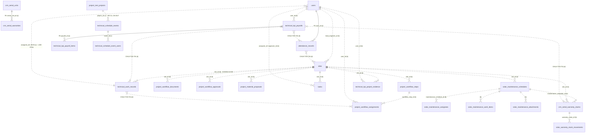

# Khảo sát Công trình — Kỹ thuật — Báo cáo — KPI — Lương kỹ thuật — Bảo trì/Bảo hành — Chấm công

**Ngày khảo sát:** 2026-09-19
**Nhánh:** `audit/p0-security-baseline` (các thay đổi chưa commit trên nhánh này thuộc đợt việc P0 security khác, KHÔNG nằm trong phạm vi báo cáo này và không bị đụng tới).
**Phương pháp:** đọc source tĩnh (routes, controller, model, service, migration, blade, config). Có đọc-only schema DB `egosolar_test` qua PDO (chỉ `SELECT`/`information_schema`). KHÔNG sửa code, KHÔNG chạy migrate/seed, KHÔNG ghi DB, KHÔNG đọc `.env`.
**Lưu ý về DB:** `egosolar_test` là **bản import schema** (315 bảng) chứ không phải DB được dựng bằng migration — bảng `migrations` chỉ có **3 dòng**. Vì vậy schema ở đó phản ánh một bản chụp cũ, **không** phải nguồn chân lý cho production. Mọi kết luận dựa trên DB đều được đánh dấu rõ.
**Quy ước:** Giám đốc và Admin là **cùng một vai trò** (Spatie role `admin`).

---

## 1. Tóm tắt dành cho người không chuyên

Hệ thống đang có **hai thế giới song song** và chúng **gần như không nói chuyện với nhau**:

1. **Công trình** (`/du-an`) — đang chạy tốt, có quy trình 5 giai đoạn, phân công theo bước, hồ sơ, nghiệm thu, tài chính, vật tư. Đây là nơi dữ liệu thật đang nằm.
2. **Kỹ thuật** (`/ky-thuat`) — Tổng quan / Kế hoạch / Báo cáo là **một module rời hoàn toàn**, ghi vào một bảng riêng tên `technical_work_records` mà **không module nào khác ghi vào**. Nó không đọc dữ liệu Công trình, không đọc công việc (tasks), không đọc bảo trì.

Vì vậy trang `/ky-thuat` hiển thị **0 / 0 / 0 / 0** không phải do lỗi kỹ thuật, mà vì **bảng nguồn của nó trống**: chỉ khi có người vào đúng trang `/ky-thuat/ke-hoach` bấm "Lưu kế hoạch" thì con số mới khác 0. Mọi kế hoạch thi công/khảo sát thực tế đang được tạo ở nơi khác (Công trình, Bảo trì, Tasks) nên không bao giờ chảy vào đây.

**KPI kỹ thuật** hiện là **bán tự động**: khung 5 tiêu chí (tiến độ, chất lượng, hao hụt vật tư, HSE, EVN/App) đã được nối một phần với dữ liệu Công trình (tiến độ lấy tự động từ deadline/ngày hoàn thành các bước quy trình), nhưng 4/5 tiêu chí còn lại vẫn cần **người quản lý nhập tay bằng chứng** trên trang "KPI kỹ thuật" của từng công trình. Nhân viên không tự chấm điểm mình — điều này đã đúng với mong muốn.

**Bảo hành CHƯA nối vào KPI** — không có một dòng code nào lấy số liệu bảo hành/bảo trì để cộng/trừ điểm KPI.

**Lương kỹ thuật** có lỗi nghiêm trọng về routing: **hai controller khác nhau** cùng phục vụ URL `/ky-thuat/luong`. Trang danh sách/chi tiết do controller **cũ** render, còn nút Lưu/Cập nhật lại bắn sang controller **mới**. Nghĩa là các tính năng mới (phiếu lương động, snapshot KPI) đang bị "ẩn" sau bản cũ.

**Chấm công** có GPS, nhưng **không được KPI hay Kỹ thuật dùng**, và cũng không gắn với công trình.

---

## 2. Module nào đang hoạt động thật

| Module | Trạng thái | Bằng chứng |
|---|---|---|
| **Công trình hợp nhất `/du-an`** (`projects-unified.*`) | **ĐANG DÙNG THẬT — giữ nguyên** | `routes/project_unified.php:7-11`; sidebar link duy nhất tới `projects-unified.index` (`resources/views/partials/sidebar.blade.php:563-567`) |
| **Quy trình công trình V2** (7 bước) | **ĐANG DÙNG THẬT** | `routes/project_unified.php:27-45`, `app/Http/Controllers/Projects/ProjectWorkflowV2Controller.php` (1003 dòng), bảng `project_workflow_steps/assignments/approvals/documents/events/exceptions` **tồn tại thật trong DB** |
| **Kỹ thuật Tổng quan/Kế hoạch/Báo cáo/Hoàn thiện** (`/ky-thuat*`) | **CÓ CHẠY nhưng là ốc đảo, dữ liệu trống** | `routes/technical.php:24-79` → `app/Http/Controllers/Technical/TechnicalWorkController.php` |
| **Đề xuất đổi hàng BH** (`/ky-thuat/de-xuat-doi-hang-bao-hanh`) | **ĐANG DÙNG THẬT** | `routes/technical.php:37-50` → `TechnicalWarrantyExchangeController` (1039 dòng), bảng `crm_serial_warranty_claims` + `solar_warranty_stock_movements` tồn tại |
| **KPI kỹ thuật (dashboard)** `/ky-thuat/kpis` | **ĐANG DÙNG THẬT** | `routes/technical.php:57-59` → `Synced\TechnicalKpi\TechnicalPayrollController@kpis` |
| **KPI theo công trình** `/ky-thuat/kpis/cong-trinh/{site}` | **ĐANG DÙNG THẬT (nhập tay bằng chứng)** | `routes/technical.php:61-70` → `TechnicalKpi\TechnicalProjectKpiController` |
| **Lương kỹ thuật** `/ky-thuat/luong` | **CHẠY NHƯNG SPLIT-BRAIN 2 controller** | xem mục 9 |
| **Bảo trì/Bảo hành `/du-an/bao-tri-bao-hanh`** (`projects-unified.maintenance.*`) | **ĐANG DÙNG THẬT — bản canonical** | `routes/project_unified.php:68-160`, sidebar:610 |
| **Chấm công `/nhan-su/cham-cong`** | **ĐANG DÙNG THẬT** (có check-in/out + GPS) | `routes/hr.php:339-379`, `app/Http/Controllers/Hr/AttendanceController.php:298,351` |
| **Tasks `/tasks`** | **ĐANG DÙNG THẬT**, có `site_id` nối công trình | `routes/web.php:335-349`; cột `tasks.site_id` tồn tại trong DB |

---

## 3. Module nào là code cũ / bỏ dở / trùng lặp

| Thành phần | Kết luận | Bằng chứng |
|---|---|---|
| `routes/technical_workspace_v151.php`, `_v152.php`, `_v154.php`, `_v155.php` | **CHẾT** — không file nào `require` chúng | `routes/web.php` chỉ require 13 file (dòng 522, 1930, 2831, 2851, 2854, 2866, 2869, 2873, 2874, 2875, 2918, 2922); không có v15x |
| `routes/maintenance_v9.php`, `maintenance_v10.php` | **CHẾT** — không được require | như trên |
| `TechnicalWorkspaceController@exportReport/storeReportSnapshot/reportHistory/showReportSnapshot/exportReportSnapshot` | **KHÔNG THỂ GỌI TỚI** — route duy nhất khai báo chúng nằm ở `routes/technical_workspace_v155.php:16-41` (file chết) | grep toàn repo: chỉ v155 tham chiếu `technical-workspace.reports.export/snapshot/history` |
| Bảng `technical_report_snapshots` | **BẢNG MỒ CÔI** — chỉ `TechnicalWorkspaceController` đọc/ghi, mà endpoint đã chết; bảng **không tồn tại** trong `egosolar_test` | `app/Http/Controllers/Technical/TechnicalWorkspaceController.php:587-640,1178-1191`; migration `2026_08_09_193000` |
| `routes/project_test.php` toàn bộ (`project-test.*`, `sales-projects.*`, `technical-projects.*`) | **ĐÃ KHAI TỬ** — mọi GET bị redirect sang `/du-an`, mọi POST/PUT/DELETE bị trả **409** | `app/Http/Middleware/RetireLegacyProjectModule.php:16-56`; áp dụng ở `routes/project_test.php:11` |
| `config/ego_menu_v4.php`, `config/ego_menu_excel.php` | **CONFIG CHẾT** — không file PHP/Blade nào đọc chúng (chỉ `ego_navigation`, `ego_workspace` được dùng) | grep `ego_menu_v4` trong `app/` + `resources/views/` → 0 kết quả |
| `TechnicalKpi\TechnicalPayrollController` (1080 dòng) | **BẢN CŨ nhưng VẪN ĐANG PHỤC VỤ các URL GET** — xem mục 9 | `routes/web.php:1788-1822` |
| `Technical\SolarMaintenance*` (prefix `/ky-thuat/bao-tri-bao-hanh`) | **BẢN CŨ, vẫn truy cập được bằng URL**, không còn link từ sidebar | `routes/web.php:1828-1854`; sidebar chỉ trỏ `projects-unified.maintenance.index` (sidebar:610) |
| `App\Models\Site` vs `App\Models\Projects\Site` | **TRÙNG BẢNG `sites`**, `$fillable` khác nhau; bản `Projects\Site` là bản dùng cho module hợp nhất | `app/Models/Site.php:22`, `app/Models/Projects/Site.php:14` |
| `resources/views/kythuat/*` vs `resources/views/synced/kythuat/*` | **TRÙNG CẶP** (kpis, kpi_project, luong, luong_show, luong_edit, luong_settings) | cả 2 thư mục tồn tại, nội dung gần như song sinh |
| `TechnicalScheduleSyncService` | **ĐỒNG BỘ ĐÃ ĐỨT** đối với Công trình: chỉ được gọi từ model `ProjectTest\Project`/`Assignment` (đã khai tử) và từ `SolarMaintenanceSchedule` | `app/Models/ProjectTest/Project.php:47,51`; `app/Models/SolarMaintenanceSchedule.php:243,247` |
| Bảng `technical_schedule_events` / `technical_schedule_event_users` | **CHỈ CÒN NGUỒN BẢO TRÌ**; cột `project_id` trỏ `project_test_projects.id` (hệ cũ), **KHÔNG phải `sites.id`** | `database/migrations/2026_08_04_231500_create_technical_schedule_workspace.php:88-110` (backfill từ `project_test_projects`) |
| `app/Notifications`, `app/Jobs`, `app/Events`, `app/Listeners`, `app/Observers` | **KHÔNG TỒN TẠI** (không có thư mục) | `ls app/` |
| `routes/console.php` | **KHÔNG CÓ scheduler/cron nào** (chỉ lệnh `inspire` mặc định) | `routes/console.php` |

---

## 4. Bảng URL → route name → controller → method → model → table → view

### 4.1 Công trình (đang dùng thật)

| URL | Route name | Controller@method | Model | Bảng | View |
|---|---|---|---|---|---|
| `GET /du-an` | `projects-unified.index` | `Projects\UnifiedProjectController@index` | `Projects\Site` | `sites` | `projects-unified/index` |
| `GET /du-an?view=list&mine=1` ("Công trình của tôi") | `projects-unified.index` (cùng route, query `mine=1`) | như trên | `Projects\Site` | `sites` | `projects-unified/index` |
| `GET /du-an/create` | `projects-unified.create` | `@create` | `Projects\Site` | `sites` | `projects-unified/create` |
| `POST /du-an` | `projects-unified.store` | `@store` | `Projects\Site` | `sites` | — |
| `GET /du-an/{site}` (chi tiết) | `projects-unified.show` | `@show` | `Projects\Site` + raw query | `sites`, `tasks`, `material_requests`, `solar_maintenance_schedules`, `project_workflow_*` | `projects-unified/show` |
| **Chỉnh sửa** | **KHÔNG có route `edit`/`update` riêng** — sửa qua các endpoint chuyên biệt (`phase.update`, `engineer.update`, `workflow.data.save`, `finance.*`) | — | — | — | — |
| `POST /du-an/{site}/phan-cong` ("Giao kỹ sư phụ trách") | `projects-unified.engineer.update` | `@assignEngineer` | `Projects\Site` | `sites.lead_engineer_id` | — |
| `POST /du-an/{site}/quy-trinh/{step}/phan-cong` (giao việc theo bước) | `projects-unified.workflow.assign` | `ProjectWorkflowV2Controller@assign` | — (raw) | `project_workflow_assignments` | `projects-unified/partials/workflow-v2` |
| **Nút "Giao việc"** (header trang chi tiết) | `tasks.create` (?!) | `System\...TaskController@create` (route `web.php:337`) | `Tasks\Task` | `tasks` | `tasks/create` |
| **Nút "KPI kỹ thuật"** | `ky-thuat.kpis.project` | `TechnicalKpi\TechnicalProjectKpiController@show` | `Projects\Site` + raw | `technical_kpi_project_evidence` | `kythuat/kpi_project` |
| `GET /du-an/{site}?tab=documents` (Hồ sơ) | `projects-unified.show` | `@show` | — | `project_workflow_documents` | partial trong `show` |
| `POST /du-an/{site}/quy-trinh/{step}/ho-so` | `projects-unified.workflow.documents.upload` | `ProjectWorkflowV2Controller@uploadDocument` | — | `project_workflow_documents` | — |
| **Lịch sử** | không có route riêng | ghi qua `ProjectWorkflowV2Service::recordEvent` | `project_workflow_events`, `project_unified_histories` | — |
| `POST /du-an/{site}/tai-chinh/*` (Tài chính công trình) | `projects-unified.finance.{admin.update,term.store,payment.store,payment.update,expense.store,expense.update}` | `UnifiedProjectController` | — | `site_payment_terms`, `payments`, `receipts` | partial finance |
| `POST /du-an/{site}/vat-tu/de-xuat*` (Vật tư công trình) | `projects-unified.materials.proposal.*` | `UnifiedProjectController` + `ProjectWorkflowV2Controller` | — | `project_material_proposals`, `material_requests` | partial materials |
| `GET /cong-trinh`, `/cong-trinh/{project}`, `/sales/cong-trinh`, `/ky-thuat/cong-trinh/*` | `project-test.*`, `sales-projects.*`, `technical-projects.*` | **bị chặn bởi `RetireLegacyProjectModule`** → GET redirect sang `/du-an`, POST → 409 | `ProjectTest\Project` | `project_test_projects` | `projects-unified/legacy-retired` |

### 4.2 Kỹ thuật

| URL | Route name | Controller@method | Model | Bảng | View |
|---|---|---|---|---|---|
| `GET /ky-thuat` | `ky-thuat.tong-quan` | `Technical\TechnicalWorkController@overview` | **không có model** (raw) | `technical_work_records` | `technical/work/index` (`mode=overview`) |
| `GET /ky-thuat/ke-hoach` | `ky-thuat.ke-hoach` | `@plan` | — | `technical_work_records` | cùng view, `mode=plan` |
| `POST /ky-thuat/ke-hoach` | `ky-thuat.ke-hoach.store` | `@storePlan` | — | `technical_work_records` (INSERT) | — |
| `GET /ky-thuat/bao-cao` | `ky-thuat.bao-cao` | `@reports` | — | `technical_work_records` | cùng view, `mode=report` |
| `POST /ky-thuat/bao-cao/{record}` | `ky-thuat.bao-cao.save` | `@saveReport` | — | `technical_work_records` (UPDATE) | — |
| `GET /ky-thuat/hoan-thien` | `ky-thuat.hoan-thien` | `@completion` | — | `technical_work_records` | cùng view, `mode=completion` |
| `POST /ky-thuat/hoan-thien/{record}` | `ky-thuat.hoan-thien.save` | `@saveCompletion` | — | `technical_work_records` | — |
| `GET /ky-thuat/kpis` | `ky-thuat.kpis.index` | `Synced\TechnicalKpi\TechnicalPayrollController@kpis` | — (raw) | `technical_kpi_payrolls`, `technical_kpi_payroll_items`, `technical_payroll_kpi_items`, `technical_kpi_settings` | `synced/kythuat/kpis` |
| `GET /ky-thuat/kpis/cong-trinh/{site}` | `ky-thuat.kpis.project` | `TechnicalKpi\TechnicalProjectKpiController@show` | `Projects\Site` | `technical_kpi_project_evidence` | `kythuat/kpi_project` |
| `POST /ky-thuat/kpis/cong-trinh/{site}` | `ky-thuat.kpis.project.save` | `@save` | — | `technical_kpi_project_evidence` | — |
| `GET /ky-thuat/de-xuat-doi-hang-bao-hanh` | `ky-thuat.warranty-exchange.index` | `Technical\TechnicalWarrantyExchangeController@index` | `SolarWarrantyClaim` | `crm_serial_warranty_claims` | `technical/warranty-exchange/index` |
| `POST /ky-thuat/de-xuat-doi-hang-bao-hanh` | `...warranty-exchange.store` | `@store` | `SolarWarrantyClaim`, `SolarWarrantyStockMovement` | `crm_serial_warranty_claims`, `solar_warranty_stock_movements` | — |
| `GET /ky-thuat/workspace-cu` | `technical-workspace.overview` | `Technical\TechnicalWorkspaceController@overview` | `TechnicalScheduleEvent` | `technical_schedule_events`(+users) | `technical/workspace/*` |
| `/ky-thuat/dieu-hanh/*`, `/ky-thuat/cong-trinh/*`, `/ky-thuat/ho-so/*`, `/ky-thuat/bao-tri-bao-hanh/*` (workspace) | `technical-workspace.*` | `TechnicalWorkspaceController` | — | nhiều | `technical/workspace/*` |

### 4.3 Lương kỹ thuật (xem mục 9 — có xung đột)

| URL | Route name | Controller thực thi (URL match) | Route name trỏ tới | View |
|---|---|---|---|---|
| `GET /ky-thuat/luong` | `ky-thuat.luong.index` | **`TechnicalKpi\TechnicalPayrollController@index`** (web.php:1793, đăng ký trước) | bản Synced (technical.php:104) | `kythuat/luong` |
| `POST /ky-thuat/luong/luu` | `ky-thuat.luong.store` (bản cũ) | `TechnicalKpi\...@store` | — | — |
| `POST /ky-thuat/luong` | `ky-thuat.luong.store` (**tên thắng**) | `Synced\TechnicalKpi\...@store` | ✅ | — |
| `GET /ky-thuat/luong/settings` | `ky-thuat.luong.settings` | **bản cũ** (web.php:1799) | bản Synced | `kythuat/luong_settings` |
| `POST /ky-thuat/luong/settings` | `ky-thuat.luong.settings.save` | **bản cũ** (web.php:1802) | bản Synced | — |
| `GET /ky-thuat/luong/{id}` | `ky-thuat.luong.show` | **bản cũ** (web.php:1805) | bản Synced | `kythuat/luong_show` (không có phiếu lương động) |
| `GET /ky-thuat/luong/{id}/edit` | `ky-thuat.luong.edit` | **bản cũ** (web.php:1809) | bản Synced | `kythuat/luong_edit` |
| `POST /ky-thuat/luong/{id}/update` | `ky-thuat.luong.update` (cũ) | bản cũ | — | — |
| `PUT /ky-thuat/luong/{id}` | `ky-thuat.luong.update` (**tên thắng**) | `Synced\...@update` | ✅ | — |
| `POST /ky-thuat/luong/{id}/approve` | `ky-thuat.luong.approve` | **bản cũ** (web.php:1817, cùng URI) | bản Synced | — |
| `/ky-thuat/luong/slip-settings*`, `/{id}/slip-values` | `ky-thuat.luong.slip-*` | **chỉ Synced** (technical.php:118-135) | ✅ | `synced/kythuat/luong_slip_settings` |
| `POST /ky-thuat/luong/settings/kpi-items` | `ky-thuat.luong.settings.kpi-items` | **bản cũ** (web.php:1939, cùng URI, đăng ký trước) | bản Synced (technical.php:154) | — |

### 4.4 Bảo trì / Bảo hành

| URL | Route name | Controller | Bảng | View |
|---|---|---|---|---|
| `GET /du-an/bao-tri-bao-hanh` ✅ canonical | `projects-unified.maintenance.index` | `Synced\Technical\SolarMaintenanceController@index` | `solar_maintenance_schedules` | `synced/technical/maintenance/*` |
| `GET /du-an/bao-tri-bao-hanh/{schedule}` | `projects-unified.maintenance.show` | `Synced\Technical\SolarMaintenanceDetailController@show` | + `solar_maintenance_work_items/comments/attachments/approvals/status_histories/assignees/audit_logs` | — |
| `POST .../gui-duyet|phe-duyet|hoan-thanh|yeu-cau-chinh-sua|tu-choi|mo-lai` | `projects-unified.maintenance.approval.*` | `Synced\Technical\SolarMaintenanceApprovalController` | `solar_maintenance_approvals` | — |
| `POST .../phan-cong/duyet`, `.../phan-cong/nhan-viec` | `...assignment.approve/accept` | `Synced\Technical\SolarMaintenanceController` | `solar_maintenance_assignees` | — |
| `POST .../phieu-bao-hanh` | `...claims.store` | `Technical\SolarWarrantyClaimController` | `crm_serial_warranty_claims` | — |
| `POST .../kho-bao-hanh` | `...stock.store` | `Technical\SolarWarrantyStockController` | `solar_warranty_stock_movements` | — |
| `GET /ky-thuat/bao-tri-bao-hanh` ⚠️ bản cũ song song | `ky-thuat.maintenance.index` | `Technical\SolarMaintenanceController@index` | **cùng bảng** `solar_maintenance_schedules` | `technical/maintenance/*` |

### 4.5 Chấm công

| URL | Route name | Controller | Bảng |
|---|---|---|---|
| `GET /nhan-su/cham-cong` | `hr.attendance.index` | `Hr\AttendanceController@index` | `attendance_records` |
| `GET /nhan-su/cham-cong-cua-toi` | `hr.attendance.my` | `@myAttendance` | `attendance_records` |
| `POST /nhan-su/cham-cong/check-in` | (hr.php:376) | `@checkIn` | `attendance_records` (GPS: `check_in_lat/lng/address`) |
| `POST /nhan-su/cham-cong/check-out` | (hr.php:379) | `@checkOut` | `attendance_records` |
| `/nhan-su/cham-cong/yeu-cau-sua*` | `hr.attendance-corrections.*` | `Hr\AttendanceCorrectionController` | `attendance_correction_requests` (+attachments) |

---

## 5. Luồng Công trình hiện tại

**Model gốc:** `App\Models\Projects\Site` → bảng **`sites`**, PK `id` (`app/Models/Projects/Site.php:14`).

Các trường quan trọng (`app/Models/Projects/Site.php:17-71`, xác nhận có trong DB):
- Mã công trình: `project_code`
- Tên / địa điểm: `name`, `address`, `contact_name`, `contact_phone`
- Người phụ trách: **`lead_engineer_id`** (→ `users.id`, quan hệ `leadEngineer()` dòng 150) và `sales_user_id`, `created_by`
- Trạng thái: `status`, `project_phase`, `workflow_current_step`, `workflow_status`
- Tiến độ: `progress_percent`, `calculated_progress_percent`, `phase_progress_percent`, `approved_progress_percent`, `progress_override_percent`
- Công suất: `system_kwp`, `system_kw_ac`, `solar_panel_qty`, `solar_panel_wp`, `battery_kwh`
- Ngày: `deployment_started_at`, `target_completion_at`, `completed_at`, `handover_at`, `installed_at`, `warranty_to`, `warranty_started_at`
- Khách hàng: **không có `customer_id`** — chỉ có `contact_name`/`contact_phone` và `sales_order_id`
- Nguồn gốc hệ cũ: `legacy_source`, `legacy_source_id`

⚠️ **Hai model cùng bảng `sites`:** `App\Models\Site` (`app/Models/Site.php:22`) có `$fillable` thiên về báo giá (`quote_*`) và **không** có `lead_engineer_id`, `project_code`, `progress_percent`. `App\Models\Projects\Site` mới là bản dùng cho module hợp nhất. `TechnicalWarrantyExchangeController` dùng `App\Models\Site` (dòng 8) trong khi `TechnicalProjectKpiController` dùng `App\Models\Projects\Site` (dòng 6) — **nguy cơ lệch `$fillable` khi ghi**.

### 5.1 Quy trình 5 giai đoạn + 7 bước

`UnifiedProjectController::phaseWeights()` (`:2560-2564`):
```
init = 10%, design = 20%, prepare = 20%, execute = 50%, om = 0%
```
7 bước workflow V2 (`routes/project_unified.php:29`): `survey, proposal, contract, legal, construction, acceptance, warranty`.

Ánh xạ tới nghiệp vụ được hỏi:
| Bước nghiệp vụ | Tồn tại? | Dữ liệu lưu ở đâu |
|---|---|---|
| Khảo sát & phương án | ✅ | `project_workflow_steps.step_code='survey'/'proposal'` + `project_workflow_documents` |
| Hợp đồng & pháp lý | ✅ | `step_code='contract'/'legal'` |
| Đề xuất vật tư | ✅ | `project_material_proposals` + `material_requests` |
| Thi công | ✅ | `step_code='construction'`, `project_workflow_assignments.progress_percent` |
| Nghiệm thu | ✅ | `step_code='acceptance'`, `project_workflow_approvals` |
| Tài chính công trình | ✅ | `site_payment_terms`, `payments`, `receipts`, `sites.contract_amount*` |

### 5.2 Cách tính % tiến độ (QUAN TRỌNG)

Tính **động từ checklist**, rồi **lưu ngược** vào `sites`:

1. `buildPhaseChecklist()` (`UnifiedProjectController.php:560-712`) dựng danh sách mục kiểm cho giai đoạn hiện tại, mỗi mục `complete = true/false` dựa trên **dữ liệu thật** (có kỹ sư phụ trách, có hồ sơ theo `category`, có task, có đề xuất vật tư, kho đã ghép hàng, có ngày bàn giao…).
2. `percent = round(completed / total * 100)` (`:708`).
3. `calculateProjectProgress()` (`:2596-2624`):
   `calculated = base(giai đoạn trước) + (weight_giai_đoạn × phase_percent / 100)`, kẹp `max(approved, min(100, calculated))`; `om` = 100 cứng.
4. `syncCalculatedProgress()` (`:2626-2645`) **UPDATE thẳng `DB::table('sites')`** ba cột `phase_progress_percent`, `calculated_progress_percent`, `progress_percent`.

**Nơi có thể sai lệch:**
- **Mục `phase_approval` nằm TRONG checklist đếm phần trăm** (`:646-653`, `:706-708`). Khi chưa duyệt, giai đoạn không bao giờ đạt 100% dù mọi việc thật đã xong ⇒ `%` luôn thấp hơn thực tế đúng một mục.
- Mục `engineering_task`/`work_tasks` chỉ cần **tồn tại một task bất kỳ** gắn `site_id` (`$hasAnyTask`, `:585`) — tạo một task rỗng là "hoàn thành" mục này.
- `approved_reports` chỉ kiểm `tasks.status ∈ {approved, completed, done}` (`:586-590`), **không** kiểm báo cáo kỹ thuật (vì báo cáo kỹ thuật nằm ở bảng khác, xem mục 7).
- `progress_override_percent` cho phép ghi đè thủ công (`:2610-2614`), có route `POST /du-an/{site}` (`:1534-1560`) — nhưng **không lưu lý do bắt buộc** và không thấy log riêng.
- `syncCalculatedProgress` ghi bằng query builder, **bỏ qua model events** → không có audit tự động.

### 5.3 Nút "Giao việc" và "KPI kỹ thuật" trên trang Công trình

**"Giao việc"** — `resources/views/projects-unified/show.blade.php:72`:
```blade
<a href="{{ route('tasks.create', ['site_id'=>$site->id, 'title'=>'['.$project['code'].'] '.$project['name']]) }}">Giao việc</a>
```
→ **rời khỏi module Công trình**, sang module Tasks chung (`routes/web.php:337`). Ghi vào bảng `tasks` (có `site_id`, `assignee_id`, `approver_id`, `progress_percent`, `due_at`, `result_note`). **Hoạt động thật, dữ liệu thật.** Nhưng đây là "giao việc chung", **không phải** giao việc kỹ thuật có checklist/trọng số/nghiệm thu.

Ngoài ra trong tab Quy trình có nút **"Giao việc"** thật sự của workflow (`resources/views/projects-unified/partials/workflow-v2.blade.php:333,411,500`) → `projects-unified.workflow.assign` → ghi `project_workflow_assignments` (có `assignment_role`, `progress_percent`, `accepted_at`, `submitted_at`). **Đây mới là cơ chế phân công chuẩn của Công trình.**

**"KPI kỹ thuật"** — `show.blade.php:68-69` và `:185-186`:
```blade
route('ky-thuat.kpis.project', ['site'=>$site->id, 'month'=>now()->format('Y-m')])
```
→ `TechnicalProjectKpiController@show` → view `kythuat/kpi_project`. Hiển thị **KPI của từng NHÂN VIÊN trên công trình này**, không phải KPI của công trình. Danh sách người lấy từ `project_workflow_assignments` + `sites.lead_engineer_id` (`ProjectKpiLinkService::projectUsers()`). Form cho quản lý **nhập tay bằng chứng** (nghiệm thu lần đầu, % hao hụt, HSE, EVN/App, điểm phạt) lưu vào `technical_kpi_project_evidence`. **Có trùng nguồn với KPI ở menu Kỹ thuật** — cả hai cùng đọc bảng này (xem mục 8).

### 5.4 Khuyến nghị

**KHÔNG viết lại module Công trình.** Toàn bộ dữ liệu cần cho KPI tự động (phân công theo bước, deadline `due_at`/`recommitted_due_at`, ngày duyệt `approved_at`, nghiệm thu, hồ sơ) **đã có sẵn** trong `project_workflow_steps` + `project_workflow_assignments`. Việc cần làm là **đọc từ đó**, không tạo bảng mới song song.

---

## 6. Luồng Kỹ thuật hiện tại

### 6.1 `/ky-thuat` lấy dữ liệu từ đâu

```
GET /ky-thuat
 └─ routes/technical.php:29  →  Technical\TechnicalWorkController@overview
     └─ :20-23 → workspace($request,'overview')
         └─ :144-177  DB::table('technical_work_records as r')
                        leftJoin sites s, users c
                        [lọc company] [lọc kỹ thuật viên] [lọc từ khoá]
         └─ :200-205  $kpis = total/planned/reported/completed (đếm trên collection)
         └─ :194      view('technical.work.index')
                        → resources/views/technical/work/index.blade.php:71
                          "Tổng công việc / Đã lên kế hoạch / Đã báo cáo / Đã hoàn thiện"
```

### 6.2 Các mục trong menu Kỹ thuật (`resources/views/partials/sidebar.blade.php:597-603`)

| Mục | Route | Controller | Bảng | Dùng thật? |
|---|---|---|---|---|
| Tổng quan | `ky-thuat.tong-quan` | `TechnicalWorkController@overview` | `technical_work_records` | Có code, **dữ liệu trống** |
| Kế hoạch | `ky-thuat.ke-hoach` | `@plan`/`@storePlan` | `technical_work_records` | Có, là **nguồn ghi duy nhất** |
| Đề xuất đổi hàng BH | `ky-thuat.warranty-exchange.index` | `TechnicalWarrantyExchangeController` | `crm_serial_warranty_claims` | **Dùng thật, đầy đủ** |
| Báo cáo | `ky-thuat.bao-cao` | `@reports`/`@saveReport` | `technical_work_records` | Có, phụ thuộc Kế hoạch |
| KPIs | `ky-thuat.kpis.index` | `Synced\TechnicalKpi\...@kpis` | `technical_kpi_payrolls*` | **Dùng thật** |

Mục **"Hoàn thiện"** (`ky-thuat.hoan-thien`) còn route nhưng **đã bị gỡ khỏi menu** (ghi chú `routes/technical.php:72`).

### 6.3 Kế hoạch kỹ thuật hiện tại — đối chiếu yêu cầu

| Yêu cầu | Hiện trạng | Bằng chứng |
|---|---|---|
| Ai tạo | Bất kỳ ai qua được `authorizeAccess()` = kỹ thuật viên hoặc BGĐ. **Không phân biệt trưởng phòng** | `TechnicalWorkController.php:209-213` |
| Tạo cho ai | `assignee_ids` — **mảng JSON trong 1 cột `longText`**, không bảng nối, không FK | `:71`, migration `:25` |
| Liên kết công trình | ✅ `site_id` → `sites.id` (validate `exists:sites,id`) nhưng **KHÔNG có FK** | `:46,63` |
| Lịch ngày/tuần/tháng | ❌ chỉ có **một cột `work_date`** (kiểu `date`), không có giờ bắt đầu/kết thúc, không có view lịch | migration `:19` |
| Hạn hoàn thành | ⚠️ có `due_date` nhưng **chỉ được ghi ở bước Hoàn thiện**, không nhập khi lập kế hoạch | `:129` vs `:62-76` |
| Nhiều người thực hiện | ⚠️ có (JSON) nhưng **không dùng `technical_schedule_event_users`** | — |
| Checklist | ❌ **không tồn tại** | — |
| Trọng số / loại công việc | ⚠️ chỉ có `work_type` (string tự do, max 100) và `priority` (low/normal/high/urgent). **Không có trọng số** | `:47-48` |
| Trạng thái | ✅ `planned → reported → completed` | `:72,102,132` |
| Nghiệm thu / duyệt | ❌ **không có bước duyệt** — chính người báo cáo tự chuyển sang `completed` | `:109-138` (không kiểm role) |
| Thông báo | ❌ **không có** (không có `app/Notifications`, không ghi `task_notifications`) | — |

### 6.4 Phân quyền Kỹ thuật

| Ai | Được gì | Bằng chứng |
|---|---|---|
| Truy cập trang `/ky-thuat*` | `EnforcePageAccess` toàn cục kiểm permission `page.technical` (`config/role_permissions.php:123-130`: routes `ky-thuat.*`, prefix `/ky-thuat`) |
| Vào Tổng quan/Kế hoạch/Báo cáo | `authorizeAccess()`: `isTechnician()` **hoặc** `isExecutive()` | `TechnicalWorkController.php:209-213`, `SolarMaintenanceAccess.php:88-102,64-72` |
| **Kỹ thuật viên chỉ xem việc của mình?** | ✅ `isTechnicianOnly()` → lọc `created_by = me` hoặc `assignee_ids LIKE '%…%'` | `:155-165` |
| **Tạo kế hoạch** | ⚠️ **mọi kỹ thuật viên đều tạo được**, không dùng `canPlan()`/`canAssign()` dù các hàm này đã tồn tại | `:42` chỉ gọi `authorizeAccess` |
| **Duyệt/nghiệm thu** | ❌ **không có** | — |
| **Xoá** | ❌ không có endpoint xoá | — |
| KPI dashboard | `role:ky_thuat\|technical\|technical_manager\|accounting\|admin\|manager\|management` | `routes/technical.php:58` |
| Chấm KPI công trình (`save`) | `role:technical_manager\|admin\|manager\|management` (route) + `hasAnyRole(['admin','manager','management','technical_manager'])` (controller) | `routes/technical.php:68`, `TechnicalProjectKpiController.php:34` |

⚠️ **Lỗi phân quyền đáng chú ý:** trong quy tắc lọc kỹ thuật viên (`:159`) có điều kiện `orWhere('r.assignee_ids','like','%"'.$userId.'"%')` — nhưng `assignee_ids` được ghi là JSON **số nguyên** `[5,7]` (`:71` dùng `intval`), nên mẫu có dấu nháy kép **không bao giờ khớp**. Các mẫu còn lại (`%[5,%`, `%,5,%`, `%,5]%`, `= '[5]'`) vẫn phủ được các trường hợp thường gặp, nhưng đây là lọc bằng chuỗi — dễ sai khi ID có chung tiền tố.

---

## 7. Luồng Báo cáo ngày/tuần/tháng hiện tại

### 7.1 Kết luận theo từng hạng mục

| Hạng mục | Có / Không | Ở đâu |
|---|---|---|
| Báo cáo **ngày** | ⚠️ **Nửa vời**. Có form `POST /ky-thuat/bao-cao/{record}` với `report_date`, nhưng **gắn vào một bản ghi kế hoạch**, không phải nhật ký theo ngày. Một kế hoạch chỉ có **một** báo cáo (UPDATE đè lên, `TechnicalWorkController.php:96-104`) | `technical_work_records.report_*` |
| Báo cáo **tuần** | ❌ **KHÔNG TỒN TẠI** | — |
| Báo cáo **tháng** | ❌ **KHÔNG TỒN TẠI** | — |
| Công thức tổng hợp tuần/tháng từ ngày | ❌ **KHÔNG TỒN TẠI** | — |
| Theo **công trình** | ✅ qua `site_id` | `:63` |
| Theo **nhân viên** | ⚠️ qua `created_by` + `assignee_ids` (JSON) | `:64,71` |
| **Ảnh/file minh chứng** | ✅ `plan_files`, `report_files`, `completion_files` (JSON, upload lên disk **`public`**) | `:257-272` |
| **Vật tư đã dùng** | ❌ **KHÔNG có trường nào** | migration |
| **% tiến độ** | ❌ **KHÔNG có trường nào trong báo cáo kỹ thuật** | migration |
| **Vấn đề phát sinh** | ⚠️ chỉ có text tự do `report_note` / `technical_note` | `:52,100` |
| **Kế hoạch tiếp theo** | ⚠️ có `remaining_work` + `due_date` ở bước Hoàn thiện | `:127,129` |
| **Người duyệt & trạng thái duyệt** | ❌ **KHÔNG CÓ** — không có cột `approved_by`/`approved_at`, không có endpoint duyệt | migration `:15-39` |
| **Lịch sử chỉnh sửa** | ❌ **KHÔNG CÓ** — `saveReport` UPDATE đè, không ghi log | `:96-104` |

### 7.2 Validation & permission của báo cáo

`TechnicalWorkController@saveReport` (`:81-107`):
- validate: `report_title` (required, ≤255), `report_date` (required, date), `result_text` (required, ≤30000), `report_note` (nullable), `files.*` (file, ≤50MB) — **không giới hạn `mimes`**.
- permission: chỉ `authorizeAccess()` (bất kỳ kỹ thuật viên) + `assertSiteInScope()` theo company. **Một kỹ thuật viên có thể ghi đè báo cáo của người khác** nếu biết `{record}` và cùng company — hàm `findRecord()` (`:224-232`) **không kiểm `created_by`/`assignee_ids`**.

### 7.3 "Báo cáo kỹ thuật" của Workspace

`TechnicalWorkspaceController@report`, `dailyReport`, `projectProgressReport`, `performanceReport`… (`routes/technical_workspace.php:34,70-76,80`) là **báo cáo tổng hợp chỉ-đọc** dựng từ `technical_schedule_events` + `solar_maintenance_schedules` + `attendance_records` — **không phải** nơi kỹ thuật viên nhập báo cáo. Phần lưu lịch sử báo cáo (`technical_report_snapshots`) **không gọi tới được** vì route nằm ở file chết `technical_workspace_v155.php`.

---

## 8. Luồng KPI hiện tại

### 8.1 Có bao nhiêu hệ thống KPI

| # | Hệ thống | Bảng | Dùng thật? |
|---|---|---|---|
| 1 | **`Synced\TechnicalKpi\TechnicalPayrollController`** — KPI + lương kỹ thuật (bản mới, 1793 dòng) | `technical_kpi_payrolls`, `technical_kpi_payroll_items`, `technical_payroll_kpi_items`, `technical_kpi_settings`, `technical_payroll_slip_fields/values` | ✅ (dashboard + store/update) |
| 2 | **`TechnicalKpi\TechnicalPayrollController`** — bản cũ (1080 dòng) | cùng bảng | ⚠️ vẫn phục vụ các URL GET + approve + settings |
| 3 | **`TechnicalKpi\TechnicalProjectKpiController`** + `ProjectKpiLinkService` — KPI theo công trình | `technical_kpi_project_evidence` | ✅ |
| 4 | `sales_daily_kpis`, `crm_sales_kpi_tiers`, `sales_commissions` — **KPI Sales, khác hoàn toàn**, chỉ nêu để phân biệt | — | ✅ (module khác) |
| 5 | `marketing_kpi_pay_*`, `mkt_*_kpi` — KPI Marketing | — | ✅ (module khác) |
| 6 | `crm_compensation_v2` | **không tồn tại trong `egosolar_test`** | ❓ |
| 7 | `payroll_slip_settings/components/component_values` (payroll chung) vs `technical_payroll_slip_fields/values` (kỹ thuật) | **2 hệ phiếu lương song song** | cả hai tồn tại |

### 8.2 KPI nhập tay hay tự động — câu trả lời chính xác

**Bán tự động.** Cơ chế ở `Synced\TechnicalKpi\TechnicalPayrollController::calculate()` (`:652-783`):

```php
:664  $projectMetrics = ProjectKpiLinkService::metricsForUserMonth($employee->id, $payroll_month);
:701  if ($sourceCode !== 'manual' && $sourceMetric['available']) {
:702      $plan   = $sourceMetric['plan'];      // GHI ĐÈ số nhập tay
:703      $actual = $sourceMetric['actual'];
      }
```

Tức là: **nếu nguồn Công trình có dữ liệu thì số tự động thắng số nhập tay**. Nhân viên không có endpoint nào tự chấm điểm mình — **đúng với yêu cầu nghiệp vụ**.

Mức độ tự động thực tế của từng nguồn (`ProjectKpiLinkService::metricsForUserMonth`, `:183-260`):

| Nguồn | Tự động hay nhập tay | Chi tiết |
|---|---|---|
| `project_timeline` (Tiến độ) | ✅ **HOÀN TOÀN TỰ ĐỘNG** | `plan` = số công trình có deadline rơi trong tháng; `actual` = số đúng hạn. Deadline = `project_workflow_steps.recommitted_due_at ?? due_at ?? sites.target_completion_at`; hoàn thành = `acceptance.approved_at ?? submitted_at ?? sites.completed_at ?? handover_at` (`:297-303`) |
| `project_quality` (Nghiệm thu lần đầu) | ❌ **NHẬP TAY** | đọc `technical_kpi_project_evidence.quality_first_pass` |
| `project_material_waste` (Hao hụt vật tư) | ❌ **NHẬP TAY** | `evidence.material_waste_percent`, lấy **trung bình** |
| `project_hse` | ❌ **NHẬP TAY** | `evidence.hse_pass` |
| `project_evn_app` | ❌ **NHẬP TAY** | `evidence.evn_app_required/completed`; có xử lý N/A khéo (`:238-241`: nếu cả kỳ không công trình nào yêu cầu → plan=actual=1, không trừ) |
| Điểm phạt | ❌ **NHẬP TAY** | `evidence.penalty_points` |

### 8.3 Công thức, trọng số, thang điểm

**Bộ 5 tiêu chí mặc định** (`Synced\...:353-424`) — ghi đè được bằng `technical_payroll_kpi_items`:

| # | Tiêu chí | Trọng số | Loại tính | Nguồn |
|---|---|---|---|---|
| 1 | Tiến độ hoàn thành lắp đặt | **30%** | `actual_div_plan` | `project_timeline` |
| 2 | Chất lượng thi công & thẩm mỹ | **25%** | `actual_div_plan` | `project_quality` |
| 3 | Khảo sát kỹ thuật & khối lượng | **15%** | `material_waste` | `project_material_waste` |
| 4 | An toàn lao động (HSE) | **15%** | `actual_div_plan` | `project_hse` |
| 5 | Hỗ trợ EVN & cài App | **15%** | `actual_div_plan` | `project_evn_app` |

**Công thức từng loại** (`calculateRate`, `:581-647`):
- `actual_div_plan` = `min(1, actual/plan)`; **`plan == 0 → trả 0`** ⚠️ (xem mục 17)
- `plan_div_actual` = `plan/actual` (0 nếu `actual==0`)
- `material_waste`: `0% → 1.20`; `≤2% → 1.00`; `≤4% → 0.85`; `≤6% → 0.70`; `>6% → 0`
- `minus_quality` / `minus_safety` / `minus_equipment` = `max(0, 1 − penalty × actual)`
- `success_project` = `min(kpi_max_rate, actual × success_project_bonus)`
- `customer_feedback` = `clamp(0, kpi_max, 1 + good×bonus − bad×penalty)`
- `ot_rule`: `actual==0 → 1`; `plan==0 → max(0, 1 − actual×0.02)`; ngược lại `plan/actual`

**Tổng hợp** (`:751-757`):
```
score_i        = rate_i × weight_i
totalKpiPercent= Σscore / Σweight
totalKpiPercent= min(kpi_max_rate (mặc định 1.3), totalKpiPercent)
totalKpiPercent= max(0, totalKpiPercent − penaltyPoints/100)
```
Trọng số **bắt buộc tổng = 100%**, nếu không sẽ chặn bằng `ValidationException` (`assertValidKpiTemplate`, `:492-506`) — thiết kế tốt.

**Điểm phạt chống cộng trùng** (`:668-671`):
```php
$penaltyPoints = max($manualPenaltyPoints, $projectPenaltyPoints);  // dùng MAX, không CỘNG
```

**Thang xếp loại** (`:721-727`): `rate ≥ 1` → "Đạt"; `≥ 0.9` → "Gần đạt"; còn lại "Chưa đạt".

### 8.4 Kỳ KPI, trạng thái, lịch sử điều chỉnh

| Câu hỏi | Trả lời |
|---|---|
| Kỳ KPI | **Tháng** (`payroll_month` kiểu `YYYY-MM`). **Không có kỳ ngày/tuần** |
| Trạng thái | `draft` → `approved` (`:1202`, `:1380`) |
| Khóa kỳ | ❌ **KHÔNG CÓ**. `update()` (`:1229-1294`) **không kiểm tra `status`** → phiếu đã `approved` vẫn sửa được và tính lại từ đầu |
| Người được điều chỉnh | Route `role:ky_thuat\|technical\|accounting\|admin\|manager` (`routes/technical.php:100`) ⇒ **một kỹ thuật viên có thể tự tạo, sửa và DUYỆT phiếu KPI/lương của chính mình**. Controller **không** kiểm thêm role nào |
| Lưu lý do điều chỉnh | ❌ chỉ có cột `note` tự do, không bắt buộc |
| Lịch sử điều chỉnh | ❌ **KHÔNG CÓ**. `update()` **XÓA toàn bộ** `technical_kpi_payroll_items` cũ rồi insert lại (`:1279-1288`) |
| Snapshot KPI tại thời điểm chốt | ⚠️ **CÓ MỘT PHẦN**: `payrollKpiTemplate()` (`:512-576`) dựng lại template từ `technical_kpi_payroll_items` đã lưu, nên sửa phiếu cũ **không** bị lệch theo cấu hình KPI mới. Nhưng số liệu nguồn (`plan`/`actual`) vẫn bị **tính lại từ `ProjectKpiLinkService`** tại thời điểm sửa (`:701-704`) ⇒ **sửa một phiếu cũ có thể ra kết quả khác** |

### 8.5 Liên kết KPI với các module khác

| Liên kết | Có/Không | Cách nối |
|---|---|---|
| ← Công trình (`sites`) | ✅ | `technical_kpi_project_evidence.site_id` — **chỉ ID, KHÔNG FK** |
| ← Bước quy trình / phân công | ✅ | `ProjectKpiLinkService::projectsForUserMonth()` join `project_workflow_assignments` × `project_workflow_steps` × `sites` — **chỉ ID, KHÔNG FK** |
| ← Kế hoạch kỹ thuật (`technical_work_records`) | ❌ **KHÔNG CÓ** — không dòng code nào |
| ← Báo cáo kỹ thuật | ❌ **KHÔNG CÓ** |
| ← Công việc (`tasks`) | ❌ **KHÔNG CÓ** |
| ← Chấm công (`attendance_records`) | ❌ **KHÔNG CÓ** — grep `attendance` trong `app/Http/Controllers/*TechnicalKpi/` và `app/Services/TechnicalKpi/` → **0 kết quả** |
| ← Nghiệm thu | ✅ gián tiếp qua `step_code='acceptance'` |
| ← Bảo trì / Bảo hành | ❌ **KHÔNG CÓ** (xem mục 10) |
| → Lương kỹ thuật | ✅ **cùng một bảng** `technical_kpi_payrolls` — KPI và lương là **một bản ghi duy nhất** |
| KPI ↔ items | ✅ **FK THẬT DUY NHẤT**: `technical_kpi_payroll_items.payroll_id → technical_kpi_payrolls.id` (xác nhận qua `information_schema` trên `egosolar_test`) |

### 8.6 Nút "KPI kỹ thuật" trong trang Công trình vs KPI ở menu Kỹ thuật

- Trang Công trình → **KPI của từng nhân viên trên công trình đó** trong một tháng; là **nơi NHẬP bằng chứng** (`technical_kpi_project_evidence`).
- Menu Kỹ thuật → **dashboard toàn phòng theo tháng**, đọc `technical_kpi_payrolls` (kết quả đã chấm) + hiển thị thêm `project_count`/`issue_count` lấy từ cùng `ProjectKpiLinkService`.
- **Không trùng chức năng**, nhưng **trùng nguồn dữ liệu** và **trùng view** (`kythuat/kpi_project.blade.php` và `synced/kythuat/kpi_project.blade.php` gần như y hệt; route trỏ tới bản **không**-synced).

---

## 9. Luồng Lương kỹ thuật hiện tại

### 9.1 Phân tích chính xác xung đột route (đã xác minh lại từ thứ tự require thật)

Thứ tự đăng ký:
1. `routes/web.php:1788-1822` — nhóm `ky-thuat/luong` với `TechnicalKpi\TechnicalPayrollController`.
2. `routes/web.php:2875` — `require __DIR__.'/technical.php'`.
3. `routes/technical.php:99-152` — nhóm `ky-thuat/luong` với `Synced\TechnicalKpi\TechnicalPayrollController`.

Cơ chế Laravel:
- **Khớp URL** (`RouteCollection::match`) → chọn route **đăng ký TRƯỚC** ⇒ bản **cũ** thắng khi URI trùng.
- **`route('tên')`** (`RouteCollection::getByName`) → bản **đăng ký SAU** ghi đè tên ⇒ bản **Synced** thắng.

Kết quả thực tế (đã đối chiếu từng URI):

| Chức năng | URI cũ | URI mới | Kết quả |
|---|---|---|---|
| index | `GET /ky-thuat/luong` | `GET /ky-thuat/luong` | **trùng URI → bản CŨ chạy**, view `kythuat/luong` |
| show / edit | `GET /{id}`, `GET /{id}/edit` | y hệt | **bản CŨ chạy** → view `kythuat/luong_show` **không có phiếu lương động** |
| settings (GET+POST) | `/settings` | `/settings` | **bản CŨ chạy** |
| approve | `POST /{id}/approve` | `POST /{id}/approve` | **bản CŨ chạy** |
| settings/kpi-items | `POST /ky-thuat/luong/settings/kpi-items` (web.php:1939) | cùng URI (technical.php:154) | **bản CŨ chạy** |
| **store** | `POST /luu` | **`POST /` (khác URI)** | `route('ky-thuat.luong.store')` trả `/ky-thuat/luong` ⇒ **bản SYNCED chạy** |
| **update** | `POST /{id}/update` | **`PUT /{id}` (khác method)** | `route(...)` + `@method('PUT')` ⇒ **bản SYNCED chạy** |
| slip-settings, slip-values | không có | chỉ Synced | **bản SYNCED chạy** (nhưng vào từ đâu? view `synced/kythuat/luong_show` **không được render**) |

➡️ **Hậu quả thật:** người dùng **xem** bằng controller cũ nhưng **ghi** bằng controller mới. Tính năng mới của bản Synced (phiếu lương cấu hình động `technical_payroll_slip_fields/values`, snapshot template `payrollKpiTemplate`, kiểm tổng trọng số) **chỉ hoạt động một nửa** — nhánh tính toán chạy, nhánh hiển thị không.

### 9.2 Công thức lương

`Synced\...::calculate()` (`:656-763`) — **duy nhất một công thức**, rất đơn giản:

```
baseRate        = settings['base_salary_rate']  (mặc định 0.7)
kpiRate         = settings['kpi_salary_rate']   (mặc định 0.3)
grossSalary     = nhập tay (required|numeric|min:0)

baseSalary      = grossSalary × baseRate
kpiBaseSalary   = grossSalary × kpiRate
realKpiSalary   = kpiBaseSalary × totalKpiPercent
kpiDifference   = realKpiSalary − kpiBaseSalary
totalIncome     = baseSalary + realKpiSalary
```

| Thành phần | Có trong công thức? |
|---|---|
| Lương cơ bản | ✅ (`grossSalary × 0.7`) |
| **Ngày công / chấm công** | ❌ **KHÔNG CÓ** — không đọc `attendance_records` |
| KPI | ✅ (`totalKpiPercent`) |
| Phụ cấp | ❌ không có trong công thức lõi; chỉ có thể thêm thủ công qua `technical_payroll_slip_fields` (mà trang hiển thị lại đang là bản cũ) |
| Thưởng | ⚠️ gián tiếp qua `customer_feedback` bonus và `kpi_max_rate = 1.3` |
| Phạt | ✅ `penalty_points` (trừ vào `totalKpiPercent`) ⚠️ **cột `penalty_points` KHÔNG TỒN TẠI trong `technical_kpi_payrolls` của `egosolar_test`** — `filterColumns()` sẽ **âm thầm bỏ qua** (xem mục 17) |
| Tạm ứng | ❌ không có |
| Bảo hiểm / thuế | ❌ không có |

### 9.3 Khóa kỳ & snapshot

| Câu hỏi | Trả lời |
|---|---|
| Kỳ lương có khóa không | ❌ **KHÔNG**. `update()` không kiểm `status`; `destroy()` xóa cứng không kiểm gì (`:1396-1409`) |
| KPI sau khóa có làm đổi kỳ lương cũ không | ⚠️ **CÓ THỂ**: giá trị đã lưu trong `technical_kpi_payrolls` là tĩnh, nhưng chỉ cần bấm "Cập nhật" một phiếu cũ là **toàn bộ `plan`/`actual` được tính lại** theo dữ liệu Công trình **hiện tại** (`:701-704`) |
| Snapshot KPI tại thời điểm chốt lương | ⚠️ **một nửa**: snapshot **cấu trúc** tiêu chí (tên/trọng số/loại) ✅ nhưng **không snapshot nguồn dữ liệu** ❌ |
| Lịch sử sửa lương | ❌ **KHÔNG CÓ** bảng log nào; `update()` xóa-và-ghi-lại items |

---

## 10. Luồng Bảo trì / Bảo hành hiện tại

### 10.1 Hệ nào đang dùng thật

**Canonical = `projects-unified.maintenance.*`** (`routes/project_unified.php:68-160`, controller `Synced\Technical\SolarMaintenance*`), vì đó là link duy nhất trong sidebar (`sidebar.blade.php:610`).
**Song song còn sống:** `ky-thuat.maintenance.*` (`routes/web.php:1828-1854`, controller `Technical\SolarMaintenance*`) — **cùng ghi vào `solar_maintenance_schedules`**, khác URL, khác tên route ⇒ **không xung đột routing** nhưng **trùng logic nghiệp vụ** và khác tập tính năng (bản `/ky-thuat/...` thiếu `work-items`, `comments`, `assignment.accept`, `approval.complete`).

### 10.2 Quy trình hiện tại — từng bước

| Bước | Có? | Ở đâu |
|---|---|---|
| Tiếp nhận yêu cầu | ✅ | `POST /du-an/bao-tri-bao-hanh` → `solar_maintenance_schedules` (`schedule_code`, `issue_note`) |
| Phân loại bảo trì / bảo hành | ✅ | cột `type` + `incident_kind` trên `solar_maintenance_schedules`; và `crm_serial_warranty_claims.claim_type` (5 loại: `warranty`, `replacement`, `incident`, `paid_repair`, `inspection` — `SolarWarrantyClaim.php:45-51`) |
| Liên kết công trình | ✅ | `solar_maintenance_schedules.site_id` (**chỉ ID, không FK**) |
| Liên kết khách hàng | ⚠️ chỉ `customer_name` (chuỗi) trên lịch; `crm_serial_warranty_claims.customer_id` có nhưng **không FK** |
| Liên kết sản phẩm/serial | ✅ | `crm_serial_warranty_claims.serial_unit_id`; `crm_serial_warranties.serial_unit_id → crm_serial_units.id` (**FK THẬT**) |
| Phân công kỹ thuật viên | ✅ | `solar_maintenance_assignees` + `assigned_to` + `assigned_user_ids` (JSON) — **3 cơ chế song song trên cùng một bảng** |
| Duyệt phân công / nhận việc | ✅ (chỉ bản Synced) | `assignment.approve`, `assignment.accept` |
| Lên lịch | ✅ | `scheduled_date`, `scheduled_start_at`, `scheduled_end_at`, `round_no`/`total_rounds` |
| **Check-in / bắt đầu xử lý** | ⚠️ **có `started_at`** trên lịch; có `check_in_at`/`check_out_at` trên `technical_schedule_event_users` nhưng **bảng đó không tồn tại trong `egosolar_test`** và chỉ được ghi bởi migration backfill |
| Báo cáo kết quả | ✅ | `result_note`, `completion_state`, `completion_actual_cost`, `solar_maintenance_work_items` |
| Ảnh trước/sau | ✅ | `solar_maintenance_attachments` (+ `solar_site_documents`) |
| Vật tư thay thế | ⚠️ có `incident_material_note` (text) + `solar_warranty_stock_movements` (có `product_id`, `serial_unit_id`, `quantity`) — **nhưng 2 nơi, không thống nhất** |
| Đổi hàng bảo hành | ✅ | xem mục 11 |
| Nghiệm thu | ⚠️ có `approval.complete` + `approved_by/at`, nhưng **không có biên bản nghiệm thu khách hàng** trên lịch bảo trì (có `customer_confirmed_at` trên claim) |
| Đóng yêu cầu | ✅ | `status`, `completed_at`, `closed_at` (claim) |

### 10.3 Các trường được hỏi — có/không (tên cột thật, xác nhận từ `information_schema`)

| Trường nghiệp vụ | Tồn tại? | Cột |
|---|---|---|
| Mã yêu cầu | ✅ | `solar_maintenance_schedules.schedule_code`; `crm_serial_warranty_claims.claim_code` |
| Công trình | ✅ | `site_id` (cả 2 bảng) |
| Người báo lỗi | ⚠️ chỉ `created_by` (người nhập hệ thống), **không có "khách báo lỗi"** |
| Kỹ thuật viên xử lý | ✅ | `assigned_to` / `assigned_user_ids` / `solar_maintenance_assignees.user_id`; `claims.assigned_to` |
| Nguyên nhân lỗi | ⚠️ text tự do: `diagnosis`, `execution_fault_note`, `incident_replacement_reason` |
| **Loại lỗi (thiết bị / thi công / sử dụng)** | ❌ **KHÔNG CÓ trường phân loại chuẩn**. Gần nhất: `incident_kind` và `claim_type` — nhưng đây là loại *yêu cầu*, không phải *nguyên nhân* |
| **Trách nhiệm thuộc ai** | ❌ **KHÔNG CÓ**. Gần nhất: `crm_serial_warranty_claims.is_chargeable` (boolean: có tính phí khách không) — **không phải** quy trách nhiệm cho kỹ thuật/NSX/khách |
| Thời gian phản hồi | ⚠️ suy ra được: `received_at` → `submitted_at`/`started_at`. **Không có cột SLA** |
| Thời gian hoàn thành | ✅ | `completed_at`, `resolved_at`, `closed_at` |
| **Tái bảo hành / làm lại** | ⚠️ gián tiếp: `reopened_at`, `reopened_by`, `round_no`/`round_group` trên lịch; chuyển trạng thái `completed → replacing` được phép (`TRANSITIONS`, `SolarWarrantyClaim.php:85`). **Không có cột `is_rework`/`parent_claim_id`** |
| Chi phí | ✅ | `estimated_cost`, `actual_cost`, `cost` (claim); `external_labor_estimated_cost`, `incident_estimated_cost`, `completion_actual_cost` (lịch) |
| Vật tư | ⚠️ | `solar_warranty_stock_movements` / `incident_material_note` |
| Kết quả nghiệm thu | ⚠️ | `customer_confirmed_at`, `approval_status`, `result_note` — **không có điểm/đánh giá** |

### 10.4 Bảo hành đã ảnh hưởng KPI chưa?

**CHƯA.** Đây là kết luận **xác nhận bằng đọc code**:
- `ProjectKpiLinkService` (toàn bộ file) **không truy vấn** bất kỳ bảng `solar_maintenance_*` hay `crm_serial_warranty_*` nào.
- `Synced\TechnicalKpi\TechnicalPayrollController::calculate()` chỉ lấy `$projectMetrics` từ `ProjectKpiLinkService` + input form.
- Không có `source_code` nào tên `warranty`/`maintenance` trong `ProjectKpiLinkService::sourceOptions()` (`:25-34`).

### 10.5 Dữ liệu hiện có ĐỦ để tính các chỉ số bảo hành chưa?

| Chỉ số mong muốn | Đủ dữ liệu? | Ghi chú |
|---|---|---|
| Số lỗi **thuộc trách nhiệm kỹ thuật** | ❌ **KHÔNG ĐỦ** — thiếu cột quy trách nhiệm. `is_chargeable` chỉ nói về tính phí khách |
| Số lần làm lại | ⚠️ **gần đủ** — đếm `reopened_at IS NOT NULL` hoặc `round_no > 1`; nhưng `round_no` cũng dùng cho bảo trì định kỳ nhiều đợt ⇒ **dễ đếm nhầm** |
| Thời gian phản hồi | ⚠️ tính được `received_at → started_at/submitted_at`, nhưng `received_at` là kiểu `date` (không có giờ) ⇒ **độ phân giải chỉ tới ngày** |
| Thời gian xử lý | ✅ `started_at → completed_at` (cả hai là `datetime`) |
| Tỷ lệ đúng SLA | ❌ **KHÔNG CÓ chuẩn SLA nào trong source hay config** |
| Tỷ lệ tái lỗi | ⚠️ tính được theo `serial_unit_id` hoặc `site_id` lặp lại, nhưng **không có liên kết cha-con giữa các claim** |

---

## 11. Luồng Đổi hàng bảo hành hiện tại

`Technical\TechnicalWarrantyExchangeController` (1039 dòng), routes `routes/technical.php:37-50`.

| Câu hỏi | Trả lời |
|---|---|
| Bảng / model | `SolarWarrantyClaim` → **`crm_serial_warranty_claims`**; `SolarWarrantyStockMovement` → **`solar_warranty_stock_movements`**; minh chứng → `solar_warranty_claim_attachments` (migration `2026_09_12_004500`) |
| Có liên kết yêu cầu bảo hành không | ✅ `crm_serial_warranty_claims.maintenance_schedule_id` (→ `solar_maintenance_schedules.id`, **chỉ ID, KHÔNG FK**) và `site_id` |
| Quy trình duyệt | ✅ 12 trạng thái + bảng chuyển trạng thái hợp lệ `TRANSITIONS` (`SolarWarrantyClaim.php:74-87`) — **thiết kế tốt nhất trong toàn bộ phạm vi audit này**. Có `submitted_by/at`, `approved_by/at`, `approval_note` |
| Có cập nhật kho không | ⚠️ **có bảng nhưng KHÔNG nối tự động vào tồn kho chính**: `solar_warranty_stock_movements` ghi `warehouse_id`, `product_id`, `serial_unit_id`, `quantity`, `movement_type`, `status` — nhưng đây là **sổ riêng**, không thấy ghi vào `crm_stock_movements`/`crm_product_stock` |
| Có cập nhật công nợ không | ❌ **KHÔNG** — có `is_chargeable`, `cost`, `estimated_cost`, `actual_cost` nhưng **không đẩy sang `crm_customer_debts`** |
| Phân quyền | `SolarMaintenanceAccess::canCreateWarrantyClaim()` (manager / technician / cskh / permission `maintenance.claim.create`) và `canHandleWarrantyStock()` |
| FK thật | ✅ **`crm_serial_warranties.serial_unit_id → crm_serial_units.id`** (xác nhận `information_schema`). Các liên kết khác của claim đều **không** có FK |

---

## 12. Luồng Chấm công / Check-in hiện tại

| Câu hỏi | Trả lời | Bằng chứng |
|---|---|---|
| Kỹ thuật viên có check-in **theo công trình** không | ❌ **KHÔNG**. `attendance_records` **không có `site_id`/`project_id`** — chỉ có `user_id`, `work_date`, và unique `(user_id, work_date)` | cột thật: `id, user_id, work_date, check_in_at, check_out_at, late_minutes, early_leave_minutes, work_minutes, status, note, check_in_lat, check_in_lng, check_in_address, check_out_lat, check_out_lng, check_out_address` |
| GPS | ✅ **ĐÃ CÓ SẴN** `check_in_lat/lng/address`, `check_out_lat/lng/address` | như trên |
| Thời gian | ✅ `check_in_at`, `check_out_at`, `late_minutes`, `early_leave_minutes`, `work_minutes` |
| Ảnh check-in | ❌ **KHÔNG CÓ** cột ảnh trên `attendance_records` |
| Kế hoạch kỹ thuật liên kết chấm công | ❌ **KHÔNG** — `technical_work_records` không có cột nào trỏ chấm công |
| Báo cáo ngày đối chiếu thời gian làm việc | ❌ **KHÔNG** |
| KPI lấy dữ liệu chấm công | ❌ **KHÔNG** (grep trong 3 file KPI → 0 kết quả) |
| Có check-in riêng cho bảo trì / kế hoạch kỹ thuật? | ⚠️ `technical_schedule_event_users.check_in_at/check_out_at` **có trong migration** nhưng bảng **không tồn tại trong `egosolar_test`**, và không controller nào ghi vào 2 cột này |
| Có check-in khảo sát công trình? | ✅ nhưng **đã khai tử**: `project-test.survey.check-in` (`routes/project_test.php:94`) nằm trong nhóm `RetireLegacyProjectModule` → trả 409 |

**Khả năng tích hợp GPS (chỉ báo cáo, không đề xuất triển khai):** cơ sở dữ liệu GPS **đã sẵn có** ở `attendance_records`. Để check-in theo công trình cần thêm liên kết `site_id` — hiện **chưa tồn tại**.

---

## 13. Sơ đồ dữ liệu và foreign key

**Chú giải:**
- `──FK──▶` (a) **Có foreign key thật** — xác nhận qua `information_schema.KEY_COLUMN_USAGE` trên `egosolar_test`
- `──ID──▶` (b) **Chỉ nối bằng ID, KHÔNG có FK**
- `··CODE··▶` (c) **Quan hệ suy đoán theo code** (join trong query, không có ràng buộc)
- `┄┄X┄┄` (d) **Quan hệ CHƯA TỒN TẠI** (cần xây)

### 13.1 Sơ đồ Mermaid



### 13.2 Bảng tổng hợp mức độ ràng buộc

| Quan hệ | Loại | Ghi chú |
|---|---|---|
| `attendance_records.user_id → users.id` | **(a) FK thật** | |
| `crm_serial_warranties.serial_unit_id → crm_serial_units.id` | **(a) FK thật** | |
| `technical_kpi_payroll_items.payroll_id → technical_kpi_payrolls.id` | **(a) FK thật** | |
| `solar_provinces.region_profile_id → solar_region_profiles.id` | **(a) FK thật** | không liên quan nghiệp vụ này |
| **Toàn bộ liên kết còn lại** (sites ↔ workflow ↔ tasks ↔ maintenance ↔ KPI ↔ warranty) | **(b) chỉ ID** | ⚠️ **Không một FK nào** giữa `sites` và bất kỳ bảng con nào |
| `technical_work_records.assignee_ids → users` | **(c) suy đoán** | JSON array, dò bằng `LIKE` |
| `technical_schedule_events.project_id → project_test_projects.id` | **(c) suy đoán, hệ đã chết** | |
| KPI ← Bảo hành / Chấm công / Báo cáo kỹ thuật | **(d) chưa tồn tại** | |

---

## 14. Vì sao dashboard Kỹ thuật đang hiện toàn số 0

**Đây là câu hỏi quan trọng nhất. Trả lời đầy đủ theo thứ tự nguyên nhân:**

### Nguyên nhân gốc rễ (chắc chắn, xác nhận từ source)

Bốn con số trên trang `/ky-thuat` được tính **chỉ từ một bảng duy nhất**:

`app/Http/Controllers/Technical/TechnicalWorkController.php:200-205`
```php
'kpis' => [
    'total'     => $records->count(),
    'planned'   => $records->where('status','planned')->count(),
    'reported'  => $records->where('status','reported')->count(),
    'completed' => $records->where('status','completed')->count(),
],
```
`$records` chỉ đến từ `DB::table('technical_work_records as r')` (`:145`).

**Grep toàn repo cho `technical_work_records` chỉ ra ĐÚNG 2 nơi ghi dữ liệu:**
- `TechnicalWorkController.php:62` — `INSERT` (chỉ khi bấm "Lưu kế hoạch" trên `/ky-thuat/ke-hoach`)
- `TechnicalWorkController.php:96` và `:126` — `UPDATE` (báo cáo / hoàn thiện, cũng chỉ từ chính trang này)

**Không có** migration seeder, command, job, observer, service hay controller nào khác ghi vào bảng này. Bảng `technical_work_records` là một **ốc đảo tuyệt đối**.

➡️ **Kết luận #1 (chắc chắn):** Trang Tổng quan Kỹ thuật chỉ đếm những bản ghi do **chính trang Kế hoạch Kỹ thuật** tạo ra. Mọi công việc kỹ thuật thực tế đang được tạo ở **ba nơi khác**:
- `project_workflow_assignments` (giao việc theo bước Công trình)
- `tasks` (nút "Giao việc" trên trang Công trình)
- `solar_maintenance_schedules` (lịch bảo trì/bảo hành)

**Không có một dòng code nào** đọc ba nguồn đó vào `technical_work_records`. Đây là **mismatch giữa bảng-ghi và bảng-đọc** điển hình.

### Các nguyên nhân phụ có thể làm về 0 NGAY CẢ KHI bảng có dữ liệu

| # | Nguyên nhân | Code | Ảnh hưởng |
|---|---|---|---|
| 2 | **Lọc theo công ty đang chọn**: nếu `session('active_company_id') > 0` và `sites.company_id` tồn tại, query thêm `WHERE s.company_id = ?`. Do dùng `leftJoin` nên **mọi bản ghi có `site_id` NULL hoặc site thuộc công ty khác đều biến mất** | `:150-153` + `EgoCompanyScope::currentId()` (`app/Support/Synced/EgoCompanyScope.php:9-12`) | **Cao** — đổi công ty ở thanh workspace là danh sách trống |
| 3 | **Lọc theo kỹ thuật viên**: nếu `isTechnicianOnly()` (là kỹ thuật viên nhưng **không** phải manager/admin) → chỉ thấy bản ghi mình tạo hoặc được giao. Mẫu `LIKE '%"5"%'` **không bao giờ khớp** vì JSON lưu số nguyên | `:155-165` vs `:71` | **Trung bình** — kỹ thuật viên có thể không thấy việc được giao |
| 4 | **Bảng chưa được tạo**: nếu `Schema::hasTable('technical_work_records')` false thì `$records = collect()` và trang vẫn hiển thị 0 **mà không báo lỗi** | `:143-144,178` | **Cao nếu chưa chạy migration** `2026_08_18_155500` |
| 5 | Giới hạn `limit(300)` — không gây 0, nhưng làm số đếm **sai** khi dữ liệu > 300 (đếm trên collection đã cắt, không phải `COUNT(*)`) | `:177`, `:201` | **Sai số** |

### Ghi chú: có phải trang nào khác không?

Menu Kỹ thuật trong `config/ego_menu_v4.php:76` trỏ "Tổng quan kỹ thuật" tới `technical-workspace.overview` = `/ky-thuat/workspace-cu`. Nhưng **config đó không được file nào đọc** — menu thật là `resources/views/partials/sidebar.blade.php:598` trỏ `ky-thuat.tong-quan` = `/ky-thuat`. Nhãn 4 ô ("Tổng công việc / Đã lên kế hoạch / Đã báo cáo / Đã hoàn thiện") khớp **chính xác** với `resources/views/technical/work/index.blade.php:71` ⇒ **đúng là trang này**.

### Cần xác nhận từ database production/thật

Nguyên nhân gốc rễ ở trên là **từ source**, không cần DB. Để biết "có dữ liệu thật mà vẫn hiện 0 không", chạy các câu SELECT **chỉ-đọc** sau trên DB thật:

```sql
-- 1) Bảng có tồn tại và có bao nhiêu dòng?
SELECT COUNT(*) AS tong, 
       SUM(status='planned')   AS da_len_ke_hoach,
       SUM(status='reported')  AS da_bao_cao,
       SUM(status='completed') AS da_hoan_thien
FROM technical_work_records;

-- 2) Nếu > 0 mà trang vẫn 0: kiểm tra company scope
SELECT r.id, r.site_id, s.company_id, s.name
FROM technical_work_records r
LEFT JOIN sites s ON s.id = r.site_id
LIMIT 50;

-- 3) So sánh khối lượng việc THẬT đang nằm ở nơi khác
SELECT 'workflow_assignments' AS nguon, COUNT(*) AS so_dong FROM project_workflow_assignments
UNION ALL SELECT 'tasks_co_site', COUNT(*) FROM tasks WHERE site_id IS NOT NULL
UNION ALL SELECT 'maintenance', COUNT(*) FROM solar_maintenance_schedules WHERE deleted_at IS NULL
UNION ALL SELECT 'technical_work_records', COUNT(*) FROM technical_work_records;
```
Dự đoán (cần kiểm chứng): dòng cuối = 0 hoặc rất nhỏ, ba dòng trên > 0 đáng kể.

---

## 15. Những chức năng đã có thể tái sử dụng

**Không cần viết lại, chỉ cần nối dây:**

| Chức năng đã có | Ở đâu | Tái dùng cho |
|---|---|---|
| **Phân công theo bước quy trình** (role, nhận việc, tiến độ, nộp kết quả, duyệt, trả lại) | `project_workflow_assignments` + `ProjectWorkflowV2Controller@assign/accept/start/progress/submitAssignment/approve/revise` | Thay thế hoàn toàn "Kế hoạch kỹ thuật" hiện tại |
| **Deadline có cam kết lại + lý do trễ** | `project_workflow_steps.due_at`, `recommitted_due_at`, `delay_reason`, `recovery_plan`, `risk_level` | Nguồn KPI tiến độ (đã đang dùng) |
| **Hồ sơ theo bước + category** | `project_workflow_documents` | Minh chứng KPI, báo cáo |
| **Nhật ký sự kiện quy trình** | `project_workflow_events` (`ProjectWorkflowV2Service::recordEvent`) | Audit trail cho KPI |
| **Tính % tiến độ tự động từ checklist** | `UnifiedProjectController::buildPhaseChecklist/calculateProjectProgress` | Mở rộng thêm mục "có báo cáo kỹ thuật đã duyệt" |
| **KPI khung 5 tiêu chí + kiểm tổng trọng số 100% + snapshot cấu trúc** | `Synced\TechnicalKpi\TechnicalPayrollController::kpiTemplate/assertValidKpiTemplate/payrollKpiTemplate` | Giữ nguyên, chỉ thêm nguồn |
| **Cơ chế "nguồn tự động ghi đè nhập tay"** | `calculate()` `:701-704` + `ProjectKpiLinkService::sourceOptions()` | **Kiến trúc mở rộng sẵn** — chỉ cần thêm `source_code` mới |
| **Xử lý N/A cho EVN/App** | `ProjectKpiLinkService:238-241` | Mẫu để xử lý N/A cho bảo hành |
| **Chống cộng trùng điểm phạt bằng `max()`** | `calculate()` `:671` | Mẫu cho điểm phạt bảo hành |
| **Phiếu lương cấu hình động** | `technical_payroll_slip_fields/values` + `buildSlipData()` | Đã có, chỉ cần sửa route để hiển thị |
| **Workflow trạng thái claim + bảng TRANSITIONS** | `SolarWarrantyClaim::TRANSITIONS` | Mẫu chuẩn cho mọi workflow khác |
| **Chấm công có GPS** | `attendance_records.check_in_lat/lng/address` | Nền tảng để thêm check-in theo công trình |
| **Phân quyền tập trung** | `SolarMaintenanceAccess` (isManager/isTechnician/canPlan/canAssign/canApprove) | Dùng lại cho kế hoạch & báo cáo kỹ thuật |
| **Page-access + menu-permission động** | `config/role_permissions.php`, `EnforcePageAccess` | Không cần làm mới |

---

## 16. Những phần còn thiếu

| # | Thiếu gì | Mức độ |
|---|---|---|
| 1 | **Cầu nối Công trình → Kỹ thuật**: không có gì đưa `project_workflow_assignments` / `tasks` / `solar_maintenance_schedules` vào màn hình Kỹ thuật | **Nghiêm trọng** — là nguyên nhân của mục 14 |
| 2 | **Báo cáo tuần / tháng** — hoàn toàn không tồn tại | **Nghiêm trọng** |
| 3 | **Duyệt / nghiệm thu báo cáo kỹ thuật** — không có `approved_by`, `approved_at`, không có endpoint | **Nghiêm trọng** |
| 4 | **Lịch sử chỉnh sửa** báo cáo / KPI / lương — không có bảng log nào | **Nghiêm trọng** |
| 5 | **Khóa kỳ KPI / kỳ lương** — sửa được phiếu đã duyệt | **Nghiêm trọng** |
| 6 | **Liên kết Bảo hành → KPI** | **Cao** |
| 7 | **Trường quy trách nhiệm lỗi bảo hành** (`fault_responsibility`: thiết bị/NSX / thi công / sử dụng / môi trường) | **Cao** |
| 8 | **Chuẩn SLA** cho bảo hành (thời gian phản hồi / xử lý theo mức ưu tiên) | **Cao** |
| 9 | **Đánh dấu làm lại / tái bảo hành** (`parent_claim_id`, `is_rework`) | **Cao** |
| 10 | **Checklist công việc kỹ thuật** + **trọng số loại công việc** | **Cao** |
| 11 | **Bảng nối nhiều người thực hiện** cho kế hoạch kỹ thuật (đang là JSON) | Trung bình |
| 12 | **Lịch ngày/tuần/tháng** cho kế hoạch kỹ thuật (chỉ có 1 cột `work_date`) | Trung bình |
| 13 | **Thông báo** — không có `app/Notifications`, không scheduler | Trung bình |
| 14 | **Liên kết chấm công ↔ công trình** (`attendance_records` không có `site_id`) | Trung bình |
| 15 | **% tiến độ và vật tư đã dùng trong báo cáo kỹ thuật** | Trung bình |
| 16 | **Foreign key** — toàn bộ liên kết `sites` ↔ con đều không có FK | Trung bình |
| 17 | **Ràng buộc chống chấm KPI 2 lần cùng kỳ**: `technical_kpi_payrolls` không có UNIQUE `(user_id, payroll_month)` | **Cao** |
| 18 | **Test tự động** — `tests/Feature` không có thư mục nào cho Projects/Technical/KPI | Trung bình |
| 19 | **Mô hình / model Eloquent** cho `technical_work_records`, `technical_kpi_payrolls`, `technical_kpi_project_evidence`, `project_workflow_*` — toàn raw query | Trung bình |
| 20 | **Validate `mimes:` khi upload** ở kế hoạch/báo cáo kỹ thuật (`files.*` chỉ có `file|max:51200`) | Trung bình |

---

## 17. Những chỗ đang tính sai hoặc có nguy cơ tính sai

| # | Vấn đề | File:dòng | Hậu quả |
|---|---|---|---|
| 1 | **`actual_div_plan` trả 0 khi `plan == 0`** | `Synced\TechnicalKpi\TechnicalPayrollController.php:587-589` | Kỳ nào nhân viên **không có công trình nào tới hạn** → `plan=0` → rate=0 → **mất trắng 30% trọng số** dù không có lỗi gì. Chỉ tiêu EVN/App được xử lý N/A (`ProjectKpiLinkService:238-241`) nhưng **tiến độ, chất lượng, HSE thì KHÔNG** |
| 2 | **Không khóa kỳ**: `update()` không kiểm `status='approved'` | `Synced\...:1229-1294`; bản cũ `TechnicalKpi\...:804` | **KPI/lương đã duyệt vẫn sửa được**, không log |
| 3 | **Sửa phiếu cũ làm đổi số liệu lịch sử**: `calculate()` gọi lại `ProjectKpiLinkService` theo dữ liệu **hiện tại** | `Synced\...:664-667, 701-704` | Mở phiếu tháng 5 bấm "Cập nhật" → điểm khác với lúc chốt |
| 4 | **Cột `penalty_points` không tồn tại trong `technical_kpi_payrolls`** (xác nhận trên `egosolar_test`) và `filterColumns()` **âm thầm bỏ qua** | `Synced\...:1195` + `filterColumns` `:43-57` | **Điểm phạt có thể không được lưu** — cần xác nhận trên DB thật |
| 5 | **`update()` XÓA rồi INSERT lại toàn bộ items** | `Synced\...:1279-1288` | Mất hoàn toàn bản ghi chi tiết cũ, không thể truy vết |
| 6 | **Kỹ thuật viên tự duyệt phiếu lương của mình**: route group `role:ky_thuat\|technical\|accounting\|admin\|manager` bao cả `store/update/approve`, controller không kiểm thêm | `routes/technical.php:99-100`, `routes/web.php:1788` | **Rủi ro gian lận lương** |
| 7 | **Không có UNIQUE `(user_id, payroll_month)`** trên `technical_kpi_payrolls` | schema | **Một nhân viên có thể có nhiều phiếu cùng tháng** → dashboard cộng trùng, `avg_kpi` lệch |
| 8 | **Mục `phase_approval` được tính vào % tiến độ công trình** | `UnifiedProjectController.php:646-653, 706-708` | % luôn thấp hơn thực tế một mục cho tới khi duyệt |
| 9 | **Checklist chấp nhận "có task bất kỳ"** | `UnifiedProjectController.php:585` | Tạo task rỗng cũng tính là hoàn thành mục |
| 10 | **Đếm trên collection đã `limit(300)`** thay vì `COUNT(*)` | `TechnicalWorkController.php:177, 200-205` | Số đếm sai khi > 300 bản ghi |
| 11 | **Lọc `assignee_ids` bằng `LIKE`** với mẫu có dấu nháy không bao giờ khớp | `TechnicalWorkController.php:159` vs `:71` | Kỹ thuật viên không thấy việc được giao |
| 12 | **Ai cũng ghi đè được báo cáo của người khác**: `findRecord()` không kiểm quyền sở hữu | `TechnicalWorkController.php:224-232`, dùng ở `:84, :112` | Mất dữ liệu báo cáo |
| 13 | **Split-brain `/ky-thuat/luong`**: xem bằng controller cũ, ghi bằng controller mới | `routes/web.php:1788-1822` vs `routes/technical.php:99-152` | Tính năng mới không hiển thị; hành vi khó đoán |
| 14 | **Hai model cùng bảng `sites` khác `$fillable`** | `app/Models/Site.php:22` vs `app/Models/Projects/Site.php:14` | Ghi qua `App\Models\Site` sẽ **im lặng bỏ** `lead_engineer_id`, `progress_percent`, `project_code` |
| 15 | **Hai bản Solar Maintenance cùng ghi `solar_maintenance_schedules`** với tập tính năng khác nhau | `routes/web.php:1828` vs `routes/project_unified.php:68` | Bản ghi tạo ở `/ky-thuat/...` thiếu work-items/comments/assignment-accept |
| 16 | **Ba cơ chế lưu người được phân công bảo trì song song**: `assigned_to`, `assigned_user_ids` (JSON), `solar_maintenance_assignees` | schema + `TechnicalScheduleSyncService:117-124` | Dễ lệch nhau; KPI tương lai dễ trừ sai người |
| 17 | **`round_no > 1` vừa là bảo trì định kỳ đợt 2 vừa có thể hiểu là làm lại** | schema | Nếu dùng làm chỉ số "tái lỗi" sẽ **đếm nhầm** |
| 18 | **`technical_schedule_events.project_id` trỏ `project_test_projects.id`** nhưng module Công trình hiện dùng `sites.id` | migration `2026_08_04_231500:88-110`; `TechnicalWorkspaceController:1280-1282` link tới `project-test.show` (đã 409/redirect) | Lịch kỹ thuật hiển thị link hỏng, dữ liệu đóng băng từ 2026-08-04 |
| 19 | **Upload không giới hạn `mimes`** ở kế hoạch/báo cáo kỹ thuật, lưu disk `public` | `TechnicalWorkController.php:55-56, 91-92, 266` | Rủi ro bảo mật file |
| 20 | **`$guarded = []`** trên `Technical\TechnicalScheduleEvent(User)` | model | Mass assignment |

---

## 18. Những module / route / model bị trùng

| Cặp trùng | Chi tiết | Ai thắng thực tế |
|---|---|---|
| `ky-thuat.luong.*` × 2 | `web.php:1788-1822` (cũ) vs `technical.php:99-152` (Synced) | **URL match → cũ; `route()` → Synced** (chi tiết mục 9.1) |
| `ky-thuat.luong.settings.kpi-items` × 2 | `web.php:1939` vs `technical.php:154` | **cũ** (cùng URI, đăng ký trước) |
| Solar Maintenance × 2 | `ky-thuat.maintenance.*` (`Technical\*`) vs `projects-unified.maintenance.*` (`Synced\*`) | **Khác URL + khác tên route → cả hai đều sống**; sidebar chỉ trỏ bản `projects-unified` |
| `App\Models\Site` × `App\Models\Projects\Site` | cùng bảng `sites` | `Projects\Site` là bản của module hợp nhất; `App\Models\Site` vẫn được `TechnicalWarrantyExchangeController:8` dùng |
| `resources/views/kythuat/*` × `resources/views/synced/kythuat/*` | kpis, kpi_project, luong, luong_show, luong_edit, luong_settings | route hiện trỏ `kythuat/kpi_project` + `synced/kythuat/kpis` — **trộn lẫn hai bộ** |
| Công trình × 2 hệ | `project-test.*` (`project_test_projects`) vs `projects-unified.*` (`sites`) | **`projects-unified` thắng tuyệt đối** — hệ cũ bị `RetireLegacyProjectModule` chặn |
| Route file workspace × 5 bản | `technical_workspace.php` (sống) + v151/v152/v154/v155 (chết) | chỉ `technical_workspace.php` được require |
| Route file maintenance × 2 bản chết | `maintenance_v9.php`, `maintenance_v10.php` | không được require |
| Config menu × 3 | `ego_menu_v4.php` + `ego_menu_excel.php` (chết) vs `ego_navigation.php`/`ego_workspace.php` (sống) | menu thật render từ `partials/sidebar.blade.php` |
| Phiếu lương × 2 hệ | `payroll_slip_*` (chung) vs `technical_payroll_slip_*` (kỹ thuật) | cả hai tồn tại trong DB |
| Người phân công bảo trì × 3 cơ chế | `assigned_to`, `assigned_user_ids`, `solar_maintenance_assignees` | cả ba cùng được ghi |

---

## 19. Các câu hỏi nghiệp vụ cần Admin (Giám đốc) xác nhận

1. **"Công việc kỹ thuật"** là gì cho đúng: (a) một bước quy trình Công trình được giao (`project_workflow_assignments`), (b) một task rời (`tasks`), hay (c) một lịch bảo trì/bảo hành? Hay cả ba đều phải hiện lên Tổng quan Kỹ thuật?
2. **Kế hoạch kỹ thuật** nên là **một tính năng bên trong Công trình** (tái dùng `project_workflow_assignments`) hay **một module riêng** có lịch tuần/tháng độc lập cho cả việc không thuộc công trình nào (bảo trì, nội bộ, hỗ trợ)?
3. **Báo cáo ngày**: một kỹ thuật viên **một ngày viết một báo cáo** (nhật ký cá nhân) hay **mỗi công việc một báo cáo**? Hiện tại là "mỗi kế hoạch một báo cáo, ghi đè".
4. **Báo cáo tuần/tháng**: tự động tổng hợp từ báo cáo ngày, hay nhân viên viết riêng? Nếu tổng hợp — tổng hợp theo chỉ số nào (số việc hoàn thành? số giờ? % tiến độ trung bình?).
5. **Ai được duyệt báo cáo kỹ thuật**: trưởng phòng kỹ thuật, người phụ trách công trình (`lead_engineer_id`), hay Admin? Có cần 2 cấp không?
6. **Khi nhân viên không có công trình nào tới hạn trong tháng** thì KPI tiến độ nên: (a) tính N/A không trừ điểm, (b) tính 0 điểm, hay (c) chuyển trọng số sang tiêu chí khác? (Hiện tại = 0 điểm — xem mục 17.1.)
7. **Kỳ KPI đã duyệt có được sửa không**? Nếu có thì ai được sửa, có cần lý do bắt buộc và log không?
8. **Bảo hành ảnh hưởng KPI như thế nào**: trừ điểm khi nào (khi tiếp nhận / khi xác định trách nhiệm / khi nghiệm thu xong)? Trừ bao nhiêu? Có cộng điểm khi xử lý nhanh/đúng SLA không?
9. **Quy tắc quy trách nhiệm lỗi bảo hành**: ai quyết định (trưởng phòng kỹ thuật? Admin?), có cần duyệt 2 cấp không, có cho phép khiếu nại không?
10. **Chuẩn SLA bảo hành**: thời gian phản hồi và thời gian hoàn thành tối đa theo từng mức ưu tiên (`urgent`/`high`/`normal`/`low`) là bao nhiêu?
11. **Nhiều kỹ thuật viên cùng xử lý một yêu cầu bảo hành lỗi** thì trừ điểm ai — người leader, chia đều, hay chỉ người được xác định gây lỗi?
12. **Chấm công có tham gia vào lương kỹ thuật không**? Hiện tại lương = `gross × 0.7 + gross × 0.3 × KPI`, **hoàn toàn không tính ngày công**. Có đúng không?
13. **Kỹ thuật viên có được tự tạo/sửa/duyệt phiếu KPI-lương của mình không**? Hiện tại route đang cho phép — đây có phải là ý đồ?
14. **Check-in theo công trình**: có muốn kỹ thuật viên check-in khi tới công trình không (GPS đã sẵn có ở `attendance_records`), hay giữ chấm công văn phòng như hiện nay?
15. **Bảo trì/Bảo hành**: có được phép **tắt hẳn** đường vào cũ `/ky-thuat/bao-tri-bao-hanh` để chỉ còn `/du-an/bao-tri-bao-hanh` không? (Có ai đang bookmark bản cũ không?)
16. **Lương kỹ thuật**: chốt dùng bản **Synced** (có phiếu lương động) và **xóa bản cũ**, hay ngược lại?
17. **Đổi hàng bảo hành có cần trừ tồn kho thật và ghi công nợ không**? Hiện `solar_warranty_stock_movements` là sổ riêng, không đụng `crm_product_stock`.
18. **Trọng số 5 tiêu chí KPI hiện tại (30/25/15/15/15)** có còn đúng không? Nếu thêm tiêu chí Bảo hành thì trừ trọng số từ đâu (tổng phải = 100%)?

---

## 20. Đề xuất kiến trúc kết nối (CHƯA viết code)

> Nguyên tắc: **không đụng vào module Công trình đang chạy ổn**; chỉ **đọc** từ nó và **bổ sung** bảng mới ở phía Kỹ thuật/KPI.

### 20.1 Luồng chính: Công trình → Phân công → Kế hoạch → Báo cáo → Nghiệm thu → KPI → Lương

```
┌──────────────────────────────────────────────────────────────────────┐
│ CÔNG TRÌNH (sites) — GIỮ NGUYÊN, KHÔNG SỬA                           │
│  project_workflow_steps  (bước + due_at + recommitted_due_at)        │
│  project_workflow_assignments (user_id + role + progress + submitted)│
│  project_workflow_documents / approvals / events                     │
└──────────────┬───────────────────────────────────────────────────────┘
               │ (1) ĐỌC, không ghi
               ▼
┌──────────────────────────────────────────────────────────────────────┐
│ LỚP HỢP NHẤT CÔNG VIỆC KỸ THUẬT  (MỚI — chỉ là VIEW/Service, không   │
│ tạo bảng trùng)                                                       │
│  TechnicalWorkFeedService::forUserMonth($userId, $month)             │
│   ├─ nguồn A: project_workflow_assignments  (việc công trình)        │
│   ├─ nguồn B: tasks WHERE site_id IS NOT NULL (việc giao rời)        │
│   └─ nguồn C: solar_maintenance_schedules + assignees (bảo trì/BH)   │
│  → chuẩn hoá về 1 DTO: {source, source_id, site_id, user_ids,        │
│     title, planned_at, due_at, status, weight_type}                  │
└──────────────┬───────────────────────────────────────────────────────┘
               │ (2) Trang /ky-thuat Tổng quan ĐỌC TỪ ĐÂY
               │     ⇒ hết 0/0/0/0 mà KHÔNG cần nhập lại dữ liệu
               ▼
┌──────────────────────────────────────────────────────────────────────┐
│ BÁO CÁO KỸ THUẬT (MỚI — bảng riêng, có kỳ)                           │
│  technical_reports (period_type: daily|weekly|monthly)               │
│   ├─ user_id, site_id (nullable), period_start, period_end           │
│   ├─ content, issues, next_plan, progress_percent, hours             │
│   ├─ status: draft → submitted → approved | revision                 │
│   ├─ approved_by, approved_at, revision_reason                       │
│   └─ source_refs JSON (trỏ về A/B/C ở trên → truy vết được)          │
│  technical_report_items  (1 dòng = 1 công việc trong kỳ)             │
│  technical_report_materials (vật tư đã dùng)                          │
│  technical_report_attachments (ảnh/file minh chứng)                  │
│  technical_report_revisions  (LỊCH SỬ CHỈNH SỬA — bắt buộc)          │
│                                                                       │
│  Tuần/tháng = TỔNG HỢP TỰ ĐỘNG từ daily (công thức do Admin chốt),   │
│  người dùng chỉ bổ sung phần nhận xét.                                │
└──────────────┬───────────────────────────────────────────────────────┘
               │ (3) chỉ báo cáo status='approved' mới vào KPI
               ▼
┌──────────────────────────────────────────────────────────────────────┐
│ KPI (MỞ RỘNG ProjectKpiLinkService — KHÔNG viết lại)                 │
│  Thêm source_code mới vào sourceOptions():                           │
│   • report_compliance  ← technical_reports (nộp đủ/đúng hạn)         │
│   • work_completion    ← TechnicalWorkFeedService (hoàn thành/giao)   │
│   • warranty_quality   ← xem 20.2                                     │
│  Giữ nguyên: project_timeline / quality / material / hse / evn        │
│  Giữ nguyên cơ chế "nguồn tự động ghi đè nhập tay"                    │
│                                                                       │
│  BẮT BUỘC BỔ SUNG:                                                    │
│   • UNIQUE (user_id, payroll_month) trên technical_kpi_payrolls      │
│   • Khóa kỳ: status='approved' ⇒ chặn update/destroy                 │
│   • technical_kpi_audit_logs (ai sửa, sửa gì, lý do)                 │
│   • Snapshot NGUỒN: lưu plan/actual + JSON dẫn chứng vào             │
│     technical_kpi_payroll_items → sửa phiếu cũ không đổi số           │
│   • Sửa actual_div_plan: plan==0 ⇒ N/A (loại khỏi Σweight),          │
│     không còn trả 0                                                   │
└──────────────┬───────────────────────────────────────────────────────┘
               │ (4) KPI chốt (approved) → khóa
               ▼
┌──────────────────────────────────────────────────────────────────────┐
│ LƯƠNG KỸ THUẬT                                                        │
│  • Hợp nhất về 1 controller (Synced), xóa nhóm route ở web.php:1788  │
│  • Chốt lương ĐỌC snapshot KPI đã khóa, KHÔNG tính lại               │
│  • Bổ sung: ngày công (attendance_records), phụ cấp, tạm ứng         │
│    (nếu Admin xác nhận câu hỏi 12)                                    │
│  • technical_payroll_audit_logs                                       │
└──────────────────────────────────────────────────────────────────────┘
```

### 20.2 Luồng Bảo hành → Phân loại trách nhiệm → Xử lý → Nghiệm thu → KPI cộng/trừ

```
Tiếp nhận (crm_serial_warranty_claims / solar_maintenance_schedules)
   │  + MỚI: received_at đổi sang DATETIME (hiện là DATE)
   ▼
Phân loại yêu cầu (claim_type — ĐÃ CÓ)
   ▼
┌──────────────────────────────────────────────────────────┐
│ PHÂN LOẠI TRÁCH NHIỆM (MỚI — cột/bảng bổ sung)           │
│  fault_category: device | workmanship | user | environment│
│  fault_responsibility: manufacturer | technical | sales |  │
│                        customer | undetermined            │
│  responsible_user_id  (NULL nếu không quy cho cá nhân)     │
│  responsibility_decided_by / _at / _note                   │
│  is_rework (bool) + parent_claim_id                        │
│  ⇒ CHỈ trưởng phòng KT / Admin được đặt; có log            │
└──────────────┬───────────────────────────────────────────┘
               ▼
Xử lý: phân công → nhận việc → thực hiện → ảnh trước/sau →
       vật tư thay thế → đổi hàng BH (ĐÃ CÓ ĐẦY ĐỦ)
               ▼
Nghiệm thu: customer_confirmed_at + approval.complete (ĐÃ CÓ)
               ▼
┌──────────────────────────────────────────────────────────┐
│ KPI cộng/trừ — CHỈ KÍCH HOẠT KHI:                        │
│   (1) claim.status = 'completed'  VÀ                      │
│   (2) responsibility_decided_at IS NOT NULL  VÀ           │
│   (3) fault_responsibility = 'technical'  VÀ              │
│   (4) responsible_user_id = nhân viên đang chấm            │
│  ⇒ Chặn được 5/5 nguy cơ trừ sai (xem 20.3)               │
│                                                           │
│  Chỉ số đề xuất (Admin chốt trọng số):                    │
│   TRỪ:  số lỗi do thi công; số lần làm lại (is_rework);   │
│         vi phạm SLA phản hồi/xử lý                        │
│   CỘNG: tỷ lệ đúng SLA; tỷ lệ nghiệm thu đạt lần đầu      │
│  Dùng max() như điểm phạt hiện tại, KHÔNG cộng dồn.       │
│                                                           │
│  Bảng chống trừ trùng (MỚI):                              │
│   technical_kpi_warranty_impacts                          │
│    UNIQUE (claim_id, user_id, payroll_month)              │
└──────────────────────────────────────────────────────────┘
```

### 20.3 Cách chặn từng nguy cơ trừ KPI sai

| Nguy cơ | Cách chặn trong kiến trúc trên |
|---|---|
| Lỗi nhà sản xuất mà trừ KTV | Điều kiện `fault_responsibility = 'technical'` |
| Lỗi người dùng mà trừ KTV | Như trên (`user` / `environment` không trừ) |
| Một BH trừ nhiều lần | `UNIQUE (claim_id, user_id, payroll_month)` trên `technical_kpi_warranty_impacts` |
| Nhiều người xử lý, trừ sai người | `responsible_user_id` là **một người duy nhất**, do quản lý chỉ định, có log |
| Yêu cầu chưa nghiệm thu đã trừ | Điều kiện `status='completed'` + `responsibility_decided_at IS NOT NULL` |
| KPI đổi sau khi khóa kỳ | Khóa kỳ + snapshot nguồn + audit log |
| Một công việc tính điểm 2 lần | `TechnicalWorkFeedService` chuẩn hoá `(source, source_id)` và **khử trùng** trước khi đếm |
| Xóa công trình làm mất lịch sử KPI | KPI item lưu **snapshot** `site_code`/`site_name`, không chỉ `site_id`; cấm hard-delete site đã có KPI |
| Admin sửa điểm không audit | `technical_kpi_audit_logs` bắt buộc, có `reason` |

---

## 21. Lộ trình nâng cấp chia nhỏ theo giai đoạn

> **Ràng buộc xuyên suốt:** không sửa `sites`, `project_workflow_*`, không đổi giao diện Công trình đang chạy.

### Giai đoạn 0 — Dọn nguy cơ, không đổi hành vi người dùng (0.5–1 ngày)
- Xóa 6 route file chết: `maintenance_v9.php`, `maintenance_v10.php`, `technical_workspace_v151/152/154/155.php`.
- Xóa 2 config chết: `ego_menu_v4.php`, `ego_menu_excel.php` (sau khi xác nhận lại bằng grep).
- Viết checklist kiểm thử thủ công cho: xem công trình, giao việc, tạo lịch bảo trì, chấm KPI, chốt lương → làm **baseline** trước mọi thay đổi.
- **Rủi ro: rất thấp** (các file này không được nạp).

### Giai đoạn 1 — Vá lỗi tính toán & phân quyền KPI/Lương (2–3 ngày)
1. **Gỡ nhóm route trùng** `ky-thuat.luong.*` ở `routes/web.php:1788-1822` và `:1939-1945`; giữ duy nhất bản Synced ở `technical.php`. Thêm redirect từ `POST /ky-thuat/luong/luu` và `POST /ky-thuat/luong/{id}/update` sang endpoint mới trong 4 tuần.
2. **Khóa kỳ**: chặn `update`/`destroy` khi `status='approved'` (trừ permission riêng `technical_payroll.unlock`).
3. **Siết quyền**: `store`/`update`/`approve` chỉ cho `technical_manager|accounting|admin|manager`; bỏ `ky_thuat|technical` khỏi nhóm ghi.
4. **Sửa `actual_div_plan` khi `plan == 0`** → N/A (loại khỏi mẫu số `Σweight`) thay vì trả 0.
5. Thêm **UNIQUE `(user_id, payroll_month)`** trên `technical_kpi_payrolls` (sau khi dọn trùng bằng SELECT ở mục 24).
6. Xác nhận/bổ sung cột `penalty_points`.
- **Rủi ro: trung bình** — ảnh hưởng trực tiếp tới số tiền. Cần đối chiếu lại 1–2 kỳ lương cũ trước/sau.

### Giai đoạn 2 — Audit log & snapshot (2–3 ngày)
- Thêm `technical_kpi_audit_logs`, `technical_payroll_audit_logs` (ai, khi nào, trước/sau, lý do bắt buộc).
- Mở rộng `technical_kpi_payroll_items`: lưu `evidence_json` (dẫn chứng nguồn tại thời điểm chốt) + `site_code`/`site_name` snapshot.
- `update()` **không xóa** items nữa mà tạo phiên bản mới (`revision_no`).
- **Rủi ro: thấp** (chỉ thêm).

### Giai đoạn 3 — Hợp nhất công việc kỹ thuật, dứt điểm "dashboard 0" (5–8 ngày)
- Viết `TechnicalWorkFeedService` (đọc 3 nguồn, khử trùng, chuẩn hoá DTO).
- Đổi `TechnicalWorkController::workspace()` sang đọc service này; `technical_work_records` chuyển thành **chỉ lịch sử** (read-only) hoặc merge vào feed như nguồn D.
- Dùng `COUNT(*)` thay vì đếm trên collection đã `limit`.
- Sửa lọc `assignee_ids` (hoặc bỏ hẳn khi đã chuyển sang feed).
- **Rủi ro: trung bình** — chỉ đổi phía Kỹ thuật, Công trình không đụng tới.

### Giai đoạn 4 — Báo cáo ngày/tuần/tháng có duyệt (8–12 ngày)
- Tạo bộ bảng `technical_reports*` (mục 22).
- Màn hình: nhân viên nhập báo cáo ngày (gắn công việc từ feed); tuần/tháng tự tổng hợp.
- Luồng duyệt: `draft → submitted → approved | revision`, có `approved_by`, lý do trả lại, lịch sử chỉnh sửa.
- Bổ sung mục checklist "Có báo cáo kỹ thuật đã duyệt" vào `buildPhaseChecklist` cho giai đoạn `execute` (**đây là điểm duy nhất chạm vào Công trình**, chỉ thêm 1 mục checklist, không đổi cấu trúc).
- **Rủi ro: trung bình-cao** — chạm vào % tiến độ Công trình. Nên bật sau khi đã có dữ liệu báo cáo, kèm cờ bật/tắt trong `config/project_workflow_v2.php`.

### Giai đoạn 5 — Nối Bảo hành vào KPI (5–8 ngày)
- Thêm trường phân loại trách nhiệm + `is_rework` + `parent_claim_id`; đổi `received_at` sang DATETIME.
- Cấu hình SLA theo `priority` (bảng `technical_sla_settings`).
- Thêm `source_code = warranty_quality` vào `ProjectKpiLinkService::sourceOptions()`.
- Bảng `technical_kpi_warranty_impacts` với UNIQUE chống trừ trùng.
- **Chạy song song 1–2 kỳ ở chế độ "chỉ hiển thị, chưa trừ"** rồi mới bật trừ điểm.
- **Rủi ro: cao về mặt con người** (liên quan tiền lương) — bắt buộc chạy thử.

### Giai đoạn 6 — Hợp nhất module song song (2–3 tuần, cần kế hoạch riêng)
- Solar Maintenance: chuyển hẳn `/ky-thuat/bao-tri-bao-hanh` → redirect sang `/du-an/bao-tri-bao-hanh`, theo dõi log 4 tuần rồi xóa `Technical\SolarMaintenance*`.
- Hợp nhất `App\Models\Site` vào `App\Models\Projects\Site`.
- Dọn view trùng `kythuat/*` vs `synced/kythuat/*`.
- Thống nhất 1 cơ chế lưu người phân công bảo trì (`solar_maintenance_assignees`).
- **Rủi ro: cao** — làm sau cùng.

### Giai đoạn 7 — Bổ sung nền tảng (song song, không gấp)
- FK cho các liên kết `sites` ↔ con (sau khi dọn dữ liệu mồ côi).
- Model Eloquent cho các bảng đang raw query.
- Thông báo (`app/Notifications`) + scheduler cho nhắc nộp báo cáo / quá hạn SLA.
- Check-in theo công trình (nếu Admin xác nhận câu hỏi 14).

---

## 22. Danh sách migration dự kiến (KHÔNG tạo file trong lần này)

> Tất cả đều là **thêm mới** hoặc **thêm cột**, không xóa/đổi cột đang dùng.

**Nhóm A — Vá KPI/Lương (Giai đoạn 1-2)**
1. `add_penalty_points_to_technical_kpi_payrolls` — thêm `penalty_points DECIMAL(8,2) DEFAULT 0` nếu thiếu.
2. `add_unique_user_month_to_technical_kpi_payrolls` — UNIQUE `(user_id, payroll_month)` (chạy **sau** khi dọn trùng).
3. `add_lock_fields_to_technical_kpi_payrolls` — `locked_at`, `locked_by`, `period_closed` BOOL.
4. `create_technical_kpi_audit_logs` — `payroll_id, action, field, old_value, new_value, reason, actor_id, created_at`.
5. `create_technical_payroll_audit_logs` — tương tự cho lương.
6. `add_evidence_snapshot_to_technical_kpi_payroll_items` — `evidence_json JSON`, `site_code`, `site_name`, `revision_no`.

**Nhóm B — Báo cáo kỹ thuật (Giai đoạn 4)**
7. `create_technical_reports` — `id, user_id, site_id NULL, period_type ENUM(daily,weekly,monthly), period_start, period_end, content, issues, next_plan, progress_percent, work_minutes, status, submitted_at, approved_by, approved_at, revision_reason, source_refs JSON, company_id, timestamps`; UNIQUE `(user_id, period_type, period_start, site_id)`.
8. `create_technical_report_items` — `report_id (FK), source_type, source_id, site_id, title, status, minutes, progress_percent`.
9. `create_technical_report_materials` — `report_id (FK), product_id, quantity, unit, note`.
10. `create_technical_report_attachments` — `report_id (FK), path, original_name, mime, size, uploaded_by`.
11. `create_technical_report_revisions` — `report_id (FK), revision_no, payload_json, actor_id, reason, created_at`.

**Nhóm C — Bảo hành ↔ KPI (Giai đoạn 5)**
12. `add_fault_classification_to_warranty_claims` — `fault_category`, `fault_responsibility`, `responsible_user_id`, `responsibility_decided_by`, `responsibility_decided_at`, `responsibility_note`, `is_rework` BOOL, `parent_claim_id`.
13. `change_received_at_to_datetime_on_warranty_claims` — DATE → DATETIME (⚠️ đổi kiểu, cần backup).
14. `create_technical_sla_settings` — `priority, first_response_minutes, resolution_minutes, is_active`.
15. `create_technical_kpi_warranty_impacts` — `claim_id, user_id, payroll_month, impact_type, points, reason, created_by`; UNIQUE `(claim_id, user_id, payroll_month)`.

**Nhóm D — Nền tảng (Giai đoạn 7)**
16. `add_foreign_keys_technical_module` — FK cho `project_workflow_steps.site_id`, `project_workflow_assignments.workflow_step_id/user_id`, `solar_maintenance_schedules.site_id`, `technical_kpi_project_evidence.site_id/user_id`, `technical_kpi_payrolls.user_id`, `crm_serial_warranty_claims.site_id/maintenance_schedule_id` (**chỉ sau khi SELECT kiểm mồ côi trả 0 dòng**).
17. `add_site_id_to_attendance_records` — chỉ khi Admin xác nhận câu hỏi 14.
18. `create_technical_schedule_assignees` — thay `assignee_ids` JSON bằng bảng nối (nếu giữ `technical_work_records`).

---

## 23. Danh sách test cần viết

**Hiện trạng:** `tests/Feature` có `Architecture, Finance, Orders, Payments, Products, Sales, Smoke, System` — **không có** thư mục nào cho Projects / Technical / KPI / Warranty.

**Test hồi quy (viết TRƯỚC khi sửa — chốt hành vi hiện tại):**
1. `/du-an` và `/du-an/{site}` trả 200 cho admin, sales-scoped chỉ thấy site của mình.
2. `/cong-trinh/{id}` GET → redirect 302 sang `/du-an/{site}`; POST → 409.
3. `buildPhaseChecklist` trả đúng `percent` cho từng giai đoạn với bộ dữ liệu cố định.
4. `calculateProjectProgress` trả đúng `base + weight×phase%` cho `init/design/prepare/execute/om`.

**Test cho phần sửa:**
5. `calculateRate('actual_div_plan', plan=0, …)` ⇒ **N/A, không phải 0**; tiêu chí bị loại khỏi `Σweight`.
6. `assertValidKpiTemplate` ném lỗi khi tổng trọng số ≠ 100%.
7. `material_waste` trả đúng bậc thang 1.20 / 1.00 / 0.85 / 0.70 / 0.
8. Không thể `update`/`destroy` phiếu `status='approved'` (403).
9. Kỹ thuật viên (`role:ky_thuat`) **không** tạo/sửa/duyệt được phiếu lương (403).
10. Không tạo được 2 phiếu cùng `(user_id, payroll_month)`.
11. `penalty_points` thực sự được lưu xuống DB.
12. Sửa phiếu cũ **không** làm đổi `plan`/`actual` đã snapshot.
13. Mọi `update`/`approve` sinh đúng 1 dòng `technical_kpi_audit_logs` kèm `reason`.

**Test cho Feed công việc (Giai đoạn 3):**
14. `TechnicalWorkFeedService` gộp đúng 3 nguồn, **không đếm trùng** khi một `solar_maintenance_schedule` cũng có `task` liên kết.
15. Dashboard `/ky-thuat` hiện đúng số khi có dữ liệu ở `project_workflow_assignments` (test cho lỗi hiện tại).
16. Đổi `active_company_id` lọc đúng, không làm mất bản ghi `site_id = NULL`.
17. `isTechnicianOnly` chỉ thấy việc của mình; `[15]` không khớp nhầm với user `5`.

**Test Báo cáo (Giai đoạn 4):**
18. Không tạo được 2 báo cáo daily cùng `(user, ngày, site)`.
19. `draft → submitted → approved` đúng; kỹ thuật viên **không** tự duyệt được.
20. Báo cáo tuần tổng hợp đúng từ 5 báo cáo ngày.
21. Người khác **không** sửa được báo cáo của mình (vá lỗi mục 17.12).
22. Upload từ chối file `.php`/`.exe`.

**Test Bảo hành ↔ KPI (Giai đoạn 5):**
23. Claim `fault_responsibility='manufacturer'` ⇒ **không** trừ điểm ai.
24. Claim `fault_responsibility='user'` ⇒ **không** trừ điểm KTV.
25. Claim chưa `completed` ⇒ **không** trừ.
26. Cùng một claim chấm 2 lần trong 1 kỳ ⇒ chỉ trừ **1 lần** (UNIQUE).
27. Nhiều người xử lý ⇒ chỉ `responsible_user_id` bị trừ.
28. SLA: `received_at → first_response_at` vượt ngưỡng ⇒ đánh dấu vi phạm đúng.
29. `TRANSITIONS` chặn chuyển trạng thái không hợp lệ.

**Test cấu trúc (mở rộng `tests/Feature/Architecture`):**
30. Không còn route name nào bị đăng ký trùng với **controller khác nhau** (quét `Route::getRoutes()`).
31. Mọi route file trong `routes/` đều được `require` ở đâu đó (phát hiện file chết).

---

## 24. Rủi ro khi triển khai

| # | Rủi ro | Mức | Giảm thiểu |
|---|---|---|---|
| 1 | **Gỡ nhóm route `ky-thuat.luong.*` ở web.php làm đổi controller đang phục vụ** — người dùng thấy giao diện khác hẳn (view `synced/kythuat/luong*`) | **Cao** | Thông báo trước; giữ redirect từ URI cũ; so sánh 2 view trước khi bật; có thể revert bằng 1 commit |
| 2 | **Sửa `actual_div_plan` khi `plan=0` làm ĐỔI SỐ TIỀN lương** của các kỳ tính lại | **Cao** | Không hồi tố; chỉ áp dụng cho kỳ mới; chạy đối chiếu 2 kỳ gần nhất và báo cáo chênh lệch cho Admin trước khi bật |
| 3 | **Thêm UNIQUE `(user_id, payroll_month)` thất bại** vì đã có dữ liệu trùng | Trung bình | Chạy SELECT kiểm trùng (mục 25) trước; dọn thủ công có xác nhận Admin |
| 4 | **Thêm mục checklist mới vào `buildPhaseChecklist` làm TỤT % tiến độ** của toàn bộ công trình đang chạy | **Cao** | Đặt sau cờ config; chỉ áp cho công trình tạo sau ngày X; hoặc chỉ hiển thị không tính điểm trong 1 tháng đầu |
| 5 | **Đổi `received_at` DATE → DATETIME** trên bảng có dữ liệu thật | Trung bình | Backup trước; thêm cột mới `received_datetime` rồi backfill thay vì ALTER trực tiếp |
| 6 | **Thêm FK thất bại vì dữ liệu mồ côi** (đã có tiền lệ: migration `2026_07_19_000002` tự ghi nhận ~51 dòng mồ côi và bỏ qua) | Trung bình | Bắt buộc chạy bộ SELECT kiểm mồ côi trước; FK chỉ thêm khi trả 0 dòng |
| 7 | **Redirect `/ky-thuat/bao-tri-bao-hanh` → `/du-an/...` làm hỏng bookmark/tài liệu nội bộ** | Trung bình | Redirect 302 (không 301) trong 4 tuần, log truy cập, thông báo nội bộ |
| 8 | **Bật trừ KPI theo bảo hành gây phản ứng nhân sự** | **Cao (con người)** | Chạy "chỉ hiển thị, chưa trừ" 1–2 kỳ; công bố quy tắc trước; có cơ chế khiếu nại |
| 9 | **Hợp nhất 2 model `Site`** làm vỡ chỗ đang `use App\Models\Site` với `$fillable` khác | Trung bình | Grep toàn bộ `use App\Models\Site`; hợp nhất `$fillable` trước, đổi namespace sau |
| 10 | **`technical_work_records` đang có dữ liệu thật ở production** mà giai đoạn 3 chuyển nó thành read-only | Trung bình | SELECT đếm trước (mục 25); nếu > 0 thì giữ làm "nguồn D" trong feed thay vì bỏ |
| 11 | **Không có test suite nền** cho Projects/Technical ⇒ mọi thay đổi đều mù | **Cao** | Giai đoạn 0 viết test hồi quy trước khi sửa (mục 23, test 1-4) |
| 12 | **Không có scheduler/queue** ⇒ tổng hợp báo cáo tuần/tháng phải chạy đồng bộ | Trung bình | Tính "lazy" khi mở trang, cache kết quả; hoặc dựng cron riêng ở giai đoạn 7 |
| 13 | **Deploy trên shared hosting, toàn bộ app ở webroot** (ghi nhận ở audit tổng quan mục E.6) | **Cao (nền tảng)** | Không thuộc phạm vi này nhưng ảnh hưởng mọi migration; cần xác nhận với đội hạ tầng |
| 14 | **Nhánh hiện tại đang có ~55 file thay đổi chưa commit của đợt P0 security** | Trung bình | Mọi việc của lộ trình này phải làm trên **nhánh riêng**, tách khỏi P0 |

---

## 25. Ước lượng phạm vi file sẽ phải sửa

> Ước lượng theo giai đoạn, dựa trên cấu trúc thực tế đã đọc.

| Giai đoạn | File **sửa** | File **tạo mới** | File **xóa** | Tổng |
|---|---|---|---|---|
| **0 — Dọn** | `routes/web.php` (nếu cần) | 2 test hồi quy | 6 route file + 2 config | ~10 |
| **1 — Vá KPI/Lương** | `routes/web.php`, `routes/technical.php`, `Synced\TechnicalKpi\TechnicalPayrollController.php`, `resources/views/synced/kythuat/luong*.blade.php` (4 file) | 3 migration, 5 test | (chưa xóa controller cũ) | ~15 |
| **2 — Audit & snapshot** | `Synced\TechnicalKpi\TechnicalPayrollController.php` | 3 migration, 2 model, 1 service, 4 test | — | ~10 |
| **3 — Feed công việc** | `Technical\TechnicalWorkController.php`, `resources/views/technical/work/index.blade.php` | `TechnicalWorkFeedService.php` + DTO, 4 test | — | ~8 |
| **4 — Báo cáo** | `Projects\UnifiedProjectController.php` (**chỉ thêm 1 mục checklist**), `config/project_workflow_v2.php`, sidebar | 5 migration, 5 model, 1 controller, 1 service, ~6 blade, 5 test | — | ~27 |
| **5 — Bảo hành ↔ KPI** | `SolarWarrantyClaim.php`, `TechnicalWarrantyExchangeController.php`, `ProjectKpiLinkService.php`, `Synced\TechnicalKpi\TechnicalPayrollController.php`, 2-3 blade | 4 migration, 2 model, 7 test | — | ~22 |
| **6 — Hợp nhất module** | `routes/web.php`, `routes/project_unified.php`, `app/Models/Site.php`, `TechnicalWarrantyExchangeController.php` + mọi chỗ `use App\Models\Site` (~10 file) | 2 test cấu trúc | `Technical\SolarMaintenance*` (9 file), `TechnicalKpi\TechnicalPayrollController.php`, view trùng `kythuat/*` (~6) | ~35 |
| **7 — Nền tảng** | rải rác | 2-3 migration, thư mục `app/Notifications`, `routes/console.php` | — | ~15 |

**Tổng ước lượng:** khoảng **130–150 file** chạm tới trong toàn bộ lộ trình, trong đó:
- **File thuộc module Công trình bị sửa: đúng 2** (`UnifiedProjectController.php` — thêm 1 mục checklist; `config/project_workflow_v2.php` — thêm cờ bật/tắt). Mọi thứ còn lại chỉ **đọc** dữ liệu Công trình.
- Giai đoạn 1-3 (hết lỗi tính sai + hết dashboard 0) chỉ chạm **~33 file**, hoàn toàn không đụng Công trình.

---

## Phụ lục A — Câu SELECT đọc-an-toàn để chạy trên DATABASE THẬT

> Toàn bộ chỉ `SELECT`, không ghi. Đây là phần **"cần xác nhận từ database"** — báo cáo này không thể kết luận thay vì `egosolar_test` gần như rỗng.

```sql
-- A1. Vì sao dashboard Kỹ thuật = 0
SELECT COUNT(*) AS tong,
       SUM(status='planned') AS planned, SUM(status='reported') AS reported,
       SUM(status='completed') AS completed
FROM technical_work_records;

-- A2. Khối lượng việc thật đang nằm ở đâu
SELECT 'workflow_assignments' AS nguon, COUNT(*) FROM project_workflow_assignments
UNION ALL SELECT 'workflow_steps', COUNT(*) FROM project_workflow_steps
UNION ALL SELECT 'tasks_gan_cong_trinh', COUNT(*) FROM tasks WHERE site_id IS NOT NULL
UNION ALL SELECT 'maintenance_schedules', COUNT(*) FROM solar_maintenance_schedules WHERE deleted_at IS NULL
UNION ALL SELECT 'warranty_claims', COUNT(*) FROM crm_serial_warranty_claims WHERE deleted_at IS NULL
UNION ALL SELECT 'technical_work_records', COUNT(*) FROM technical_work_records;

-- A3. KPI trùng kỳ (chặn migration UNIQUE nếu > 0)
SELECT user_id, payroll_month, COUNT(*) AS so_phieu
FROM technical_kpi_payrolls GROUP BY user_id, payroll_month HAVING COUNT(*) > 1;

-- A4. Cột penalty_points có tồn tại không
SELECT COLUMN_NAME, DATA_TYPE FROM information_schema.COLUMNS
WHERE TABLE_SCHEMA = DATABASE() AND TABLE_NAME = 'technical_kpi_payrolls'
ORDER BY ORDINAL_POSITION;

-- A5. Các bảng kỹ thuật đã được tạo chưa
SELECT TABLE_NAME, TABLE_ROWS FROM information_schema.TABLES
WHERE TABLE_SCHEMA = DATABASE()
  AND TABLE_NAME IN ('technical_work_records','technical_schedule_events',
      'technical_schedule_event_users','technical_report_snapshots',
      'technical_kpi_project_evidence','technical_payroll_kpi_items',
      'technical_payroll_slip_fields','technical_payroll_slip_values');

-- A6. Dữ liệu mồ côi (phải = 0 trước khi thêm FK)
SELECT 'workflow_steps_mo_coi' AS kiem_tra, COUNT(*) FROM project_workflow_steps w
  LEFT JOIN sites s ON s.id = w.site_id WHERE s.id IS NULL
UNION ALL SELECT 'maintenance_mo_coi', COUNT(*) FROM solar_maintenance_schedules m
  LEFT JOIN sites s ON s.id = m.site_id WHERE m.site_id IS NOT NULL AND s.id IS NULL
UNION ALL SELECT 'kpi_evidence_mo_coi', COUNT(*) FROM technical_kpi_project_evidence e
  LEFT JOIN sites s ON s.id = e.site_id WHERE s.id IS NULL
UNION ALL SELECT 'kpi_payroll_user_mo_coi', COUNT(*) FROM technical_kpi_payrolls p
  LEFT JOIN users u ON u.id = p.user_id WHERE u.id IS NULL
UNION ALL SELECT 'claim_site_mo_coi', COUNT(*) FROM crm_serial_warranty_claims c
  LEFT JOIN sites s ON s.id = c.site_id WHERE c.site_id IS NOT NULL AND s.id IS NULL;

-- A7. Ai đang thực sự dùng module Kỹ thuật (theo role)
SELECT r.name AS vai_tro, COUNT(DISTINCT u.id) AS so_nguoi
FROM users u
JOIN model_has_roles mr ON mr.model_id = u.id AND mr.model_type LIKE '%User'
JOIN roles r ON r.id = mr.role_id
WHERE r.name IN ('ky_thuat','technical','technician','technical_staff',
                 'technical_leader','technical_manager','admin')
GROUP BY r.name ORDER BY so_nguoi DESC;

-- A8. Bảo hành: đủ dữ liệu tính KPI chưa
SELECT claim_type, status, COUNT(*) AS so_luong,
       SUM(is_chargeable = 1) AS tinh_phi,
       SUM(reopened_at IS NOT NULL) AS da_mo_lai
FROM crm_serial_warranty_claims WHERE deleted_at IS NULL
GROUP BY claim_type, status ORDER BY so_luong DESC;

-- A9. Thời gian xử lý bảo trì (để đặt chuẩn SLA)
SELECT priority, COUNT(*) AS so_ca,
       ROUND(AVG(TIMESTAMPDIFF(HOUR, started_at, completed_at)),1) AS gio_xu_ly_tb
FROM solar_maintenance_schedules
WHERE deleted_at IS NULL AND started_at IS NOT NULL AND completed_at IS NOT NULL
GROUP BY priority;

-- A10. Công trình có bao nhiêu người được phân công (nguồn KPI tiến độ)
SELECT COUNT(DISTINCT a.user_id) AS so_ky_su_co_viec,
       COUNT(DISTINCT w.site_id) AS so_cong_trinh_co_phan_cong
FROM project_workflow_assignments a
JOIN project_workflow_steps w ON w.id = a.workflow_step_id
WHERE a.is_active = 1;

-- A11. Chấm công có đang được dùng không
SELECT DATE_FORMAT(work_date,'%Y-%m') AS thang, COUNT(*) AS so_dong,
       COUNT(DISTINCT user_id) AS so_nguoi,
       SUM(check_in_lat IS NOT NULL) AS co_gps
FROM attendance_records
GROUP BY thang ORDER BY thang DESC LIMIT 6;
```

---

## Phụ lục B — Giới hạn của khảo sát này

- **Không chạy `php artisan route:list`** (tránh tác động môi trường). Thứ tự ưu tiên route được suy ra từ thứ tự `require` trong `routes/web.php` và quy tắc Laravel (URL match = đăng ký trước, `route()` = đăng ký sau). Khuyến nghị chạy `route:list --name=ky-thuat.luong` trên **staging** để xác nhận lần cuối.
- **`egosolar_test` không phải nguồn chân lý**: bảng `migrations` chỉ có 3 dòng ⇒ đây là **schema import**, không phải DB dựng bằng migration. Việc một bảng "không tồn tại" ở đó **không** chứng minh nó không tồn tại trên production. Mọi kết luận schema đều ghi rõ nguồn.
- **Không đọc/hiển thị `.env`, `.env.testing`**; không in mật khẩu/token/APP_KEY.
- **Không sửa, không xóa, không commit, không chạy migrate/seed, không ghi database.**
- Các thay đổi chưa commit trên nhánh `audit/p0-security-baseline` (đợt P0 security) **không được đọc để đánh giá** và **không bị đụng tới**.
- Một số file rất lớn (`UnifiedProjectController` 3001 dòng, `TechnicalWorkspaceController` 1948 dòng, `ProjectTestController` 3033 dòng) được đọc **theo vùng liên quan**, không đọc toàn bộ từng dòng. Các khẳng định trong báo cáo đều kèm `file:dòng` cụ thể đã đọc.
